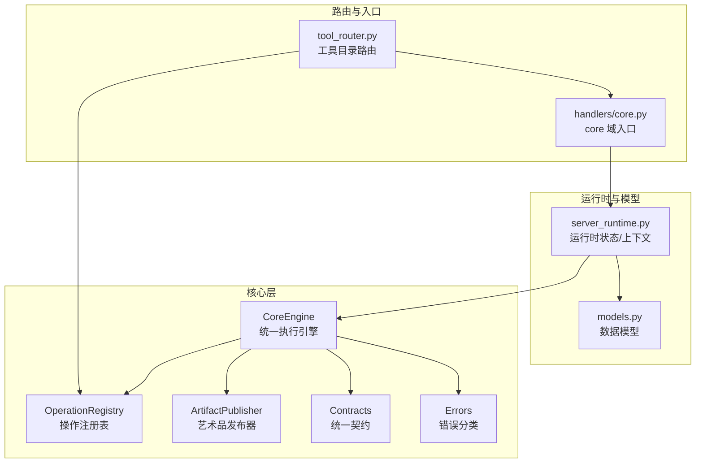
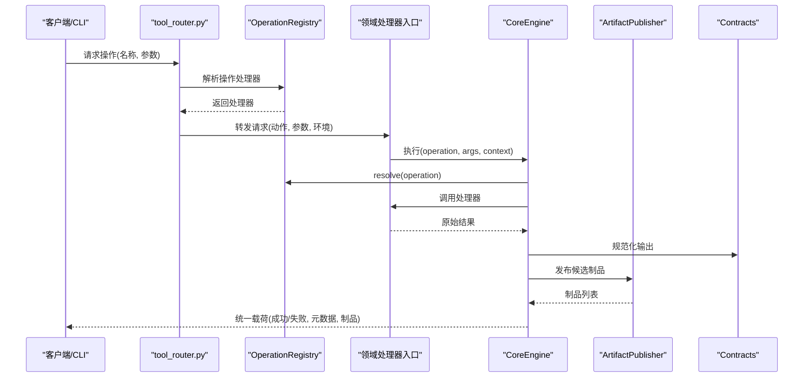
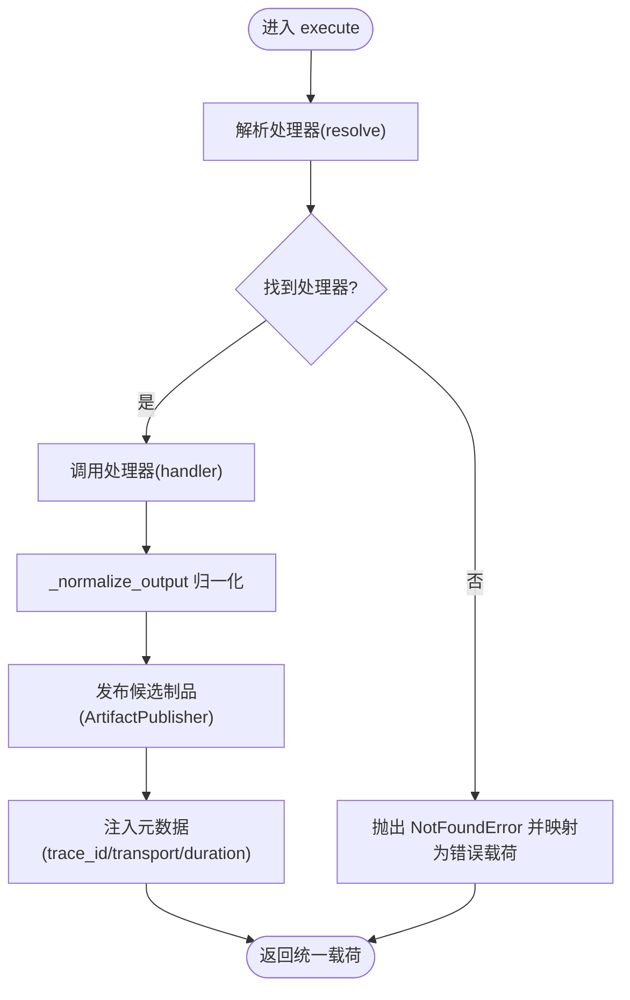
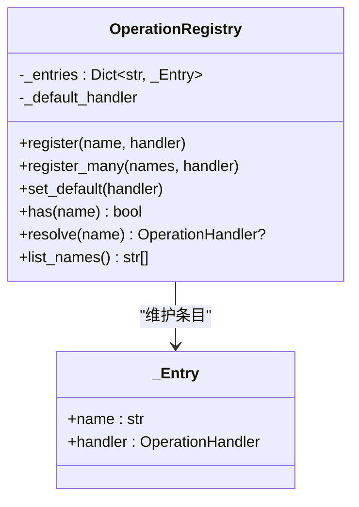
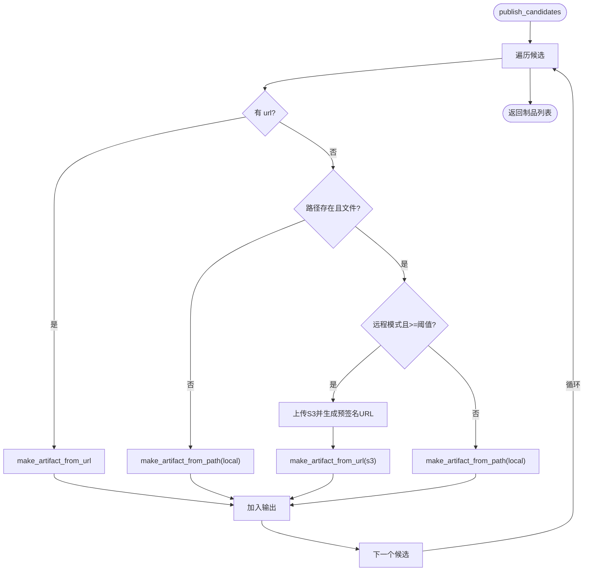
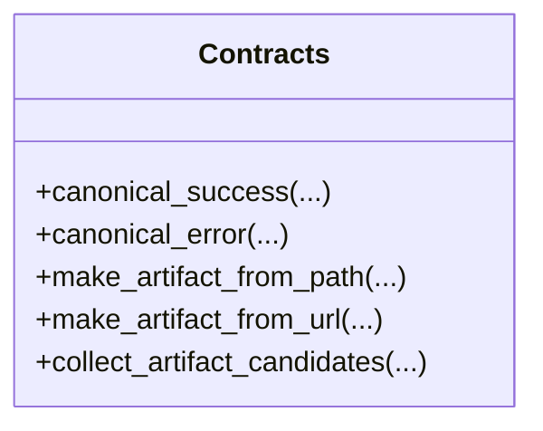
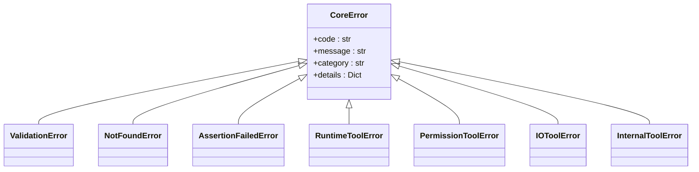
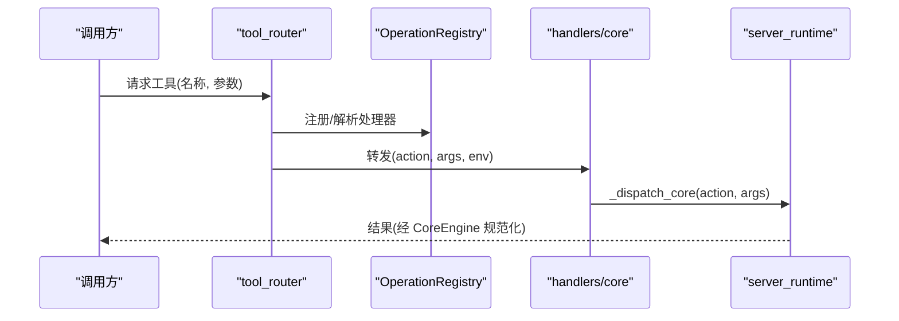
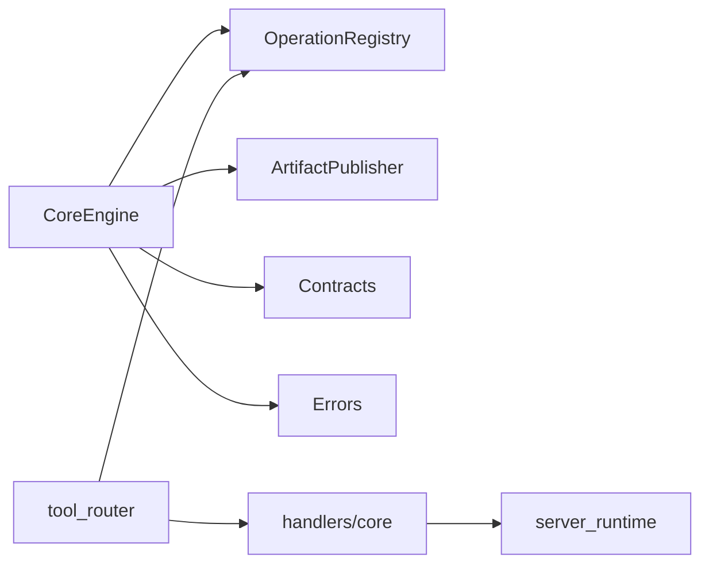

# 核心处理器

<cite>
**本文引用的文件**
- [engine.py](file://rdx/core/engine.py)
- [operation_registry.py](file://rdx/core/operation_registry.py)
- [artifact_publisher.py](file://rdx/core/artifact_publisher.py)
- [contracts.py](file://rdx/core/contracts.py)
- [errors.py](file://rdx/core/errors.py)
- [core.py](file://rdx/handlers/core.py)
- [tool_router.py](file://rdx/tool_router.py)
- [server_runtime.py](file://rdx/server_runtime.py)
- [models.py](file://rdx/models.py)
</cite>

## 目录
1. [简介](#简介)
2. [项目结构](#项目结构)
3. [核心组件](#核心组件)
4. [架构总览](#架构总览)
5. [详细组件分析](#详细组件分析)
6. [依赖分析](#依赖分析)
7. [性能考虑](#性能考虑)
8. [故障排查指南](#故障排查指南)
9. [结论](#结论)
10. [附录](#附录)

## 简介
核心处理器是 RDX Agent Tools 的统一执行引擎与契约层，负责：
- 统一操作路由与调度（通过操作注册表与工具目录）
- 规范化输出格式（成功/失败统一载荷）
- 艺术品（artifact）发布策略（本地/远程上传）
- 错误分类与映射（稳定类别与可预测的错误码）
- 上下文与追踪（trace_id、传输方式、耗时等元数据）

其目标是为 CLI 与守护进程提供一致的“内核”能力，屏蔽底层领域处理器差异，确保所有操作返回标准化结果。

## 项目结构
核心处理器相关模块分布于以下路径：
- rdx/core：核心引擎、契约、错误、注册表、艺术品发布
- rdx/handlers：领域处理器入口（如 core、capture、session 等）
- rdx/tool_router.py：基于工具目录的路由与前置条件检查
- rdx/server_runtime.py：运行时上下文、会话管理、进度上报等
- rdx/models.py：跨域共享的数据模型

图表来源
- [engine.py:30-204](file://rdx/core/engine.py#L30-L204)
- [operation_registry.py:18-45](file://rdx/core/operation_registry.py#L18-L45)
- [artifact_publisher.py:15-124](file://rdx/core/artifact_publisher.py#L15-L124)
- [contracts.py:98-165](file://rdx/core/contracts.py#L98-L165)
- [errors.py:9-121](file://rdx/core/errors.py#L9-L121)
- [tool_router.py:130-151](file://rdx/tool_router.py#L130-L151)
- [core.py:8-11](file://rdx/handlers/core.py#L8-L11)
- [server_runtime.py:54-98](file://rdx/server_runtime.py#L54-L98)
- [models.py:103-123](file://rdx/models.py#L103-L123)

章节来源
- [engine.py:1-204](file://rdx/core/engine.py#L1-L204)
- [operation_registry.py:1-45](file://rdx/core/operation_registry.py#L1-L45)
- [artifact_publisher.py:1-124](file://rdx/core/artifact_publisher.py#L1-L124)
- [contracts.py:1-248](file://rdx/core/contracts.py#L1-L248)
- [errors.py:1-121](file://rdx/core/errors.py#L1-L121)
- [tool_router.py:1-151](file://rdx/tool_router.py#L1-L151)
- [core.py:1-11](file://rdx/handlers/core.py#L1-L11)
- [server_runtime.py:1-12794](file://rdx/server_runtime.py#L1-L12794)
- [models.py:1-558](file://rdx/models.py#L1-L558)

## 核心组件
- 统一执行引擎 CoreEngine
  - 接口：execute(operation, args, context)
  - 功能：解析操作、调用处理器、规范化输出、注入元数据、错误映射
- 操作注册表 OperationRegistry
  - 接口：register(name, handler)、resolve(name)、list_names()
  - 功能：集中式操作到处理器的映射
- 艺术品发布器 ArtifactPublisher
  - 接口：publish_candidates(candidates, remote)
  - 功能：根据环境策略选择本地或远程存储，生成统一的制品引用
- 统一契约 Contracts
  - 接口：canonical_success、canonical_error、make_artifact_from_path/url、collect_artifact_candidates
  - 功能：标准化响应结构与制品描述
- 错误体系 Errors
  - 类型：CoreError 及其子类（验证、未找到、断言失败、运行时、权限、IO、内部）
  - 工具：map_exception 将异常映射为稳定类别
- 路由与入口
  - tool_router：从工具目录构建注册表，强制前置条件
  - handlers/core：core 域的统一入口，转发至 server_runtime

章节来源
- [engine.py:30-204](file://rdx/core/engine.py#L30-L204)
- [operation_registry.py:18-45](file://rdx/core/operation_registry.py#L18-L45)
- [artifact_publisher.py:15-124](file://rdx/core/artifact_publisher.py#L15-L124)
- [contracts.py:98-248](file://rdx/core/contracts.py#L98-L248)
- [errors.py:9-121](file://rdx/core/errors.py#L9-L121)
- [tool_router.py:130-151](file://rdx/tool_router.py#L130-L151)
- [core.py:8-11](file://rdx/handlers/core.py#L8-L11)

## 架构总览
核心处理器在系统中的位置如下：

图表来源
- [tool_router.py:130-151](file://rdx/tool_router.py#L130-L151)
- [operation_registry.py:36-40](file://rdx/core/operation_registry.py#L36-L40)
- [core.py:8-11](file://rdx/handlers/core.py#L8-L11)
- [engine.py:40-76](file://rdx/core/engine.py#L40-L76)
- [artifact_publisher.py:60-118](file://rdx/core/artifact_publisher.py#L60-L118)
- [contracts.py:98-165](file://rdx/core/contracts.py#L98-L165)

## 详细组件分析

### 统一执行引擎 CoreEngine
职责与流程
- 输入：operation 名称、参数字典、可选上下文
- 处理：解析处理器、调用异步处理器、规范化输出、收集制品、注入元数据
- 输出：统一载荷（成功/失败），包含 schema_version、tool_version、result_kind、ok、data、artifacts、error、meta、projections

关键特性
- 自动追踪与耗时统计（trace_id、duration_ms）
- 多种输出归一化策略（字符串、字典、legacy 字段集）
- 错误映射与稳定类别（InternalToolError、NotFoundError 等）

图表来源
- [engine.py:40-76](file://rdx/core/engine.py#L40-L76)
- [engine.py:77-204](file://rdx/core/engine.py#L77-L204)
- [artifact_publisher.py:60-118](file://rdx/core/artifact_publisher.py#L60-L118)
- [contracts.py:98-165](file://rdx/core/contracts.py#L98-L165)

章节来源
- [engine.py:30-204](file://rdx/core/engine.py#L30-L204)

### 操作注册表 OperationRegistry
职责与接口
- 注册单个或多个操作名到处理器
- 设置默认处理器
- 解析操作名对应的处理器
- 列出已注册的操作名

图表来源
- [operation_registry.py:18-45](file://rdx/core/operation_registry.py#L18-L45)

章节来源
- [operation_registry.py:18-45](file://rdx/core/operation_registry.py#L18-L45)

### 艺术品发布器 ArtifactPublisher
职责与策略
- 根据环境变量决定本地/远程模式与阈值
- 对候选制品进行去重与类型判断（路径/URL）
- 远程模式下满足大小阈值自动上传 S3 并生成预签名 URL
- 生成统一制品引用（artifact_id、mime、size_bytes、sha256、path/url、storage_backend、metadata）

图表来源
- [artifact_publisher.py:60-118](file://rdx/core/artifact_publisher.py#L60-L118)
- [contracts.py:46-95](file://rdx/core/contracts.py#L46-L95)

章节来源
- [artifact_publisher.py:15-124](file://rdx/core/artifact_publisher.py#L15-L124)
- [contracts.py:46-95](file://rdx/core/contracts.py#L46-L95)

### 统一契约 Contracts
职责与规范
- 成功载荷：canonical_success
- 失败载荷：canonical_error
- 制品构造：make_artifact_from_path、make_artifact_from_url
- 制品提取：collect_artifact_candidates（兼容旧字段）
- 其他：时间戳、版本号、TSV 投影辅助

图表来源
- [contracts.py:98-248](file://rdx/core/contracts.py#L98-L248)

章节来源
- [contracts.py:1-248](file://rdx/core/contracts.py#L1-L248)

### 错误体系 Errors
职责与映射
- 定义 CoreError 及子类（验证、未找到、断言失败、运行时、权限、IO、内部）
- map_exception 将任意异常映射为稳定类别与错误详情

图表来源
- [errors.py:9-121](file://rdx/core/errors.py#L9-L121)

章节来源
- [errors.py:1-121](file://rdx/core/errors.py#L1-L121)

### 路由与入口：tool_router 与 handlers/core
- tool_router：从工具目录加载工具清单，构建 OperationRegistry；对每个工具生成包装处理器，先检查前置条件再转发给对应领域处理器
- handlers/core：core 域入口，将请求转发给 server_runtime 的内部分发器

图表来源
- [tool_router.py:130-151](file://rdx/tool_router.py#L130-L151)
- [core.py:8-11](file://rdx/handlers/core.py#L8-L11)
- [server_runtime.py:54-98](file://rdx/server_runtime.py#L54-L98)

章节来源
- [tool_router.py:1-151](file://rdx/tool_router.py#L1-L151)
- [core.py:1-11](file://rdx/handlers/core.py#L1-L11)
- [server_runtime.py:1-12794](file://rdx/server_runtime.py#L1-L12794)

## 依赖分析
- CoreEngine 依赖
  - OperationRegistry：解析操作处理器
  - ArtifactPublisher：发布制品
  - Contracts：统一载荷与制品构造
  - Errors：异常映射
- tool_router 依赖
  - server_runtime：加载工具目录、上下文快照
  - 各领域处理器模块（buffer/capture/core/debug/...）
  - OperationRegistry：注册工具到处理器
- handlers/core 依赖
  - server_runtime：内部分发核心操作

图表来源
- [engine.py:12-16](file://rdx/core/engine.py#L12-L16)
- [tool_router.py:8-29](file://rdx/tool_router.py#L8-L29)
- [core.py:5-10](file://rdx/handlers/core.py#L5-L10)

章节来源
- [engine.py:1-204](file://rdx/core/engine.py#L1-L204)
- [tool_router.py:1-151](file://rdx/tool_router.py#L1-L151)
- [core.py:1-11](file://rdx/handlers/core.py#L1-L11)

## 性能考虑
- 异步执行：CoreEngine 与各处理器均采用异步，避免阻塞
- 输出归一化：减少下游解析成本，统一载荷结构
- 制品发布策略：按大小阈值与远程模式选择最优存储，降低网络开销
- 元数据注入：trace_id、transport、duration_ms 便于端到端追踪与性能分析
- 运行时上下文：server_runtime 提供上下文容量控制与限制配置，防止资源耗尽

## 故障排查指南
常见问题与定位建议
- 操作未找到
  - 现象：返回 not_found 类别错误
  - 排查：确认工具是否在工具目录中注册，名称是否正确
- 前置条件不满足
  - 现象：返回带 details 的 runtime 错误，包含 prerequisite、via_tools、reason
  - 排查：检查 capture_file_id、session_id、remote_id、capability.remote 等前置条件
- 文件/权限/IO 错误
  - 现象：映射为 validation/io/runtime 等类别
  - 排查：检查输入参数、文件路径、访问权限
- 远程连接/渲染状态异常
  - 现象：SessionError 或 renderdoc_status 相关错误
  - 排查：确认远程端点可达、设备序列号、传输协议、捕获文件有效性

章节来源
- [tool_router.py:111-127](file://rdx/tool_router.py#L111-L127)
- [errors.py:90-121](file://rdx/core/errors.py#L90-L121)
- [server_runtime.py:141-145](file://rdx/server_runtime.py#L141-L145)

## 结论
核心处理器通过统一执行引擎、契约与错误体系，为多领域处理器提供了稳定的“内核”。它以最小耦合的方式集成路由、前置条件检查、制品发布与元数据注入，既保证了跨域一致性，又保留了扩展性与可维护性。配合 server_runtime 的上下文与会话管理，核心处理器构成了 RDX Agent Tools 的基础设施基石。

## 附录
- 使用示例（步骤级）
  - 路由阶段：tool_router 基于工具目录构建注册表，为每个工具生成处理器包装
  - 入口阶段：handlers/core 将请求转发给 server_runtime 内部分发器
  - 执行阶段：CoreEngine 解析处理器并调用，规范化输出，发布制品
  - 返回阶段：统一载荷包含 schema_version、tool_version、result_kind、ok/data/artifacts/error/meta/projections
- 最佳实践
  - 明确操作命名空间（domain.action），确保唯一性
  - 在处理器中返回结构化字典，便于自动制品提取
  - 合理设置 RDX_ARTIFACT_MODE 与阈值，平衡本地与远程存储
  - 使用 ExecutionContext 注入 trace_id、transport、metadata，便于追踪
- 扩展点与自定义
  - 新增领域处理器：在 tool_router 中注册 domain 处理器映射
  - 注册新操作：通过 OperationRegistry.register 或 register_many
  - 自定义错误：抛出 CoreError 子类或在处理器中返回标准错误载荷
  - 自定义制品策略：扩展 ArtifactPublisher 的发布逻辑（例如新增存储后端）
- 日志与调试
  - CoreEngine 记录执行失败的调试信息
  - server_runtime 提供上下文快照、预览状态、进度上报等调试能力
  - 运行时状态包含 metrics、limits、snapshots 等可观测性数据

章节来源
- [tool_router.py:130-151](file://rdx/tool_router.py#L130-L151)
- [core.py:8-11](file://rdx/handlers/core.py#L8-L11)
- [engine.py:40-76](file://rdx/core/engine.py#L40-L76)
- [server_runtime.py:239-262](file://rdx/server_runtime.py#L239-L262)
- [models.py:103-123](file://rdx/models.py#L103-L123)