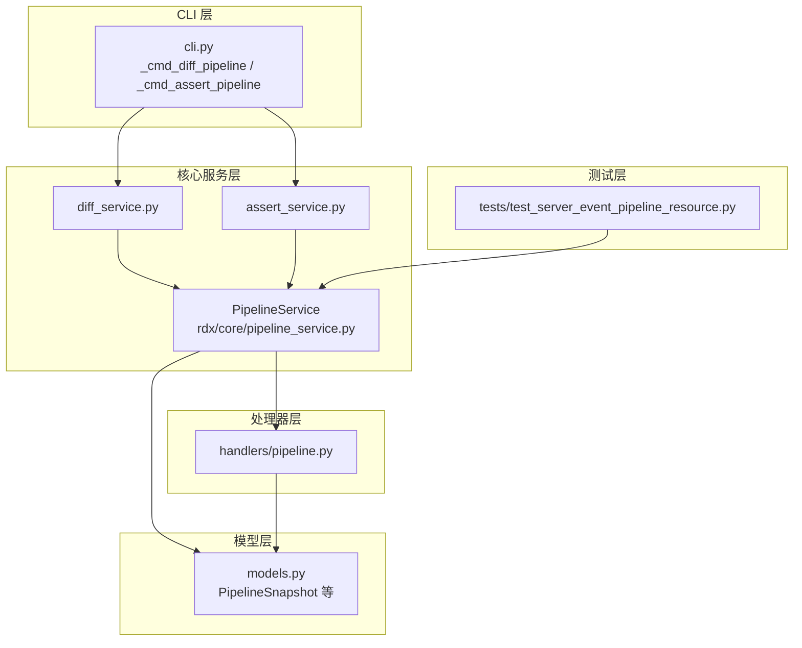
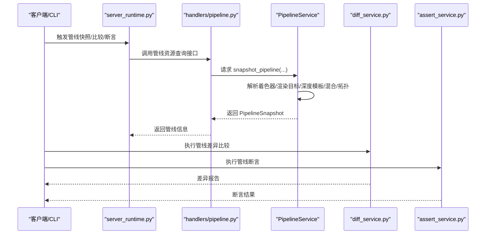
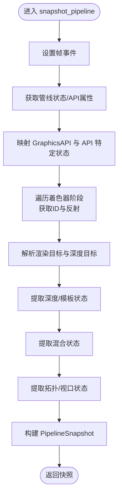
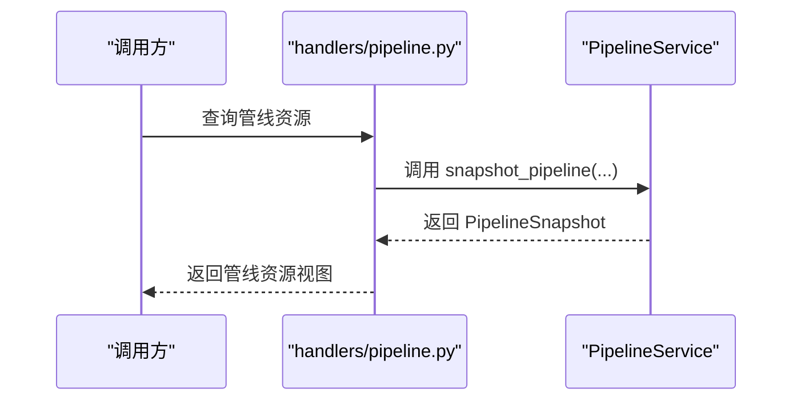
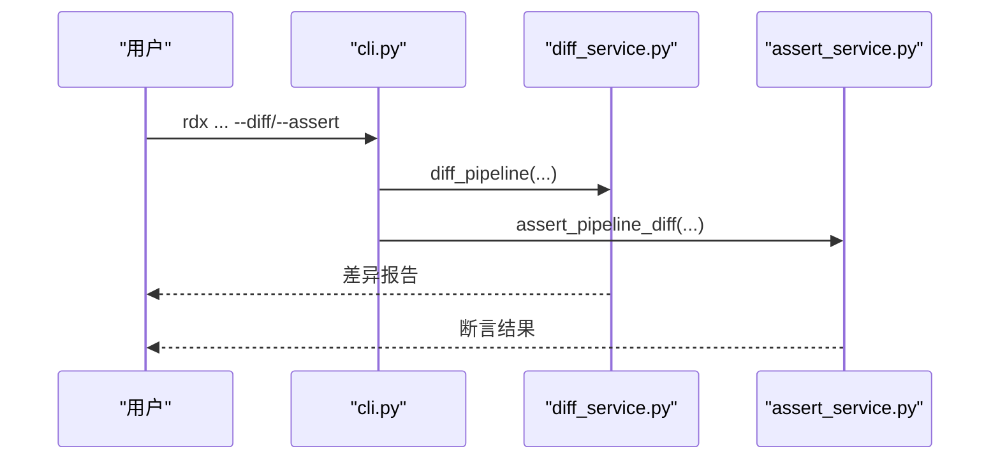
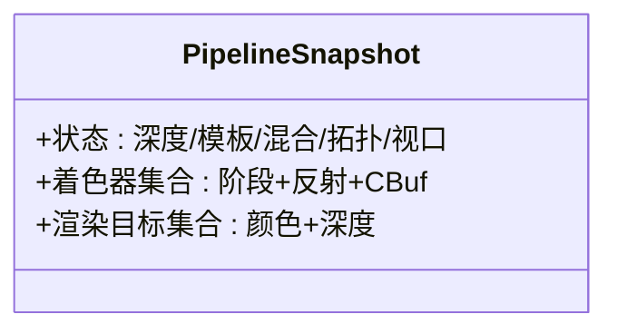
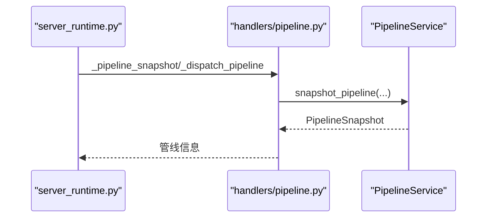
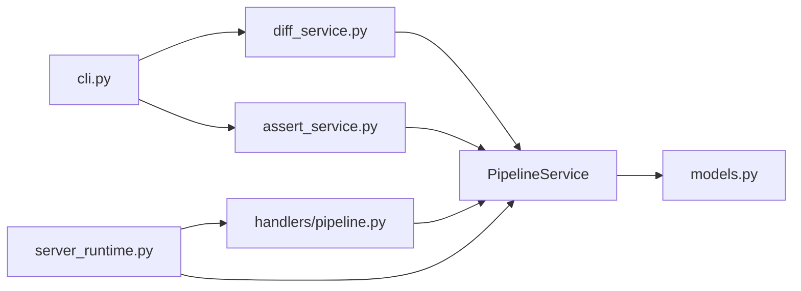
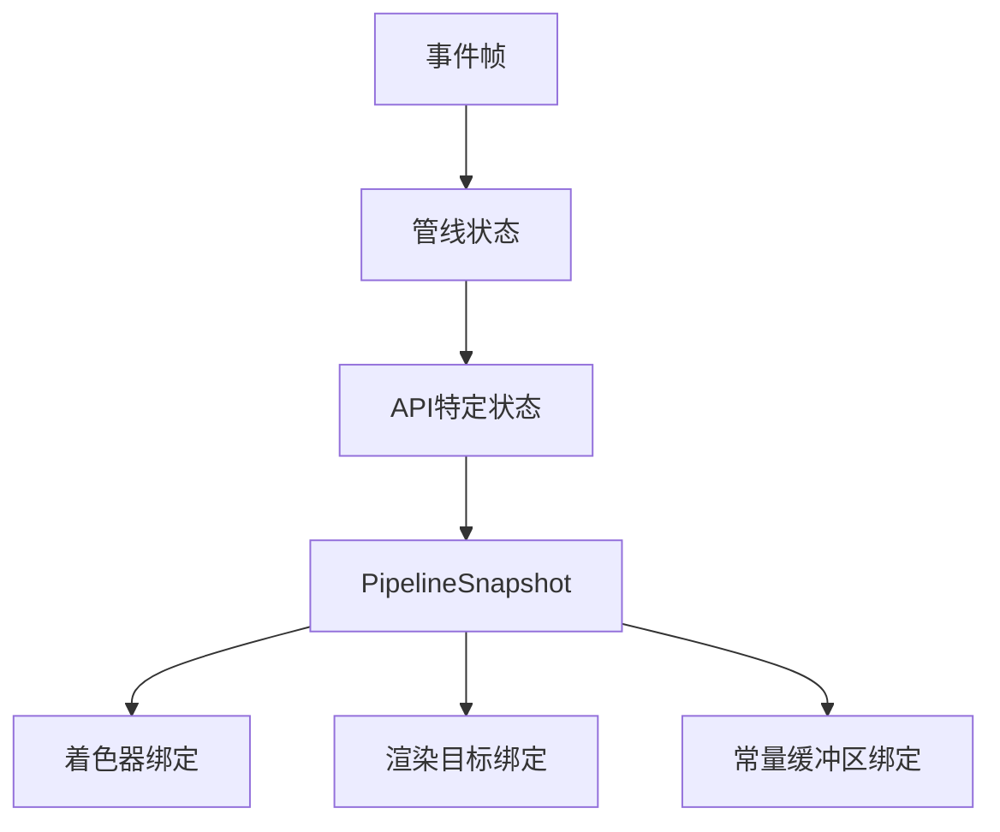

# 管线处理器

<cite>
**本文引用的文件**
- [pipeline_service.py](file://rdx/core/pipeline_service.py)
- [pipeline.py](file://rdx/handlers/pipeline.py)
- [models.py](file://rdx/models.py)
- [server_runtime.py](file://rdx/server_runtime.py)
- [cli.py](file://rdx/cli.py)
- [diff_service.py](file://rdx/core/diff_service.py)
- [assert_service.py](file://rdx/core/assert_service.py)
- [test_server_event_pipeline_resource.py](file://tests/test_server_event_pipeline_resource.py)
</cite>

## 目录
1. [简介](#简介)
2. [项目结构](#项目结构)
3. [核心组件](#核心组件)
4. [架构总览](#架构总览)
5. [详细组件分析](#详细组件分析)
6. [依赖分析](#依赖分析)
7. [性能考虑](#性能考虑)
8. [故障排查指南](#故障排查指南)
9. [结论](#结论)
10. [附录](#附录)

## 简介
本文件系统化阐述管线处理器的设计与实现，覆盖图形管线的状态管理、配置与操作处理机制；详述管线对象的创建、修改与查询接口；涵盖状态转换、绑定关系与依赖管理；提供管线配置、渲染状态设置与管线重建的实际代码示例路径；解释与着色器、纹理和缓冲区的协作关系；并总结优化、状态缓存与性能调优的最佳实践。

## 项目结构
围绕“管线”主题的关键模块分布如下：
- 核心服务层：负责从捕获控制器提取管线状态、构建管线快照、执行差异与断言。
- 处理器层：对外暴露管线资源访问与查询接口，供上层工具与服务器运行时使用。
- 模型层：定义管线快照与相关数据结构，作为跨层传递的数据契约。
- CLI 层：提供命令行入口以比较与断言管线差异。
- 测试层：验证事件级管线资源绑定与一致性。

**图表来源**
- [pipeline_service.py:628-700](file://rdx/core/pipeline_service.py#L628-L700)
- [pipeline.py](file://rdx/handlers/pipeline.py)
- [models.py:265-320](file://rdx/models.py#L265-L320)
- [cli.py:1068-1107](file://rdx/cli.py#L1068-L1107)
- [diff_service.py:1-40](file://rdx/core/diff_service.py#L1-L40)
- [assert_service.py:1-40](file://rdx/core/assert_service.py#L1-L40)
- [test_server_event_pipeline_resource.py](file://tests/test_server_event_pipeline_resource.py)

**章节来源**
- [pipeline_service.py:628-700](file://rdx/core/pipeline_service.py#L628-L700)
- [pipeline.py](file://rdx/handlers/pipeline.py)
- [models.py:265-320](file://rdx/models.py#L265-L320)
- [cli.py:1068-1107](file://rdx/cli.py#L1068-L1107)
- [diff_service.py:1-40](file://rdx/core/diff_service.py#L1-L40)
- [assert_service.py:1-40](file://rdx/core/assert_service.py#L1-L40)
- [test_server_event_pipeline_resource.py](file://tests/test_server_event_pipeline_resource.py)

## 核心组件
- PipelineService：异步抓取当前帧事件的管线状态，解析着色器、渲染目标、深度模板、混合与拓扑等，并生成 PipelineSnapshot。
- handlers/pipeline.py：提供管线资源的查询与绑定关系访问接口。
- models.py：定义 PipelineSnapshot 及其子结构，作为序列化与传输载体。
- CLI 命令：_cmd_diff_pipeline 与 _cmd_assert_pipeline 分别用于比较与断言管线差异。
- diff_service.py / assert_service.py：封装管线差异计算与断言逻辑，复用 PipelineService 的快照能力。
- 测试用例：验证事件级管线资源绑定的一致性。

**章节来源**
- [pipeline_service.py:628-700](file://rdx/core/pipeline_service.py#L628-L700)
- [pipeline.py](file://rdx/handlers/pipeline.py)
- [models.py:265-320](file://rdx/models.py#L265-L320)
- [cli.py:1068-1107](file://rdx/cli.py#L1068-L1107)
- [diff_service.py:1-40](file://rdx/core/diff_service.py#L1-L40)
- [assert_service.py:1-40](file://rdx/core/assert_service.py#L1-L40)
- [test_server_event_pipeline_resource.py](file://tests/test_server_event_pipeline_resource.py)

## 架构总览
下图展示从事件到管线快照、再到差异/断言与查询的整体流程。

**图表来源**
- [server_runtime.py:5143-5160](file://rdx/server_runtime.py#L5143-L5160)
- [pipeline.py](file://rdx/handlers/pipeline.py)
- [pipeline_service.py:628-700](file://rdx/core/pipeline_service.py#L628-L700)
- [diff_service.py:1-40](file://rdx/core/diff_service.py#L1-L40)
- [assert_service.py:1-40](file://rdx/core/assert_service.py#L1-L40)

## 详细组件分析

### 组件一：PipelineService（管线快照与状态抽取）
- 职责
  - 设置当前帧事件，抓取管线状态与 API 特定属性。
  - 抽取并标准化：着色器阶段、反射信息、渲染目标、深度模板、混合、视口、拓扑等。
  - 生成 PipelineSnapshot，供上层使用。
- 关键流程
  - 选择 GraphicsAPI 并映射 API 特定状态。
  - 遍历着色器阶段，获取着色器 ID 与反射信息。
  - 解析输出渲染目标与深度目标。
  - 提取深度/模板、混合、拓扑、视口等状态。
- 数据结构
  - PipelineSnapshot：包含管线状态、着色器集合、渲染目标集合等字段。
- 错误处理
  - 对属性缺失或类型不匹配进行容错记录与跳过。

**图表来源**
- [pipeline_service.py:636-700](file://rdx/core/pipeline_service.py#L636-L700)
- [pipeline_service.py:245-257](file://rdx/core/pipeline_service.py#L245-L257)
- [pipeline_service.py:264-275](file://rdx/core/pipeline_service.py#L264-L275)
- [pipeline_service.py:628-700](file://rdx/core/pipeline_service.py#L628-L700)

**章节来源**
- [pipeline_service.py:628-700](file://rdx/core/pipeline_service.py#L628-L700)
- [pipeline_service.py:245-257](file://rdx/core/pipeline_service.py#L245-L257)
- [pipeline_service.py:264-275](file://rdx/core/pipeline_service.py#L264-L275)
- [models.py:265-320](file://rdx/models.py#L265-L320)

### 组件二：handlers/pipeline.py（管线资源查询与绑定）
- 职责
  - 对外暴露管线资源查询接口，供服务器运行时与上层工具使用。
  - 协助定位管线对象与其绑定的着色器、纹理、缓冲区等资源。
- 典型交互
  - 通过会话管理器获取控制器，再调用 PipelineService 进行快照。
  - 将快照映射为可查询的管线资源视图。

**图表来源**
- [pipeline.py](file://rdx/handlers/pipeline.py)
- [pipeline_service.py:628-700](file://rdx/core/pipeline_service.py#L628-L700)

**章节来源**
- [pipeline.py](file://rdx/handlers/pipeline.py)
- [pipeline_service.py:628-700](file://rdx/core/pipeline_service.py#L628-L700)

### 组件三：CLI 工具（管线差异与断言）
- 功能
  - _cmd_diff_pipeline：对两个管线快照进行差异比较，输出差异报告。
  - _cmd_assert_pipeline：断言当前管线与期望管线一致，失败时抛出错误。
- 使用场景
  - 自动化回归：在不同构建或提交间对比管线行为。
  - 集成测试：确保管线配置未被意外变更。

**图表来源**
- [cli.py:1068-1107](file://rdx/cli.py#L1068-L1107)
- [diff_service.py:1-40](file://rdx/core/diff_service.py#L1-L40)
- [assert_service.py:1-40](file://rdx/core/assert_service.py#L1-L40)

**章节来源**
- [cli.py:1068-1107](file://rdx/cli.py#L1068-L1107)
- [diff_service.py:1-40](file://rdx/core/diff_service.py#L1-L40)
- [assert_service.py:1-40](file://rdx/core/assert_service.py#L1-L40)

### 组件四：模型与数据契约（PipelineSnapshot）
- 结构要点
  - 包含管线状态字段（如深度、模板、混合、拓扑、视口等）。
  - 包含着色器集合（阶段、反射信息、常量缓冲区等）。
  - 包含渲染目标集合（颜色与深度目标）。
- 作用
  - 作为跨层传递的数据契约，保证快照与查询结果的稳定性与可比性。

**图表来源**
- [models.py:265-320](file://rdx/models.py#L265-L320)

**章节来源**
- [models.py:265-320](file://rdx/models.py#L265-L320)

### 组件五：服务器运行时集成（管线快照与分派）
- 作用
  - 在服务器运行时中触发管线快照与分派，支持 VFS 管线类节点访问。
- 关键点
  - 通过会话管理器获取控制器，调用 PipelineService。
  - 支持按事件 ID 快照，便于回放与对比。

**图表来源**
- [server_runtime.py:5143-5160](file://rdx/server_runtime.py#L5143-L5160)
- [server_runtime.py:7456-7483](file://rdx/server_runtime.py#L7456-L7483)
- [pipeline.py](file://rdx/handlers/pipeline.py)
- [pipeline_service.py:628-700](file://rdx/core/pipeline_service.py#L628-L700)

**章节来源**
- [server_runtime.py:5143-5160](file://rdx/server_runtime.py#L5143-L5160)
- [server_runtime.py:7456-7483](file://rdx/server_runtime.py#L7456-L7483)
- [pipeline.py](file://rdx/handlers/pipeline.py)
- [pipeline_service.py:628-700](file://rdx/core/pipeline_service.py#L628-L700)

## 依赖分析
- 内部耦合
  - handlers/pipeline.py 依赖 PipelineService 生成的 PipelineSnapshot。
  - CLI 层依赖 diff_service.py 与 assert_service.py 完成比较与断言。
  - 服务器运行时依赖 handlers/pipeline.py 与 PipelineService 实现管线快照与分派。
- 外部依赖
  - 通过会话管理器与捕获控制器交互，获取当前帧事件与管线状态。
- 循环依赖
  - 当前设计避免循环依赖：服务层仅向下依赖，上层仅向上调用。

**图表来源**
- [cli.py:1068-1107](file://rdx/cli.py#L1068-L1107)
- [diff_service.py:1-40](file://rdx/core/diff_service.py#L1-L40)
- [assert_service.py:1-40](file://rdx/core/assert_service.py#L1-L40)
- [pipeline.py](file://rdx/handlers/pipeline.py)
- [pipeline_service.py:628-700](file://rdx/core/pipeline_service.py#L628-L700)
- [models.py:265-320](file://rdx/models.py#L265-L320)
- [server_runtime.py:5143-5160](file://rdx/server_runtime.py#L5143-L5160)

**章节来源**
- [cli.py:1068-1107](file://rdx/cli.py#L1068-L1107)
- [diff_service.py:1-40](file://rdx/core/diff_service.py#L1-L40)
- [assert_service.py:1-40](file://rdx/core/assert_service.py#L1-L40)
- [pipeline.py](file://rdx/handlers/pipeline.py)
- [pipeline_service.py:628-700](file://rdx/core/pipeline_service.py#L628-L700)
- [models.py:265-320](file://rdx/models.py#L265-L320)
- [server_runtime.py:5143-5160](file://rdx/server_runtime.py#L5143-L5160)

## 性能考虑
- 异步抓取与线程池
  - 使用 asyncio.to_thread 将阻塞式控制器调用移至线程池，避免主线程阻塞。
- 状态缓存与去重
  - 对相同事件与相同查询条件的结果进行缓存，减少重复快照开销。
- 批量解析
  - 合理批量获取纹理与着色器反射信息，降低跨层调用次数。
- 差异计算优化
  - 仅对关键状态字段进行差异比较，忽略冗余细节，提升比较效率。
- 最佳实践
  - 在 CI 中仅对关键帧事件做管线快照，避免全量快照带来的性能压力。
  - 使用增量断言策略，优先断言影响渲染结果的核心状态。

[本节为通用指导，无需列出具体文件来源]

## 故障排查指南
- 常见问题
  - 事件 ID 无效：确认事件已正确设置且存在。
  - 着色器为空：检查着色器阶段是否启用，以及反射信息是否可用。
  - 渲染目标缺失：确认输出目标描述符与纹理资源有效。
  - API 映射异常：检查 GraphicsAPI 类型与 API 特定状态字段映射。
- 排查步骤
  - 使用 CLI 的差异命令对比当前与基线管线，定位差异字段。
  - 在服务器运行时中按事件 ID 触发快照，核对 PipelineSnapshot 字段。
  - 查看测试用例中关于事件级管线资源绑定的断言，复现实验环境。
- 相关参考
  - 差异与断言实现位于 diff_service.py 与 assert_service.py。
  - 事件级管线资源绑定测试位于 test_server_event_pipeline_resource.py。

**章节来源**
- [diff_service.py:1-40](file://rdx/core/diff_service.py#L1-L40)
- [assert_service.py:1-40](file://rdx/core/assert_service.py#L1-L40)
- [test_server_event_pipeline_resource.py](file://tests/test_server_event_pipeline_resource.py)

## 结论
管线处理器通过 PipelineService 将底层捕获控制器的状态抽象为统一的 PipelineSnapshot，并由 handlers/pipeline.py 提供查询接口，配合 CLI 的差异与断言工具，形成完整的管线配置与验证闭环。该设计兼顾了可扩展性与性能，适合在自动化测试与回归场景中稳定使用。

[本节为总结性内容，无需列出具体文件来源]

## 附录

### A. 管线状态转换与绑定关系
- 状态转换
  - 从事件级管线状态到 PipelineSnapshot 的转换由 PipelineService 完成。
  - 不同 GraphicsAPI 的状态字段需映射到统一结构。
- 绑定关系
  - 管线绑定着色器（各阶段）、渲染目标（颜色与深度）、常量缓冲区等。
  - 纹理与采样器通过资源 ID 与管线状态关联。

**图表来源**
- [pipeline_service.py:628-700](file://rdx/core/pipeline_service.py#L628-L700)
- [models.py:265-320](file://rdx/models.py#L265-L320)

**章节来源**
- [pipeline_service.py:628-700](file://rdx/core/pipeline_service.py#L628-L700)
- [models.py:265-320](file://rdx/models.py#L265-L320)

### B. 管线配置、渲染状态设置与重建示例（路径）
- 获取当前事件的管线快照
  - [snapshot_pipeline(...):636-700](file://rdx/core/pipeline_service.py#L636-L700)
- 设置帧事件并抓取管线状态
  - [SetFrameEvent(...):646-646](file://rdx/core/pipeline_service.py#L646-L646)
  - [GetPipelineState(...):648-648](file://rdx/core/pipeline_service.py#L648-L648)
- 解析深度/模板状态
  - [_extract_depth_stencil(...):245-257](file://rdx/core/pipeline_service.py#L245-L257)
- 解析渲染目标
  - [_extract_render_targets(...):264-275](file://rdx/core/pipeline_service.py#L264-L275)
- 服务器运行时触发快照
  - [_pipeline_snapshot(...):5143-5160](file://rdx/server_runtime.py#L5143-L5160)
- CLI 差异与断言
  - [_cmd_diff_pipeline(...):1068-1068](file://rdx/cli.py#L1068-L1068)
  - [_cmd_assert_pipeline(...):1107-1107](file://rdx/cli.py#L1107-L1107)

**章节来源**
- [pipeline_service.py:245-257](file://rdx/core/pipeline_service.py#L245-L257)
- [pipeline_service.py:264-275](file://rdx/core/pipeline_service.py#L264-L275)
- [pipeline_service.py:636-700](file://rdx/core/pipeline_service.py#L636-L700)
- [server_runtime.py:5143-5160](file://rdx/server_runtime.py#L5143-L5160)
- [cli.py:1068-1107](file://rdx/cli.py#L1068-L1107)

### C. 与着色器、纹理和缓冲区的协作
- 着色器
  - 遍历各阶段获取着色器 ID 与反射信息，用于常量缓冲区与资源绑定分析。
- 纹理
  - 通过资源 ID 获取纹理对象，用于渲染目标与采样资源绑定。
- 缓冲区
  - 通过常量缓冲区与管线状态关联，参与渲染状态重建。

**章节来源**
- [pipeline_service.py:657-664](file://rdx/core/pipeline_service.py#L657-L664)
- [pipeline_service.py:273-274](file://rdx/core/pipeline_service.py#L273-L274)