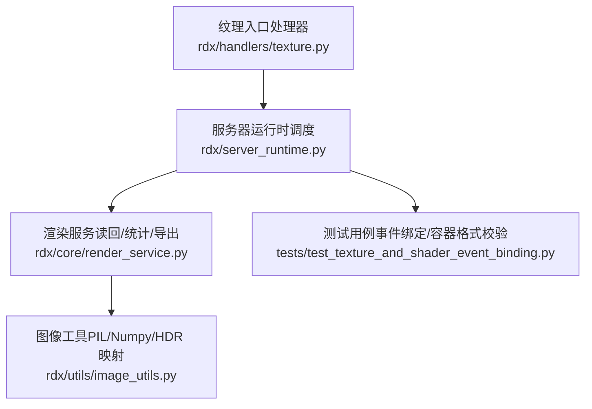
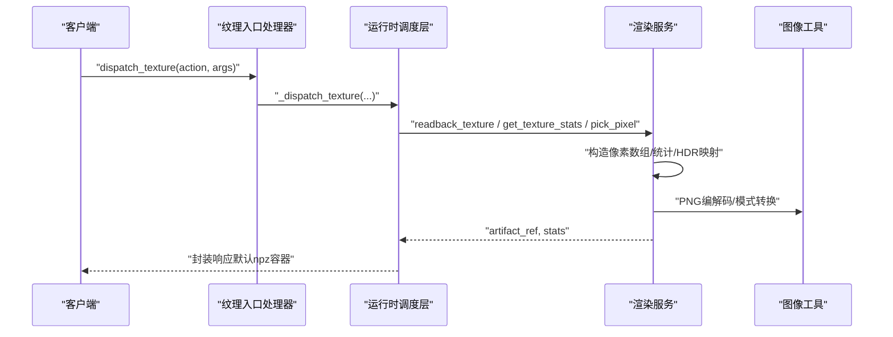
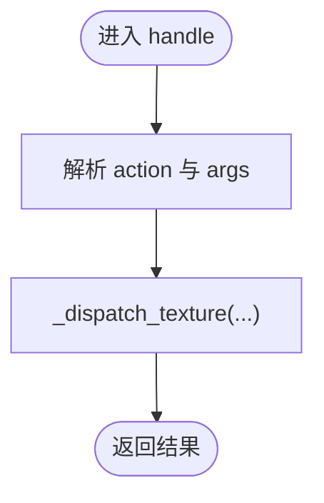
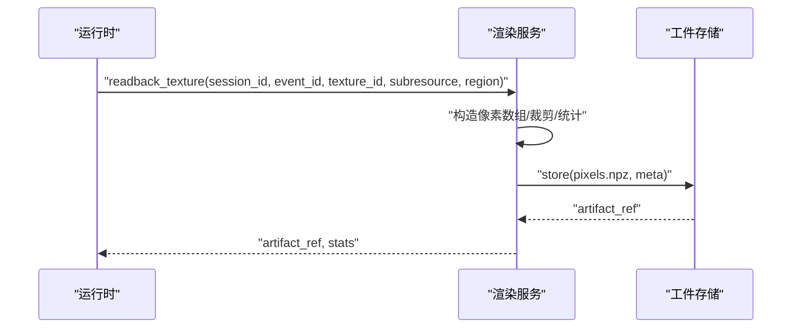
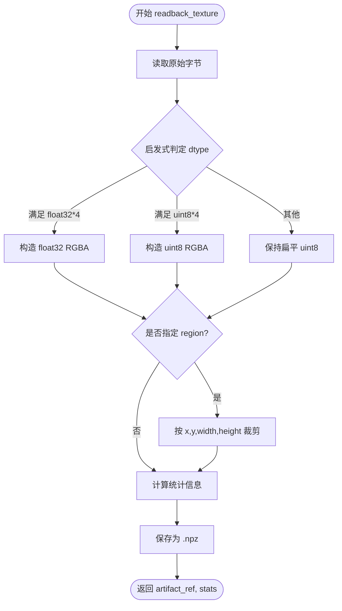
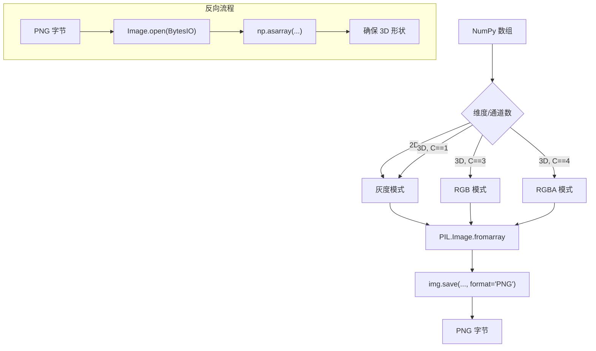
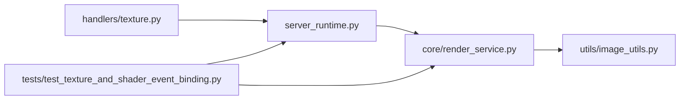

# 纹理处理器

<cite>
**本文引用的文件**
- [rdx/handlers/texture.py](file://rdx/handlers/texture.py)
- [rdx/server_runtime.py](file://rdx/server_runtime.py)
- [rdx/core/render_service.py](file://rdx/core/render_service.py)
- [rdx/utils/image_utils.py](file://rdx/utils/image_utils.py)
- [tests/test_texture_and_shader_event_binding.py](file://tests/test_texture_and_shader_event_binding.py)
</cite>

## 目录
1. [简介](#简介)
2. [项目结构](#项目结构)
3. [核心组件](#核心组件)
4. [架构总览](#架构总览)
5. [详细组件分析](#详细组件分析)
6. [依赖分析](#依赖分析)
7. [性能考虑](#性能考虑)
8. [故障排查指南](#故障排查指南)
9. [结论](#结论)
10. [附录](#附录)

## 简介
本文件系统性阐述纹理处理器在该代码库中的实现与使用方式，覆盖以下主题：
- 纹理数据的加载、解码与处理流程
- 纹理格式识别、像素数据提取与颜色空间转换
- 纹理压缩、解压缩与格式转换操作
- 纹理数据访问、像素读取与图像处理
- 纹理绑定、采样与渲染状态管理
- 纹理优化、内存管理与质量控制策略

## 项目结构
纹理处理能力由“入口分发层 → 运行时调度层 → 渲染服务层 → 图像工具层”构成，测试用例验证了典型工作流。

图表来源
- [rdx/handlers/texture.py:1-11](file://rdx/handlers/texture.py#L1-L11)
- [rdx/server_runtime.py:8436-8831](file://rdx/server_runtime.py#L8436-L8831)
- [rdx/core/render_service.py:655-801](file://rdx/core/render_service.py#L655-L801)
- [rdx/utils/image_utils.py:393-443](file://rdx/utils/image_utils.py#L393-L443)
- [tests/test_texture_and_shader_event_binding.py:247-341](file://tests/test_texture_and_shader_event_binding.py#L247-L341)

章节来源
- [rdx/handlers/texture.py:1-11](file://rdx/handlers/texture.py#L1-L11)
- [rdx/server_runtime.py:8436-8831](file://rdx/server_runtime.py#L8436-L8831)
- [rdx/core/render_service.py:655-801](file://rdx/core/render_service.py#L655-L801)
- [rdx/utils/image_utils.py:393-443](file://rdx/utils/image_utils.py#L393-L443)
- [tests/test_texture_and_shader_event_binding.py:247-341](file://tests/test_texture_and_shader_event_binding.py#L247-L341)

## 核心组件
- 入口处理器：将纹理相关动作转发至运行时调度层，统一参数解析与错误处理。
- 运行时调度层：负责事件解析、纹理 ID 解析、子资源与区域裁剪、容器格式选择（默认 .npz）、跨线程执行与结果封装。
- 渲染服务层：对接底层渲染框架（通过控制器接口），完成纹理读回、像素数组构造、统计计算、HDR 映射与导出。
- 图像工具层：提供 PNG 编解码、PIL 图像对象互转、HDR Reinhard 映射等通用图像处理能力。

章节来源
- [rdx/handlers/texture.py:8-11](file://rdx/handlers/texture.py#L8-L11)
- [rdx/server_runtime.py:8436-8831](file://rdx/server_runtime.py#L8436-L8831)
- [rdx/core/render_service.py:655-801](file://rdx/core/render_service.py#L655-L801)
- [rdx/utils/image_utils.py:393-443](file://rdx/utils/image_utils.py#L393-L443)

## 架构总览
下图展示从入口到渲染服务再到图像工具的整体调用链路与职责边界。

图表来源
- [rdx/handlers/texture.py:8-11](file://rdx/handlers/texture.py#L8-L11)
- [rdx/server_runtime.py:8436-8831](file://rdx/server_runtime.py#L8436-L8831)
- [rdx/core/render_service.py:655-801](file://rdx/core/render_service.py#L655-L801)
- [rdx/utils/image_utils.py:393-443](file://rdx/utils/image_utils.py#L393-L443)

## 详细组件分析

### 组件A：纹理入口处理器
- 职责
  - 将纹理动作（如 get_pixel_value、compute_stats、get_data 等）分发给运行时调度层。
  - 保持最小实现，确保与上层协议的一致性。
- 关键点
  - 动作名与参数透传，不进行业务逻辑处理。
  - 便于扩展新动作与统一错误返回。

图表来源
- [rdx/handlers/texture.py:8-11](file://rdx/handlers/texture.py#L8-L11)

章节来源
- [rdx/handlers/texture.py:8-11](file://rdx/handlers/texture.py#L8-L11)

### 组件B：运行时调度层（纹理）
- 职责
  - 解析事件 ID 与纹理 ID，支持显式纹理 ID 与输出目标推断。
  - 支持子资源（mip/slice/sample）与区域裁剪（region）。
  - 默认将纹理读回数据保存为 .npz 容器；若指定非 .npz 输出路径则拒绝。
  - 提供像素采样（pick_pixel）、统计（compute_stats）、直方图（get_histogram）、差异（diff）等能力。
- 关键流程
  - get_data/get_subresource_data：读取指定子资源，生成 .npz 并返回元数据。
  - compute_stats：计算通道级 min/max/mean，并合并事件级证据等级。
  - get_pixel_value：在指定坐标采样像素，返回浮点与整型视图。
  - get_region_values：按矩形区域裁剪后读回。
  - diff：加载两个 .npz，计算 MSE、PSNR 等指标。
- 错误与约束
  - 非 npz 输出路径会被拒绝，避免格式不匹配导致的后续解析问题。
  - 事件绑定真相度（binding_truth_level）贯穿返回，用于评估绑定可靠性。

图表来源
- [rdx/server_runtime.py:8436-8446](file://rdx/server_runtime.py#L8436-L8446)
- [rdx/core/render_service.py:655-801](file://rdx/core/render_service.py#L655-L801)

章节来源
- [rdx/server_runtime.py:8436-8831](file://rdx/server_runtime.py#L8436-L8831)
- [tests/test_texture_and_shader_event_binding.py:247-341](file://tests/test_texture_and_shader_event_binding.py#L247-L341)

### 组件C：渲染服务（纹理读回与处理）
- 职责
  - 从底层控制器读取纹理原始数据（Raw Buffer）。
  - 基于缓冲区大小启发式判断像素数据类型（float32 RGBA 或 uint8 RGBA），否则保留为扁平字节数组。
  - 可选区域裁剪（region），随后计算统计信息（min/max/mean/nan/inf）。
  - 将像素数组保存为压缩 .npz，元数据随工件存储。
- 关键算法
  - 启发式类型判定：根据期望像素数与字节数比较，决定 dtype。
  - 区域裁剪：在三维数组上按 x/y/width/height 截取。
  - 统计聚合：逐通道 min/max/mean，并汇总 NaN/Inf 计数。
- 颜色空间与格式
  - 读回数据的分量布局与资源格式一致；未做额外颜色空间转换。
  - 若需要 sRGB/线性空间转换，应在上游管线或导出阶段处理。

图表来源
- [rdx/core/render_service.py:655-801](file://rdx/core/render_service.py#L655-L801)

章节来源
- [rdx/core/render_service.py:655-801](file://rdx/core/render_service.py#L655-L801)

### 组件D：图像工具（PNG 编解码与 HDR 映射）
- 职责
  - 将 NumPy 数组编码为 PNG 字节，或将 PNG 字节解码为 NumPy 数组。
  - 提供 HDR Reinhard 亮度映射，便于高动态范围数据可视化。
- 应用场景
  - 导出中间结果或预览图时，可将 .npz 中的像素数组转为 PNG。
  - HDR 数据在显示前进行色调映射，避免过曝或全黑。

图表来源
- [rdx/utils/image_utils.py:393-443](file://rdx/utils/image_utils.py#L393-L443)

章节来源
- [rdx/utils/image_utils.py:393-443](file://rdx/utils/image_utils.py#L393-L443)

### 组件E：测试用例（事件绑定与容器格式）
- 职责
  - 验证纹理事件绑定与真相度传播。
  - 验证 get_data 默认使用 .npz 容器，且拒绝非 .npz 输出路径。
- 关键断言
  - 成功读回并返回 container_format 为 npz。
  - 当输出路径扩展名非 .npz 时，返回特定错误码（扩展名不匹配）。

章节来源
- [tests/test_texture_and_shader_event_binding.py:247-341](file://tests/test_texture_and_shader_event_binding.py#L247-L341)

## 依赖分析
- 入口处理器依赖运行时分发机制，保持薄层职责。
- 运行时调度层依赖渲染服务与工件存储，负责参数解析与容器格式约束。
- 渲染服务依赖底层控制器接口与图像工具，完成像素读回与图像处理。
- 测试用例通过模拟运行时与渲染服务行为，验证端到端流程。

图表来源
- [rdx/handlers/texture.py:8-11](file://rdx/handlers/texture.py#L8-L11)
- [rdx/server_runtime.py:8436-8831](file://rdx/server_runtime.py#L8436-L8831)
- [rdx/core/render_service.py:655-801](file://rdx/core/render_service.py#L655-L801)
- [rdx/utils/image_utils.py:393-443](file://rdx/utils/image_utils.py#L393-L443)
- [tests/test_texture_and_shader_event_binding.py:247-341](file://tests/test_texture_and_shader_event_binding.py#L247-L341)

章节来源
- [rdx/server_runtime.py:8436-8831](file://rdx/server_runtime.py#L8436-L8831)
- [rdx/core/render_service.py:655-801](file://rdx/core/render_service.py#L655-L801)

## 性能考虑
- GPU 侧统计优先：使用底层加速的最小/最大查询，避免完整 CPU 读回，显著降低带宽与延迟。
- 启发式类型判定：在已知尺寸前提下快速确定 dtype，减少不必要的转换开销。
- 压缩容器：.npz 压缩存储，降低磁盘占用与传输成本。
- 区域裁剪：仅读回感兴趣区域，减少内存与 I/O。
- HDR 映射：在导出前进行色调映射，避免后续多次重复计算。

## 故障排查指南
- 读回失败或形状异常
  - 检查 subresource 参数（mip/slice/sample）是否越界。
  - 确认 region 裁剪范围不超过纹理尺寸。
- 扩展名不匹配
  - get_data 默认生成 .npz；若指定非 .npz 输出路径会报错。请修正输出路径或移除扩展名限制。
- 绑定真相度降级
  - 当绑定信息不可靠或缺失时，返回的 binding_truth_level 会降级。建议结合事件上下文与资源别名进一步定位。
- HDR 数据显示异常
  - 确认是否进行了 HDR tone mapping；必要时调整曝光或白场参数。

章节来源
- [tests/test_texture_and_shader_event_binding.py:297-341](file://tests/test_texture_and_shader_event_binding.py#L297-L341)
- [rdx/server_runtime.py:8813-8829](file://rdx/server_runtime.py#L8813-L8829)

## 结论
该纹理处理器以清晰的分层设计实现了从事件解析、纹理读回、像素处理到导出与可视化的完整闭环。通过 GPU 加速统计、启发式类型判定与 .npz 压缩存储，兼顾了性能与易用性。配合测试用例与真相度传播机制，能够稳定支撑调试与质量评估场景。

## 附录

### 实际代码示例（以路径代替具体代码）
- 读取纹理子资源并保存为 .npz
  - [调用位置:8457-8462](file://rdx/server_runtime.py#L8457-L8462)
- 计算纹理统计信息
  - [调用位置:8577-8582](file://rdx/server_runtime.py#L8577-L8582)
- 在指定坐标采样像素
  - [调用位置:8520-8523](file://rdx/server_runtime.py#L8520-L8523)
- 按矩形区域读回像素
  - [调用位置:8542-8547](file://rdx/server_runtime.py#L8542-L8547)
- 计算两张纹理的差异（MSE/PSNR）
  - [调用位置:8788-8804](file://rdx/server_runtime.py#L8788-L8804)
- 将像素数组编码为 PNG
  - [调用位置:393-405](file://rdx/utils/image_utils.py#L393-L405)
- 将 PNG 字节解码为像素数组
  - [调用位置:408-426](file://rdx/utils/image_utils.py#L408-L426)
- HDR Reinhard 映射
  - [调用位置:434-443](file://rdx/utils/image_utils.py#L434-L443)