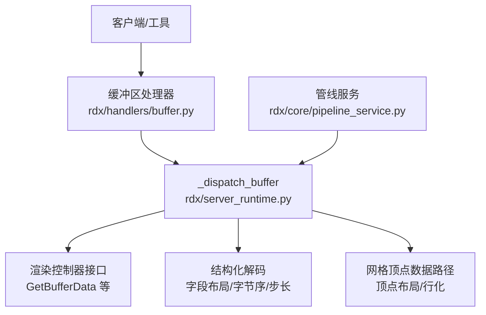
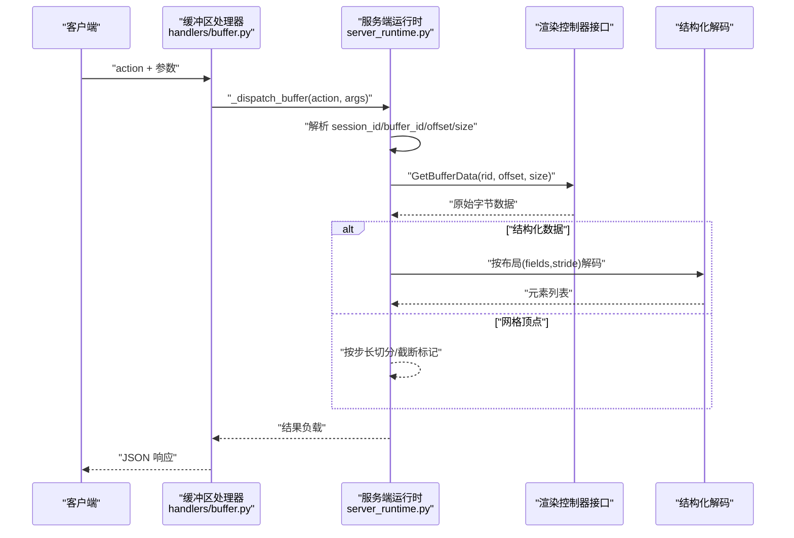
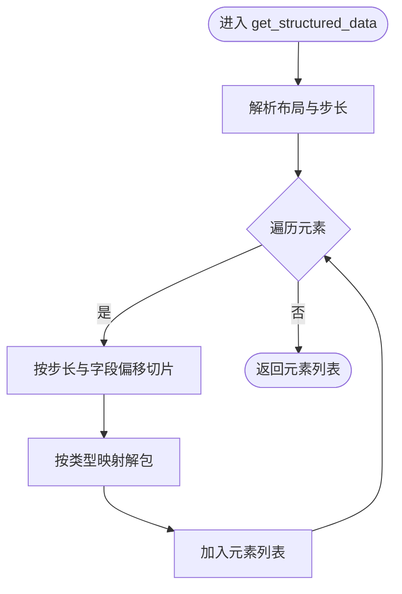
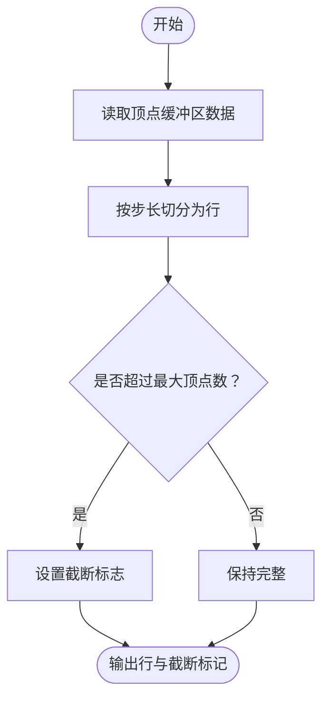
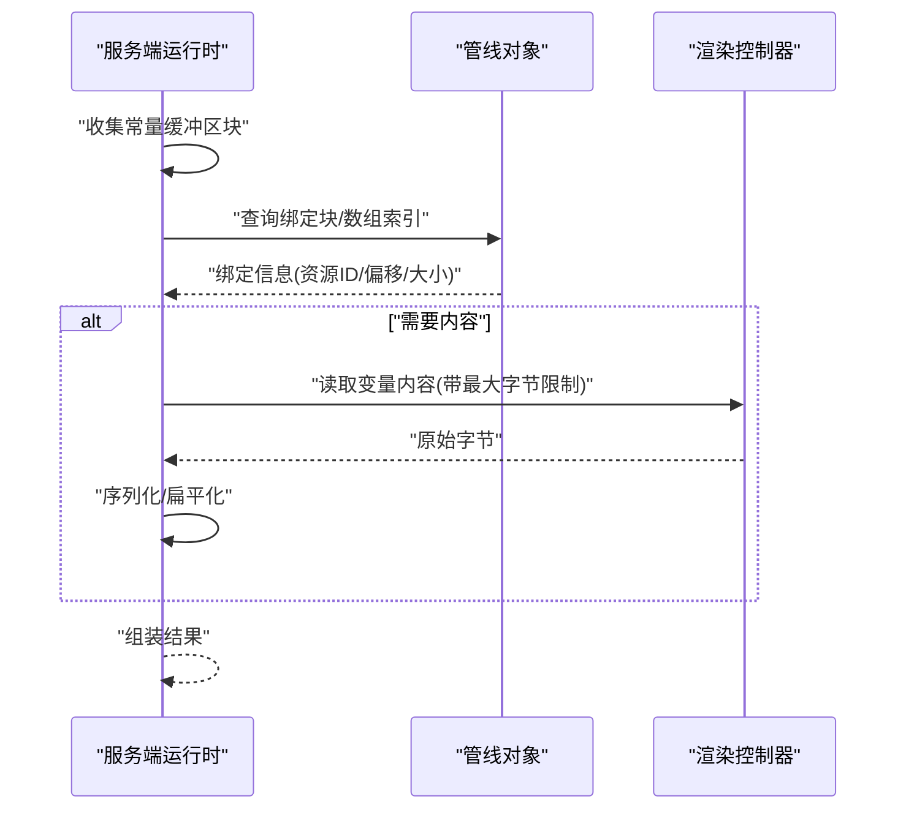
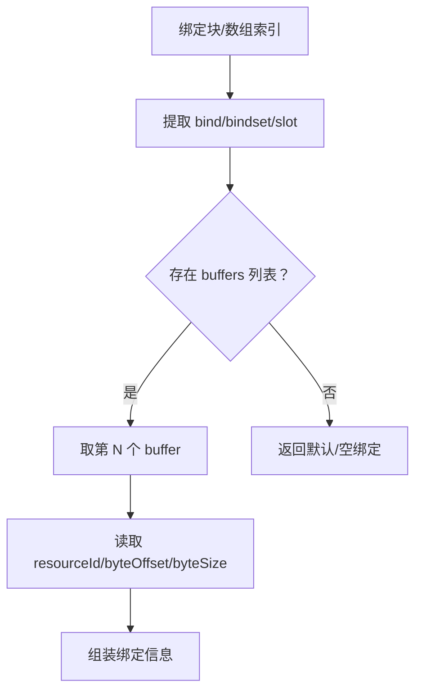
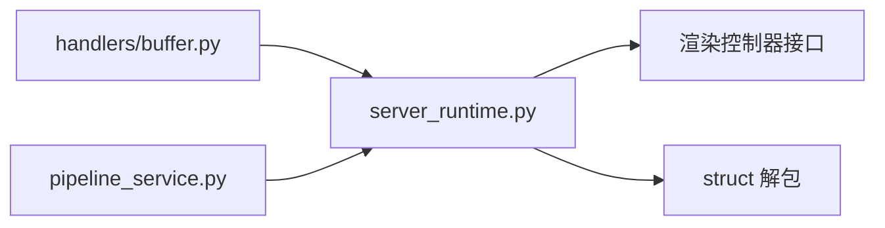

# 缓冲区处理器

<cite>
**本文引用的文件**
- [rdx/handlers/buffer.py](file://rdx/handlers/buffer.py)
- [rdx/server_runtime.py](file://rdx/server_runtime.py)
- [tests/test_texture_and_shader_event_binding.py](file://tests/test_texture_and_shader_event_binding.py)
- [rdx/core/pipeline_service.py](file://rdx/core/pipeline_service.py)
</cite>

## 目录
1. [引言](#引言)
2. [项目结构](#项目结构)
3. [核心组件](#核心组件)
4. [架构总览](#架构总览)
5. [详细组件分析](#详细组件分析)
6. [依赖分析](#依赖分析)
7. [性能考虑](#性能考虑)
8. [故障排查指南](#故障排查指南)
9. [结论](#结论)
10. [附录](#附录)

## 引言
本文件系统性阐述 GPU 缓冲区在该代码库中的数据管理、访问与操作处理机制，覆盖以下主题：
- 缓冲区类型识别、数据布局与内存映射
- 数据读取、写入与同步（异步 offload）流程
- 内容提取、数据转换与格式化输出
- 缓冲区绑定、状态管理与生命周期控制
- 性能优化、内存管理与监控策略

## 项目结构
围绕“缓冲区”能力的关键文件与职责如下：
- rdx/handlers/buffer.py：对外暴露的缓冲区处理入口，转发到服务端运行时
- rdx/server_runtime.py：核心实现，负责资源解析、控制器调用、数据解码与结构化输出
- tests/test_texture_and_shader_event_binding.py：测试用例，验证常量缓冲区内容读取与扁平化
- rdx/core/pipeline_service.py：管线层对描述符绑定信息的采集与导出，支撑缓冲区绑定状态管理

图表来源
- [rdx/handlers/buffer.py:8-9](file://rdx/handlers/buffer.py#L8-L9)
- [rdx/server_runtime.py:8125-8221](file://rdx/server_runtime.py#L8125-L8221)
- [rdx/core/pipeline_service.py:481-513](file://rdx/core/pipeline_service.py#L481-L513)

章节来源
- [rdx/handlers/buffer.py:1-11](file://rdx/handlers/buffer.py#L1-L11)
- [rdx/server_runtime.py:8125-8221](file://rdx/server_runtime.py#L8125-L8221)
- [rdx/core/pipeline_service.py:481-513](file://rdx/core/pipeline_service.py#L481-L513)

## 核心组件
- 处理器入口
  - 将外部 action 与参数转发至服务端运行时的统一调度函数
  - 关键路径：[rdx/handlers/buffer.py:8-9](file://rdx/handlers/buffer.py#L8-L9)
- 统一分发与执行
  - 解析会话与缓冲区资源 ID，计算偏移与大小，通过异步 offload 调用控制器接口读取原始字节
  - 支持多种动作：基础数据读取、结构化解码、查找模式匹配等
  - 关键路径：[rdx/server_runtime.py:8125-8221](file://rdx/server_runtime.py#L8125-L8221)
- 结构化解码引擎
  - 基于布局定义（字段名、类型、偏移、步长）进行字节切片与解包
  - 类型映射覆盖常见整数/浮点/半精度等基础类型
  - 关键路径：[rdx/server_runtime.py:8181-8219](file://rdx/server_runtime.py#L8181-L8219)
- 网格顶点数据路径
  - 针对网格顶点缓冲区，按顶点步长切分，生成行化数据与截断标记
  - 关键路径：[rdx/server_runtime.py:8343-8356](file://rdx/server_runtime.py#L8343-L8356)
- 常量缓冲区绑定与内容读取
  - 从反射信息中收集常量缓冲区块，结合绑定点与数组索引定位实际缓冲区
  - 可选读取变量内容并扁平化为键值对，便于调试与校验
  - 关键路径：[rdx/server_runtime.py:9375-9471](file://rdx/server_runtime.py#L9375-L9471)

章节来源
- [rdx/handlers/buffer.py:8-9](file://rdx/handlers/buffer.py#L8-L9)
- [rdx/server_runtime.py:8125-8221](file://rdx/server_runtime.py#L8125-L8221)
- [rdx/server_runtime.py:8181-8219](file://rdx/server_runtime.py#L8181-L8219)
- [rdx/server_runtime.py:8343-8356](file://rdx/server_runtime.py#L8343-L8356)
- [rdx/server_runtime.py:9375-9471](file://rdx/server_runtime.py#L9375-L9471)

## 架构总览
下图展示从客户端请求到数据返回的完整链路，包括缓冲区读取、结构化解码与网格数据路径。

图表来源
- [rdx/handlers/buffer.py:8-9](file://rdx/handlers/buffer.py#L8-L9)
- [rdx/server_runtime.py:8125-8221](file://rdx/server_runtime.py#L8125-L8221)

## 详细组件分析

### 组件A：缓冲区读取与结构化解码
- 功能要点
  - 读取原始字节：通过控制器接口按资源 ID、偏移与长度拉取数据
  - 结构化解码：依据布局定义（字段名、类型、偏移、步长）逐元素解包
  - 输出格式：元素列表，每个元素包含字段名与对应值；支持最大元素数量限制
- 关键实现位置
  - 读取与分发：[rdx/server_runtime.py:8125-8136](file://rdx/server_runtime.py#L8125-L8136)
  - 结构化解码主循环：[rdx/server_runtime.py:8200-8219](file://rdx/server_runtime.py#L8200-L8219)
- 典型使用场景
  - 顶点属性读取：指定布局与步长，返回每条记录的字段值
  - 常量缓冲区变量读取：结合绑定信息与最大字节数限制，避免过大内容阻塞

图表来源
- [rdx/server_runtime.py:8181-8219](file://rdx/server_runtime.py#L8181-L8219)

章节来源
- [rdx/server_runtime.py:8125-8221](file://rdx/server_runtime.py#L8125-L8221)
- [rdx/server_runtime.py:8181-8219](file://rdx/server_runtime.py#L8181-L8219)

### 组件B：网格顶点数据路径
- 功能要点
  - 按顶点步长切分原始字节，生成“行”表示的顶点数据
  - 计算截断标记：当最大顶点数限制导致裁剪时，返回 truncated 标志
- 关键实现位置
  - 读取与行化：[rdx/server_runtime.py:8343-8356](file://rdx/server_runtime.py#L8343-L8356)

图表来源
- [rdx/server_runtime.py:8343-8356](file://rdx/server_runtime.py#L8343-L8356)

章节来源
- [rdx/server_runtime.py:8343-8356](file://rdx/server_runtime.py#L8343-L8356)

### 组件C：常量缓冲区绑定与内容读取
- 功能要点
  - 从着色器反射信息中枚举常量缓冲区块，结合绑定点与数组索引定位实际资源
  - 可选读取变量内容，并将多维结构扁平化为键值对，便于调试
  - 支持最大字节限制，避免一次性读取过大内容
- 关键实现位置
  - 绑定信息提取：[rdx/server_runtime.py:9375-9471](file://rdx/server_runtime.py#L9375-L9471)
  - 测试用例验证：[tests/test_texture_and_shader_event_binding.py:226-243](file://tests/test_texture_and_shader_event_binding.py#L226-L243)

图表来源
- [rdx/server_runtime.py:9375-9471](file://rdx/server_runtime.py#L9375-L9471)

章节来源
- [rdx/server_runtime.py:9375-9471](file://rdx/server_runtime.py#L9375-L9471)
- [tests/test_texture_and_shader_event_binding.py:226-243](file://tests/test_texture_and_shader_event_binding.py#L226-L243)

### 组件D：缓冲区绑定与状态管理
- 功能要点
  - 从管线快照或反射信息中提取绑定点、集/空间、槽位与资源 ID
  - 支持数组索引与空资源检测，确保后续读取安全
- 关键实现位置
  - 绑定信息提取：[rdx/server_runtime.py:9343-9372](file://rdx/server_runtime.py#L9343-L9372)
  - 描述符绑定采集（管线层）：[rdx/core/pipeline_service.py:481-513](file://rdx/core/pipeline_service.py#L481-L513)

图表来源
- [rdx/server_runtime.py:9343-9372](file://rdx/server_runtime.py#L9343-L9372)
- [rdx/core/pipeline_service.py:481-513](file://rdx/core/pipeline_service.py#L481-L513)

章节来源
- [rdx/server_runtime.py:9343-9372](file://rdx/server_runtime.py#L9343-L9372)
- [rdx/core/pipeline_service.py:481-513](file://rdx/core/pipeline_service.py#L481-L513)

## 依赖分析
- 组件耦合
  - 处理器层仅负责转发，降低与具体实现的耦合度
  - 运行时层承担资源解析、控制器调用与数据转换，内聚性高
- 外部依赖
  - 渲染控制器接口（如 GetBufferData、GetCBufferVariableContents）由上层提供
  - Python 标准库 struct 用于字节解包
- 循环依赖
  - 未见直接循环依赖；各模块职责清晰

图表来源
- [rdx/handlers/buffer.py:8-9](file://rdx/handlers/buffer.py#L8-L9)
- [rdx/server_runtime.py:8125-8221](file://rdx/server_runtime.py#L8125-L8221)
- [rdx/core/pipeline_service.py:481-513](file://rdx/core/pipeline_service.py#L481-L513)

章节来源
- [rdx/handlers/buffer.py:8-9](file://rdx/handlers/buffer.py#L8-L9)
- [rdx/server_runtime.py:8125-8221](file://rdx/server_runtime.py#L8125-L8221)
- [rdx/core/pipeline_service.py:481-513](file://rdx/core/pipeline_service.py#L481-L513)

## 性能考虑
- 异步 offload
  - 通过异步调用控制器接口，避免阻塞主线程，提升吞吐
  - 关键路径：[rdx/server_runtime.py:8086](file://rdx/server_runtime.py#L8086)、[rdx/server_runtime.py:8136](file://rdx/server_runtime.py#L8136)
- 分页与上限
  - 结构化解码与网格读取均支持最大元素/字节限制，防止大缓冲区拖垮响应
  - 关键路径：[rdx/server_runtime.py:8188-8189](file://rdx/server_runtime.py#L8188-L8189)、[rdx/server_runtime.py:9438-9440](file://rdx/server_runtime.py#L9438-L9440)
- 字节序与类型映射
  - 使用紧凑小端格式映射常见类型，减少转换开销
  - 关键路径：[rdx/server_runtime.py:8191-8199](file://rdx/server_runtime.py#L8191-L8199)
- 绑定信息复用
  - 在管线层提前采集绑定信息，避免重复查询
  - 关键路径：[rdx/core/pipeline_service.py:481-513](file://rdx/core/pipeline_service.py#L481-L513)

## 故障排查指南
- 常见问题与定位
  - 读取为空或截断：检查 size/offset 是否越界，确认 max_elements/max_bytes 设置
    - 参考路径：[rdx/server_runtime.py:8133-8135](file://rdx/server_runtime.py#L8133-L8135)、[rdx/server_runtime.py:8188-8189](file://rdx/server_runtime.py#L8188-L8189)
  - 结构化解码字段缺失：确认布局字段定义与步长正确
    - 参考路径：[rdx/server_runtime.py:8206-8217](file://rdx/server_runtime.py#L8206-L8217)
  - 常量缓冲区内容为空：检查绑定资源 ID、偏移与大小，以及最大字节限制
    - 参考路径：[rdx/server_runtime.py:9432-9452](file://rdx/server_runtime.py#L9432-L9452)
- 单元测试参考
  - 验证常量缓冲区内容读取与扁平化输出
  - 参考路径：[tests/test_texture_and_shader_event_binding.py:226-243](file://tests/test_texture_and_shader_event_binding.py#L226-L243)

章节来源
- [rdx/server_runtime.py:8133-8135](file://rdx/server_runtime.py#L8133-L8135)
- [rdx/server_runtime.py:8188-8189](file://rdx/server_runtime.py#L8188-L8189)
- [rdx/server_runtime.py:8206-8217](file://rdx/server_runtime.py#L8206-L8217)
- [rdx/server_runtime.py:9432-9452](file://rdx/server_runtime.py#L9432-L9452)
- [tests/test_texture_and_shader_event_binding.py:226-243](file://tests/test_texture_and_shader_event_binding.py#L226-L243)

## 结论
该缓冲区处理器以“统一调度 + 结构化解码 + 网格专用路径 + 绑定状态管理”为核心，实现了对 GPU 缓冲区的高效读取、解析与输出。通过异步 offload、分页与上限控制、紧凑字节序映射与绑定信息复用，兼顾了性能与稳定性。配合测试用例与管线层采集，可满足从调试到导出的全链路需求。

## 附录
- 实际代码示例（以路径代替代码）
  - 读取缓冲区原始数据并按布局解码
    - 示例路径：[rdx/server_runtime.py:8125-8219](file://rdx/server_runtime.py#L8125-L8219)
  - 读取网格顶点数据并生成行化输出
    - 示例路径：[rdx/server_runtime.py:8343-8356](file://rdx/server_runtime.py#L8343-L8356)
  - 读取常量缓冲区内容并扁平化
    - 示例路径：[rdx/server_runtime.py:9432-9462](file://rdx/server_runtime.py#L9432-L9462)
  - 获取缓冲区绑定信息
    - 示例路径：[rdx/server_runtime.py:9343-9372](file://rdx/server_runtime.py#L9343-L9372)