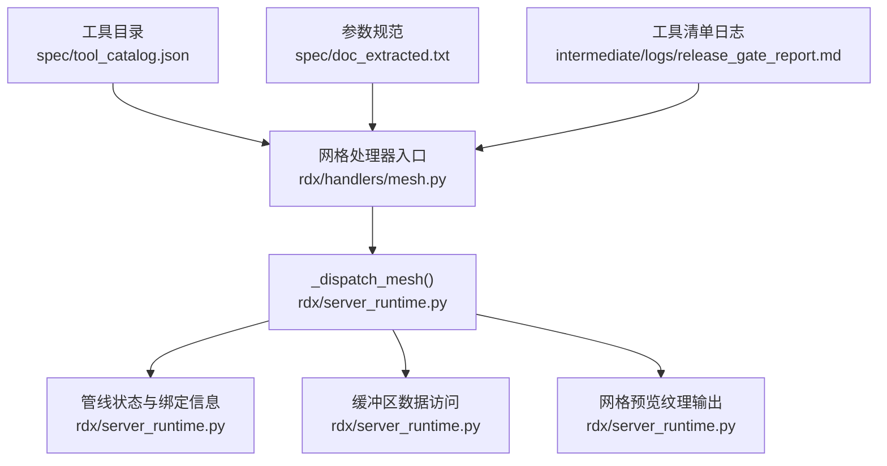
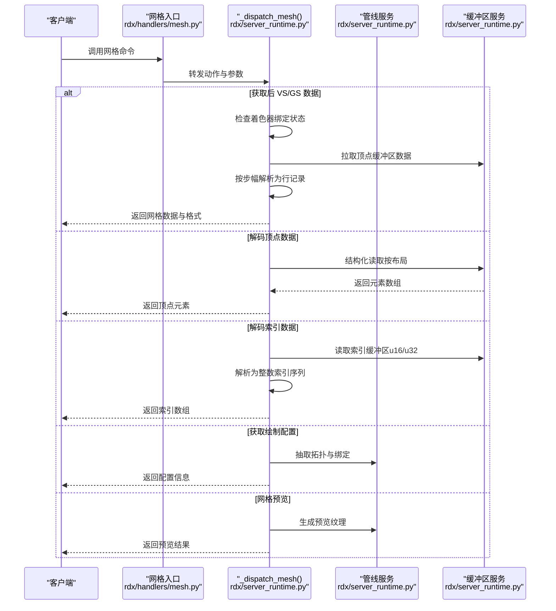
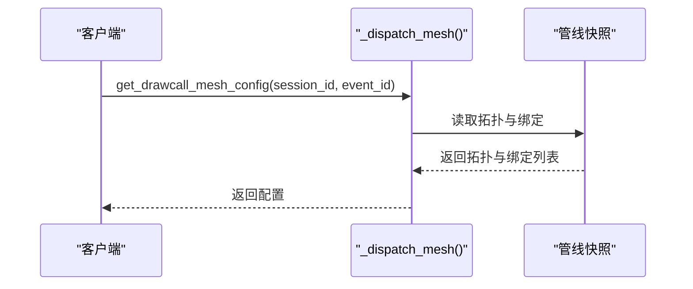
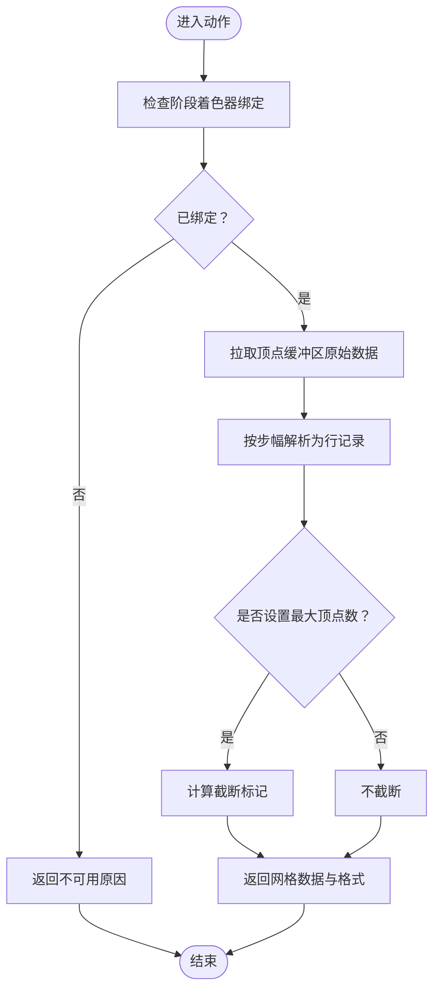
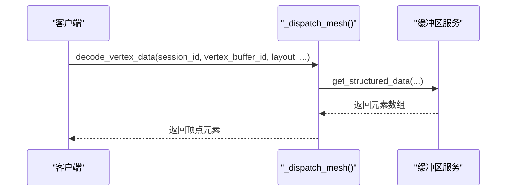
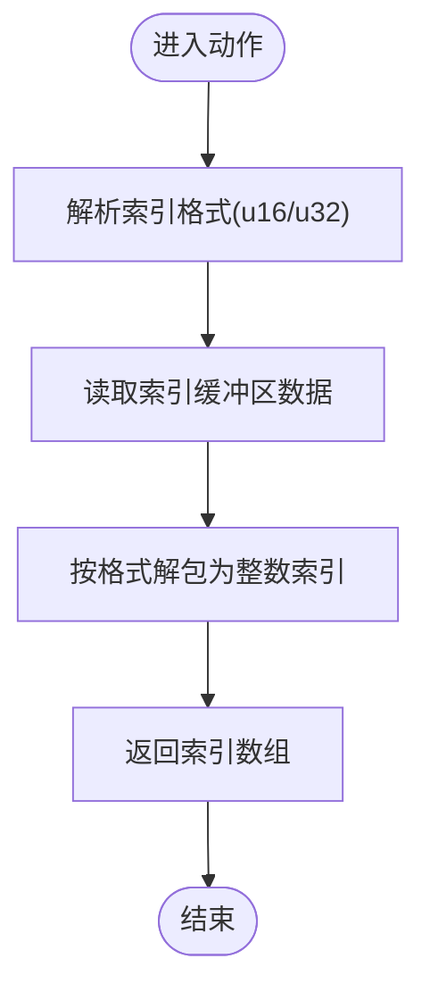
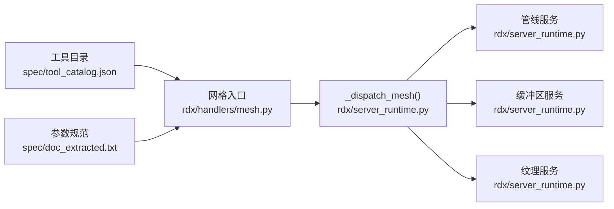

# 网格处理器

<cite>
**本文引用的文件**
- [rdx/handlers/mesh.py](file://rdx/handlers/mesh.py)
- [rdx/server_runtime.py](file://rdx/server_runtime.py)
- [spec/tool_catalog.json](file://spec/tool_catalog.json)
- [spec/doc_extracted.txt](file://spec/doc_extracted.txt)
- [intermediate/logs/release_gate_report.md](file://intermediate/logs/release_gate_report.md)
</cite>

## 目录
1. [简介](#简介)
2. [项目结构](#项目结构)
3. [核心组件](#核心组件)
4. [架构总览](#架构总览)
5. [详细组件分析](#详细组件分析)
6. [依赖分析](#依赖分析)
7. [性能考虑](#性能考虑)
8. [故障排查指南](#故障排查指南)
9. [结论](#结论)
10. [附录](#附录)

## 简介
本文件系统性梳理网格处理器在工具链中的职责与实现，覆盖以下主题：
- 网格数据的采集、解码与结构化输出：包括顶点缓冲区解码、索引数据解码、绘制配置获取与预览生成。
- 拓扑结构与资源绑定：从管线快照中抽取拓扑类型、顶点输入布局与绑定信息。
- 数据处理流程：从捕获事件中提取后顶点着色器/几何着色器阶段的顶点数据，按步幅解析为行记录，并支持截断控制。
- 工具接口：通过统一的调度入口暴露一组 mesh 相关命令，便于外部调用与集成。

## 项目结构
网格处理器位于运行时服务层，对外通过 handler 将请求转发到运行时分发函数，再由运行时根据动作名执行具体逻辑。关键文件如下：
- rdx/handlers/mesh.py：网格相关命令的入口分发，直接委托给运行时分发函数。
- rdx/server_runtime.py：网格处理的核心实现，包含多种 mesh 动作（如获取绘制配置、获取后 VS/GS 数据、解码顶点/索引数据、生成网格预览等）。
- spec/tool_catalog.json 与 spec/doc_extracted.txt：工具目录与参数规范，用于描述可用的 mesh 命令及其参数。
- intermediate/logs/release_gate_report.md：包含工具清单与调用路径的参考日志。

**图表来源**
- [rdx/handlers/mesh.py:1-11](file://rdx/handlers/mesh.py#L1-L11)
- [rdx/server_runtime.py:8279-8401](file://rdx/server_runtime.py#L8279-L8401)

**章节来源**
- [rdx/handlers/mesh.py:1-11](file://rdx/handlers/mesh.py#L1-L11)
- [rdx/server_runtime.py:8279-8401](file://rdx/server_runtime.py#L8279-L8401)
- [spec/tool_catalog.json](file://spec/tool_catalog.json)
- [spec/doc_extracted.txt](file://spec/doc_extracted.txt)
- [intermediate/logs/release_gate_report.md](file://intermediate/logs/release_gate_report.md)

## 核心组件
- 网格处理器入口：负责接收动作名与参数，统一转交给运行时分发函数。
- 运行时分发函数：根据动作名执行不同网格处理逻辑，包括：
  - 获取绘制配置：返回拓扑与绑定列表。
  - 获取后 VS/GS 数据：拉取顶点缓冲区并按步幅解析为行记录。
  - 解码顶点数据：基于布局定义从结构化缓冲区读取元素。
  - 解码索引数据：按 u16/u32 格式解析索引缓冲区。
  - 生成网格预览：将网格渲染结果作为纹理输出。
- 工具目录与文档：提供命令名称、参数签名与默认值等元信息，便于自动化与脚本集成。

**章节来源**
- [rdx/handlers/mesh.py:8-9](file://rdx/handlers/mesh.py#L8-L9)
- [rdx/server_runtime.py:8279-8401](file://rdx/server_runtime.py#L8279-L8401)
- [spec/tool_catalog.json](file://spec/tool_catalog.json)
- [spec/doc_extracted.txt](file://spec/doc_extracted.txt)

## 架构总览
网格处理的端到端流程如下：
- 客户端调用网格命令（如获取后 VS 数据、解码顶点数据等）。
- 入口 handler 将请求转发至运行时分发函数。
- 分发函数根据动作名选择对应处理分支：
  - 若为“获取后 VS/GS 数据”，则先检查是否已绑定相应阶段的着色器；若未绑定，则返回不可用原因；否则拉取顶点缓冲区数据并按步幅解析。
  - 若为“解码顶点数据”，则委托缓冲区模块按布局定义读取结构化数据。
  - 若为“解码索引数据”，则按指定格式（u16/u32）解析索引缓冲区。
  - 若为“获取绘制配置”，则从管线快照中抽取拓扑与绑定信息。
  - 若为“网格预览”，则生成预览纹理并返回。
- 所有分支最终以统一的响应格式返回结果，包含成功标志、数据与可选的错误详情。

**图表来源**
- [rdx/handlers/mesh.py:8-9](file://rdx/handlers/mesh.py#L8-L9)
- [rdx/server_runtime.py:8279-8401](file://rdx/server_runtime.py#L8279-L8401)

## 详细组件分析

### 组件一：绘制配置获取（get_drawcall_mesh_config）
- 功能：从管线快照中获取当前绘制事件的拓扑类型与顶点输入绑定列表，供后续网格处理使用。
- 关键点：
  - 需要会话 ID 与事件 ID。
  - 返回拓扑字符串与绑定项列表，绑定项包含资源 ID、偏移、步幅等。
- 复杂度：O(B)，B 为绑定数量（通常较小）。

**图表来源**
- [rdx/server_runtime.py:8279-8286](file://rdx/server_runtime.py#L8279-L8286)

**章节来源**
- [rdx/server_runtime.py:8279-8286](file://rdx/server_runtime.py#L8279-L8286)

### 组件二：后处理网格数据获取（get_post_vs_data / get_post_gs_data）
- 功能：获取经过顶点/几何着色器阶段后的顶点数据，按步幅解析为行记录，并支持最大顶点数限制。
- 关键点：
  - 需要会话 ID；可选事件 ID、实例索引、视图索引与最大顶点数。
  - 若目标阶段未绑定着色器或资源为空，则返回不可用原因。
  - 成功时返回网格格式信息、行记录、顶点计数与截断标记。
- 处理流程：
  - 检查着色器绑定状态。
  - 拉取顶点缓冲区原始字节。
  - 按步幅切片并生成行记录。
  - 计算截断标记（当显式限制最大顶点数时）。

**图表来源**
- [rdx/server_runtime.py:8287-8356](file://rdx/server_runtime.py#L8287-L8356)

**章节来源**
- [rdx/server_runtime.py:8287-8356](file://rdx/server_runtime.py#L8287-L8356)

### 组件三：顶点数据解码（decode_vertex_data）
- 功能：基于布局定义从顶点缓冲区读取结构化元素，返回顶点字段的结构化数组。
- 关键点：
  - 需要会话 ID、顶点缓冲区 ID 与布局定义（含步幅与属性列表）。
  - 支持偏移、顶点数量与最大元素数控制。
  - 成功时返回元素数组；失败时透传底层错误。
- 复杂度：O(N)，N 为读取的元素数量。

**图表来源**
- [rdx/server_runtime.py:8357-8373](file://rdx/server_runtime.py#L8357-L8373)

**章节来源**
- [rdx/server_runtime.py:8357-8373](file://rdx/server_runtime.py#L8357-L8373)

### 组件四：索引数据解码（decode_index_data）
- 功能：从索引缓冲区读取索引数据，支持 u16 与 u32 两种格式。
- 关键点：
  - 需要会话 ID 与索引缓冲区 ID；可选格式（默认 u32）、索引数量、偏移与最大读取长度。
  - 成功时返回索引整数数组；失败时返回底层错误。
- 复杂度：O(K)，K 为索引数量。

**图表来源**
- [rdx/server_runtime.py:8374-8401](file://rdx/server_runtime.py#L8374-L8401)

**章节来源**
- [rdx/server_runtime.py:8374-8401](file://rdx/server_runtime.py#L8374-L8401)

### 组件五：网格预览（get_mesh_preview）
- 功能：生成网格的可视化预览纹理，便于调试与展示。
- 关键点：
  - 需要会话 ID 与事件 ID。
  - 内部可能涉及管线状态、渲染目标与着色器组合的协调。
- 输出：预览纹理资源或相关标识。

**章节来源**
- [rdx/server_runtime.py:8402-8401](file://rdx/server_runtime.py#L8402-L8401)

## 依赖分析
- 入口依赖：网格入口仅依赖运行时分发函数，耦合度低，便于扩展新动作。
- 运行时依赖：分发函数依赖管线服务（获取拓扑与绑定）、缓冲区服务（读取原始数据与结构化数据）与纹理服务（生成预览）。
- 工具目录与文档：提供命令与参数的权威说明，确保调用一致性与可维护性。

**图表来源**
- [rdx/handlers/mesh.py:8-9](file://rdx/handlers/mesh.py#L8-L9)
- [rdx/server_runtime.py:8279-8401](file://rdx/server_runtime.py#L8279-L8401)
- [spec/tool_catalog.json](file://spec/tool_catalog.json)
- [spec/doc_extracted.txt](file://spec/doc_extracted.txt)

**章节来源**
- [rdx/handlers/mesh.py:8-9](file://rdx/handlers/mesh.py#L8-L9)
- [rdx/server_runtime.py:8279-8401](file://rdx/server_runtime.py#L8279-L8401)
- [spec/tool_catalog.json](file://spec/tool_catalog.json)
- [spec/doc_extracted.txt](file://spec/doc_extracted.txt)

## 性能考虑
- 步幅解析与截断：按步幅解析顶点数据时，建议合理设置最大顶点数以避免过大数据集带来的内存与传输压力。
- 格式选择：索引数据解码时优先使用合适的数据类型（u16/u32），减少带宽与内存占用。
- 结构化读取：顶点数据解码采用布局驱动，避免逐字段硬编码带来的重复工作量与错误风险。
- 预览生成：网格预览可能涉及额外的渲染开销，建议在调试场景中按需启用。

## 故障排查指南
- 后 VS/GS 数据不可用：
  - 检查目标阶段是否已绑定着色器；若未绑定，将返回明确的不可用原因。
  - 确认事件 ID 与实例/视图索引正确。
- 顶点/索引数据为空：
  - 检查缓冲区 ID 是否有效且非空资源。
  - 确认偏移与大小参数是否越界。
- 结构化解码失败：
  - 检查布局定义是否与实际缓冲区一致（步幅、属性偏移与格式）。
  - 确认读取范围内的数据完整性。
- 预览生成异常：
  - 检查渲染目标与着色器状态是否满足预览需求。

**章节来源**
- [rdx/server_runtime.py:8308-8341](file://rdx/server_runtime.py#L8308-L8341)
- [rdx/server_runtime.py:8357-8373](file://rdx/server_runtime.py#L8357-L8373)
- [rdx/server_runtime.py:8374-8401](file://rdx/server_runtime.py#L8374-L8401)

## 结论
网格处理器通过统一的入口与分发机制，实现了对后处理网格数据、顶点/索引解码以及网格预览的完整支持。其设计具备良好的可扩展性与可维护性，能够满足从调试到分析的多样化需求。建议在实际使用中结合工具目录与参数规范，确保命令调用的一致性与稳定性。

## 附录

### 常用命令与参数速览
- 获取绘制配置：get_drawcall_mesh_config
  - 参数：session_id, event_id
  - 返回：拓扑与绑定列表
- 获取后 VS 数据：get_post_vs_data
  - 参数：session_id, [event_id], [instance], [view_index], [max_vertices]
  - 返回：网格格式、行记录、顶点计数与截断标记
- 获取后 GS 数据：get_post_gs_data
  - 参数：session_id, [event_id], [instance], [view_index], [max_vertices]
  - 返回：网格格式、行记录、顶点计数与截断标记
- 解码顶点数据：decode_vertex_data
  - 参数：session_id, vertex_buffer_id, layout, [vertex_offset], [vertex_count], [base_vertex]
  - 返回：顶点元素数组
- 解码索引数据：decode_index_data
  - 参数：session_id, index_buffer_id, [format], [index_count], [index_offset]
  - 返回：索引数组
- 网格预览：get_mesh_preview
  - 参数：session_id, event_id
  - 返回：预览纹理

**章节来源**
- [spec/tool_catalog.json](file://spec/tool_catalog.json)
- [spec/doc_extracted.txt](file://spec/doc_extracted.txt)
- [intermediate/logs/release_gate_report.md](file://intermediate/logs/release_gate_report.md)