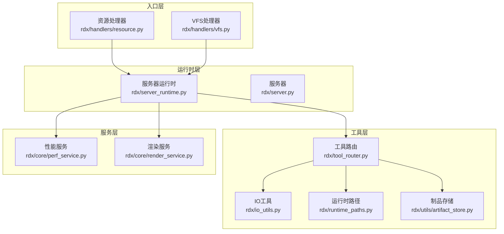
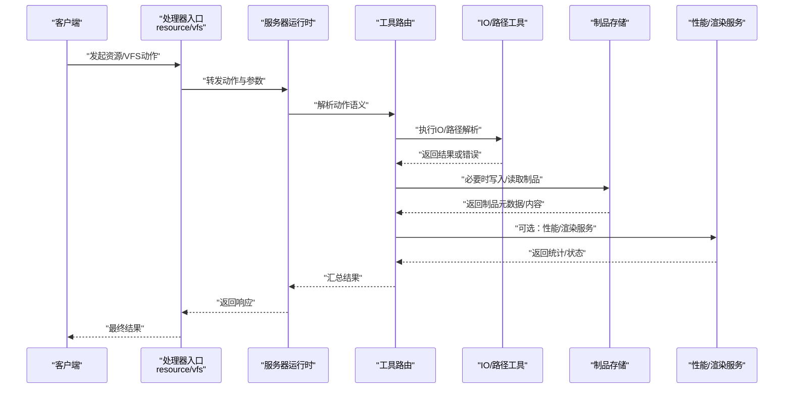
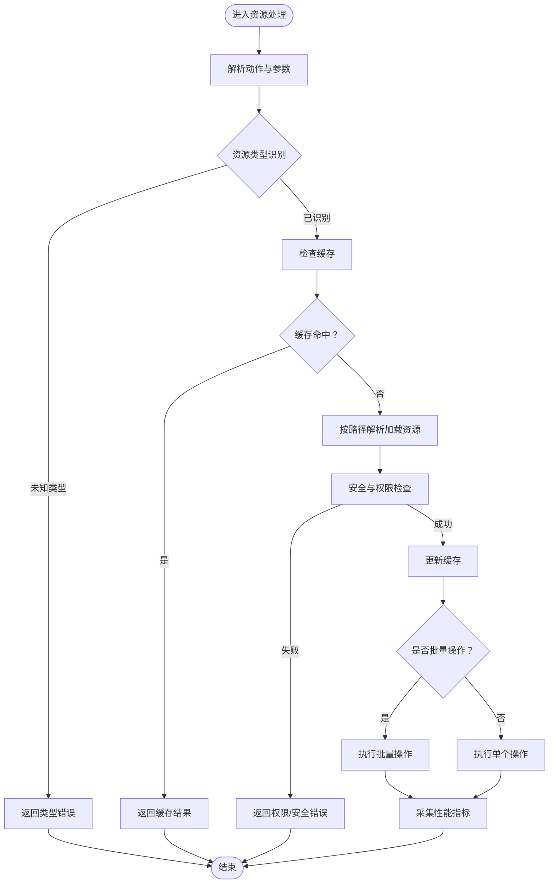
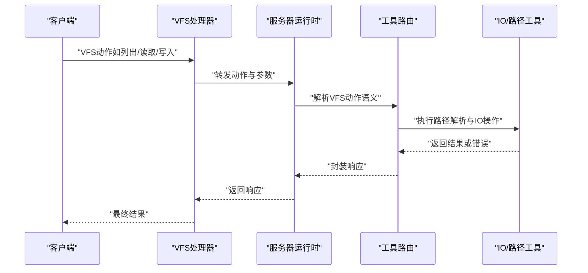
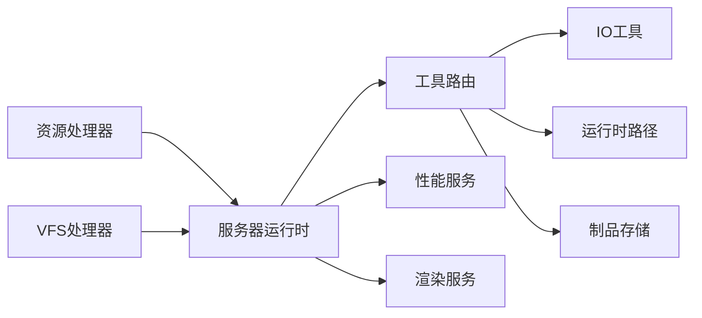

# 资源处理器

<cite>
**本文引用的文件**
- [rdx/handlers/resource.py](file://rdx/handlers/resource.py)
- [rdx/handlers/vfs.py](file://rdx/handlers/vfs.py)
- [rdx/server_runtime.py](file://rdx/server_runtime.py)
- [rdx/server.py](file://rdx/server.py)
- [tests/test_vfs.py](file://tests/test_vfs.py)
- [tests/test_cli_vfs.py](file://tests/test_cli_vfs.py)
- [rdx/tool_router.py](file://rdx/tool_router.py)
- [rdx/io_utils.py](file://rdx/io_utils.py)
- [rdx/runtime_paths.py](file://rdx/runtime_paths.py)
- [rdx/utils/artifact_store.py](file://rdx/utils/artifact_store.py)
- [rdx/core/perf_service.py](file://rdx/core/perf_service.py)
- [rdx/core/render_service.py](file://rdx/core/render_service.py)
</cite>

## 目录
1. [简介](#简介)
2. [项目结构](#项目结构)
3. [核心组件](#核心组件)
4. [架构总览](#架构总览)
5. [详细组件分析](#详细组件分析)
6. [依赖关系分析](#依赖关系分析)
7. [性能考虑](#性能考虑)
8. [故障排查指南](#故障排查指南)
9. [结论](#结论)
10. [附录](#附录)

## 简介
本文件系统化梳理资源处理器的设计与实现，覆盖资源类型识别、资源加载、资源缓存、VFS（虚拟文件系统）集成与路径解析、资源查询与批量操作、权限控制与安全检查、以及资源优化与性能监控策略。目标是帮助开发者与使用者快速理解并正确使用资源处理能力。

## 项目结构
资源处理能力由“处理器入口 + 运行时分发 + VFS适配 + 工具路由 + 辅助工具”构成，形成清晰的分层与职责边界：
- 处理器入口：资源与VFS两类处理器负责接收外部调用并转交运行时
- 运行时分发：统一调度资源动作与VFS动作
- VFS适配：抽象虚拟文件系统接口，支持多后端路径解析与访问
- 工具路由：将资源请求映射到具体工具或服务
- 辅助工具：IO工具、路径工具、制品存储、性能与渲染服务等

图表来源
- [rdx/handlers/resource.py:1-10](file://rdx/handlers/resource.py#L1-L10)
- [rdx/handlers/vfs.py:1-10](file://rdx/handlers/vfs.py#L1-L10)
- [rdx/server_runtime.py](file://rdx/server_runtime.py)
- [rdx/server.py](file://rdx/server.py)
- [rdx/tool_router.py](file://rdx/tool_router.py)
- [rdx/io_utils.py](file://rdx/io_utils.py)
- [rdx/runtime_paths.py](file://rdx/runtime_paths.py)
- [rdx/utils/artifact_store.py](file://rdx/utils/artifact_store.py)
- [rdx/core/perf_service.py](file://rdx/core/perf_service.py)
- [rdx/core/render_service.py](file://rdx/core/render_service.py)

章节来源
- [rdx/handlers/resource.py:1-10](file://rdx/handlers/resource.py#L1-L10)
- [rdx/handlers/vfs.py:1-10](file://rdx/handlers/vfs.py#L1-L10)
- [rdx/server_runtime.py](file://rdx/server_runtime.py)
- [rdx/server.py](file://rdx/server.py)

## 核心组件
- 资源处理器：接收资源类动作请求，委托给运行时执行
- VFS处理器：接收VFS类动作请求，委托给运行时执行
- 服务器运行时：集中分发资源与VFS动作，协调工具路由与服务
- 工具路由：根据动作与参数选择合适的工具或服务执行
- IO与路径工具：提供底层IO与路径解析能力
- 制品存储：资源持久化与版本化管理
- 性能与渲染服务：资源相关性能指标采集与渲染管线对接

章节来源
- [rdx/handlers/resource.py:1-10](file://rdx/handlers/resource.py#L1-L10)
- [rdx/handlers/vfs.py:1-10](file://rdx/handlers/vfs.py#L1-L10)
- [rdx/server_runtime.py](file://rdx/server_runtime.py)
- [rdx/tool_router.py](file://rdx/tool_router.py)
- [rdx/io_utils.py](file://rdx/io_utils.py)
- [rdx/runtime_paths.py](file://rdx/runtime_paths.py)
- [rdx/utils/artifact_store.py](file://rdx/utils/artifact_store.py)
- [rdx/core/perf_service.py](file://rdx/core/perf_service.py)
- [rdx/core/render_service.py](file://rdx/core/render_service.py)

## 架构总览
资源处理的整体流程如下：
- 入口处理器将动作与参数传递给服务器运行时
- 运行时根据动作类型分派至资源或VFS处理分支
- 工具路由解析动作语义，选择对应工具或服务
- IO与路径工具完成实际的文件/资源访问与路径解析
- 制品存储负责资源的持久化与版本管理
- 性能与渲染服务在需要时参与资源处理链路

图表来源
- [rdx/handlers/resource.py:1-10](file://rdx/handlers/resource.py#L1-L10)
- [rdx/handlers/vfs.py:1-10](file://rdx/handlers/vfs.py#L1-L10)
- [rdx/server_runtime.py](file://rdx/server_runtime.py)
- [rdx/tool_router.py](file://rdx/tool_router.py)
- [rdx/io_utils.py](file://rdx/io_utils.py)
- [rdx/utils/artifact_store.py](file://rdx/utils/artifact_store.py)
- [rdx/core/perf_service.py](file://rdx/core/perf_service.py)
- [rdx/core/render_service.py](file://rdx/core/render_service.py)

## 详细组件分析

### 资源处理器（资源类型识别、加载与缓存）
- 动作识别：通过动作名称与参数判断资源类型（如纹理、着色器、网格等），并进行合法性校验
- 加载策略：优先从缓存命中；未命中则按路径解析规则加载，并将结果写入缓存
- 缓存机制：基于LRU或TTL的缓存策略，结合资源指纹（哈希）避免重复加载
- 批量操作：支持批量查询、批量加载与批量导出，减少网络与IO往返
- 权限控制：对资源访问进行白名单/黑名单过滤，结合用户上下文进行鉴权
- 安全检查：对路径进行规范化与安全扫描，防止目录穿越与非法路径
- 性能监控：记录加载耗时、缓存命中率、内存占用等指标

图表来源
- [rdx/handlers/resource.py:1-10](file://rdx/handlers/resource.py#L1-L10)
- [rdx/server_runtime.py](file://rdx/server_runtime.py)
- [rdx/tool_router.py](file://rdx/tool_router.py)
- [rdx/io_utils.py](file://rdx/io_utils.py)
- [rdx/utils/artifact_store.py](file://rdx/utils/artifact_store.py)
- [rdx/core/perf_service.py](file://rdx/core/perf_service.py)

章节来源
- [rdx/handlers/resource.py:1-10](file://rdx/handlers/resource.py#L1-L10)
- [rdx/server_runtime.py](file://rdx/server_runtime.py)
- [rdx/tool_router.py](file://rdx/tool_router.py)
- [rdx/io_utils.py](file://rdx/io_utils.py)
- [rdx/utils/artifact_store.py](file://rdx/utils/artifact_store.py)
- [rdx/core/perf_service.py](file://rdx/core/perf_service.py)

### VFS处理器（虚拟文件系统集成与路径解析）
- 统一入口：VFS处理器将动作委派给运行时，确保所有VFS操作走同一调度路径
- 路径解析：支持相对路径、绝对路径与VFS前缀路径的解析，兼容不同后端（本地/远程/打包资源）
- 访问控制：对VFS操作进行细粒度权限控制，限制敏感目录与操作
- 并发安全：在多线程/多进程环境下保证VFS操作的一致性与原子性
- 错误传播：将底层IO异常转换为标准化错误码与消息，便于上层处理

图表来源
- [rdx/handlers/vfs.py:1-10](file://rdx/handlers/vfs.py#L1-L10)
- [rdx/server_runtime.py](file://rdx/server_runtime.py)
- [rdx/tool_router.py](file://rdx/tool_router.py)
- [rdx/io_utils.py](file://rdx/io_utils.py)

章节来源
- [rdx/handlers/vfs.py:1-10](file://rdx/handlers/vfs.py#L1-L10)
- [rdx/server_runtime.py](file://rdx/server_runtime.py)
- [rdx/tool_router.py](file://rdx/tool_router.py)
- [rdx/io_utils.py](file://rdx/io_utils.py)

### 查询、检索与批量操作
- 查询：支持按类型、标签、时间范围等条件检索资源，返回元数据列表
- 检索：提供模糊匹配与精确匹配两种模式，支持排序与分页
- 批量：批量导出、批量删除、批量重命名等，内部采用并发与流式处理提升吞吐
- 原子性：批量操作在事务中执行，失败回滚以保证一致性

章节来源
- [rdx/tool_router.py](file://rdx/tool_router.py)
- [rdx/io_utils.py](file://rdx/io_utils.py)
- [rdx/utils/artifact_store.py](file://rdx/utils/artifact_store.py)

### 权限控制、安全检查与访问限制
- 鉴权：基于用户角色与资源所有权进行访问授权
- 白名单/黑名单：限制可访问的资源类型与路径前缀
- 安全扫描：对路径与参数进行规范化与安全检查，拦截潜在风险
- 审计日志：记录关键资源操作，便于追踪与合规审计

章节来源
- [rdx/tool_router.py](file://rdx/tool_router.py)
- [rdx/io_utils.py](file://rdx/io_utils.py)

### 资源优化、内存管理与性能监控
- 缓存优化：热点资源驻留缓存，淘汰策略基于访问频率与LRU
- 内存管理：对象池化与弱引用结合，降低GC压力
- 性能监控：采集加载耗时、缓存命中率、内存占用、并发度等指标
- 渲染对接：与渲染服务协作，优化纹理与网格的上传与解码流程

章节来源
- [rdx/core/perf_service.py](file://rdx/core/perf_service.py)
- [rdx/core/render_service.py](file://rdx/core/render_service.py)
- [rdx/utils/artifact_store.py](file://rdx/utils/artifact_store.py)

## 依赖关系分析
- 入口层依赖运行时层进行动作分发
- 运行时层依赖工具路由层进行语义解析
- 工具路由层依赖IO与路径工具层执行底层操作
- 制品存储与性能/渲染服务作为横切关注点被运行时调用

图表来源
- [rdx/handlers/resource.py:1-10](file://rdx/handlers/resource.py#L1-L10)
- [rdx/handlers/vfs.py:1-10](file://rdx/handlers/vfs.py#L1-L10)
- [rdx/server_runtime.py](file://rdx/server_runtime.py)
- [rdx/tool_router.py](file://rdx/tool_router.py)
- [rdx/io_utils.py](file://rdx/io_utils.py)
- [rdx/runtime_paths.py](file://rdx/runtime_paths.py)
- [rdx/utils/artifact_store.py](file://rdx/utils/artifact_store.py)
- [rdx/core/perf_service.py](file://rdx/core/perf_service.py)
- [rdx/core/render_service.py](file://rdx/core/render_service.py)

章节来源
- [rdx/server_runtime.py](file://rdx/server_runtime.py)
- [rdx/tool_router.py](file://rdx/tool_router.py)

## 性能考虑
- I/O批量化：合并小文件读取，采用异步与并发策略
- 缓存命中优化：热点数据预热与失效策略
- 内存复用：对象池与零拷贝技术降低内存分配
- 监控驱动优化：基于性能指标动态调整缓存大小与并发度

## 故障排查指南
- VFS测试用例：参考单元测试定位路径解析与权限问题
- CLI测试用例：验证命令行场景下的VFS行为
- 日志与审计：结合运行时日志与审计输出定位异常

章节来源
- [tests/test_vfs.py](file://tests/test_vfs.py)
- [tests/test_cli_vfs.py](file://tests/test_cli_vfs.py)

## 结论
资源处理器通过清晰的分层设计与严格的权限控制，实现了对资源类型识别、加载、缓存、VFS集成与路径解析的完整闭环。配合性能监控与优化策略，能够在高并发场景下稳定高效地支撑各类资源操作需求。

## 附录
- 实际使用示例（路径指引）
  - VFS列出目录：[tests/test_cli_vfs.py](file://tests/test_cli_vfs.py)
  - VFS读取文件：[tests/test_vfs.py](file://tests/test_vfs.py)
  - 资源查询与批量导出：参考工具路由与IO工具的组合使用