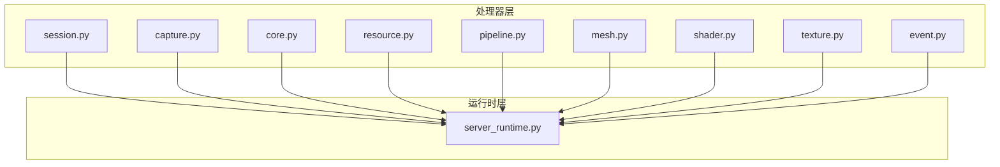
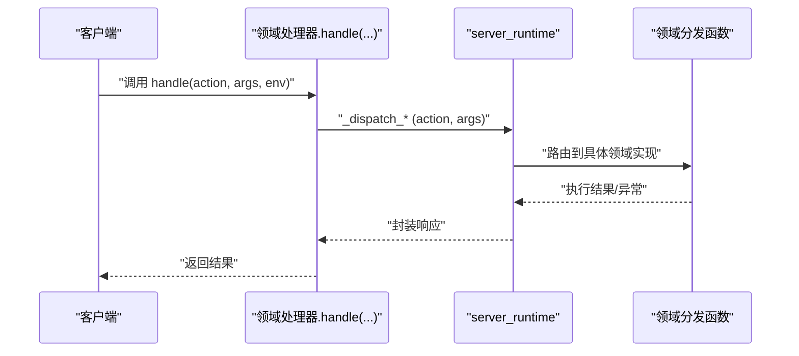
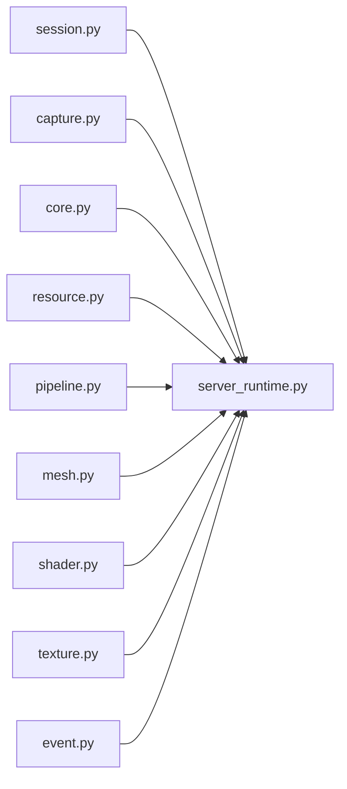

# 领域处理器

<cite>
**本文引用的文件**
- [rdx/handlers/__init__.py](file://rdx/handlers/__init__.py)
- [rdx/handlers/session.py](file://rdx/handlers/session.py)
- [rdx/handlers/capture.py](file://rdx/handlers/capture.py)
- [rdx/handlers/core.py](file://rdx/handlers/core.py)
- [rdx/handlers/resource.py](file://rdx/handlers/resource.py)
- [rdx/handlers/pipeline.py](file://rdx/handlers/pipeline.py)
- [rdx/handlers/mesh.py](file://rdx/handlers/mesh.py)
- [rdx/handlers/shader.py](file://rdx/handlers/shader.py)
- [rdx/handlers/texture.py](file://rdx/handlers/texture.py)
- [rdx/handlers/event.py](file://rdx/handlers/event.py)
- [rdx/server_runtime.py](file://rdx/server_runtime.py)
</cite>

## 目录
1. [简介](#简介)
2. [项目结构](#项目结构)
3. [核心组件](#核心组件)
4. [架构总览](#架构总览)
5. [详细组件分析](#详细组件分析)
6. [依赖分析](#依赖分析)
7. [性能考虑](#性能考虑)
8. [故障排查指南](#故障排查指南)
9. [结论](#结论)
10. [附录](#附录)

## 简介
本文件系统性梳理 RDX 项目中的“领域处理器”体系，覆盖会话、捕获、核心、资源、管线、网格、着色器、纹理、事件等专用处理模块。文档从架构与协作关系入手，解释各处理器的职责边界、接口约定与调用链路，并给出扩展与自定义指南、典型使用模式、性能优化建议以及常见问题排查方法。

## 项目结构
领域处理器位于 rdx/handlers 目录下，每个子模块对应一个“领域”，统一通过异步 handle 接口对外暴露能力，内部委派给 server_runtime 的特定分发函数完成具体工作。

图表来源
- [rdx/handlers/session.py:1-11](file://rdx/handlers/session.py#L1-L11)
- [rdx/handlers/capture.py:1-11](file://rdx/handlers/capture.py#L1-L11)
- [rdx/handlers/core.py:1-11](file://rdx/handlers/core.py#L1-L11)
- [rdx/handlers/resource.py:1-11](file://rdx/handlers/resource.py#L1-L11)
- [rdx/handlers/pipeline.py:1-11](file://rdx/handlers/pipeline.py#L1-L11)
- [rdx/handlers/mesh.py:1-11](file://rdx/handlers/mesh.py#L1-L11)
- [rdx/handlers/shader.py:1-11](file://rdx/handlers/shader.py#L1-L11)
- [rdx/handlers/texture.py:1-11](file://rdx/handlers/texture.py#L1-L11)
- [rdx/handlers/event.py:1-11](file://rdx/handlers/event.py#L1-L11)
- [rdx/server_runtime.py](file://rdx/server_runtime.py)

章节来源
- [rdx/handlers/__init__.py:1-3](file://rdx/handlers/__init__.py#L1-L3)
- [rdx/handlers/session.py:1-11](file://rdx/handlers/session.py#L1-L11)
- [rdx/handlers/capture.py:1-11](file://rdx/handlers/capture.py#L1-L11)
- [rdx/handlers/core.py:1-11](file://rdx/handlers/core.py#L1-L11)
- [rdx/handlers/resource.py:1-11](file://rdx/handlers/resource.py#L1-L11)
- [rdx/handlers/pipeline.py:1-11](file://rdx/handlers/pipeline.py#L1-L11)
- [rdx/handlers/mesh.py:1-11](file://rdx/handlers/mesh.py#L1-L11)
- [rdx/handlers/shader.py:1-11](file://rdx/handlers/shader.py#L1-L11)
- [rdx/handlers/texture.py:1-11](file://rdx/handlers/texture.py#L1-L11)
- [rdx/handlers/event.py:1-11](file://rdx/handlers/event.py#L1-L11)

## 核心组件
- 统一接口：所有领域处理器均提供 async def handle(action, args, env) -> Any 的异步入口，参数语义如下：
  - action：字符串，表示该领域内的具体操作名（如“open”、“close”、“list”等）
  - args：字典，承载操作所需的键值对参数
  - env：字典，承载环境上下文（如认证令牌、运行时配置、路径前缀等）
- 分发委派：handle 内部直接调用 server_runtime 的领域分发函数，例如：
  - 会话：_dispatch_session
  - 捕获：_dispatch_capture
  - 核心：_dispatch_core
  - 资源：_dispatch_resource
  - 管线：_dispatch_pipeline
  - 网格/着色器/纹理/事件：_dispatch_mesh/_dispatch_shader/_dispatch_texture/_dispatch_event
- 返回值：统一返回 Any 类型，由 server_runtime 完成最终序列化或错误包装。

章节来源
- [rdx/handlers/session.py:8-9](file://rdx/handlers/session.py#L8-L9)
- [rdx/handlers/capture.py:8-9](file://rdx/handlers/capture.py#L8-L9)
- [rdx/handlers/core.py:8-9](file://rdx/handlers/core.py#L8-L9)
- [rdx/handlers/resource.py:8-9](file://rdx/handlers/resource.py#L8-L9)
- [rdx/handlers/pipeline.py:8-9](file://rdx/handlers/pipeline.py#L8-L9)
- [rdx/handlers/mesh.py:8-9](file://rdx/handlers/mesh.py#L8-L9)
- [rdx/handlers/shader.py:8-9](file://rdx/handlers/shader.py#L8-L9)
- [rdx/handlers/texture.py:8-9](file://rdx/handlers/texture.py#L8-L9)
- [rdx/handlers/event.py:8-9](file://rdx/handlers/event.py#L8-L9)

## 架构总览
领域处理器采用“薄壳分发”的设计：上层仅负责参数透传与异步调度，核心业务逻辑集中在 server_runtime 中，确保各领域的一致性与可维护性。

图表来源
- [rdx/handlers/session.py:8-9](file://rdx/handlers/session.py#L8-L9)
- [rdx/handlers/capture.py:8-9](file://rdx/handlers/capture.py#L8-L9)
- [rdx/handlers/core.py:8-9](file://rdx/handlers/core.py#L8-L9)
- [rdx/handlers/resource.py:8-9](file://rdx/handlers/resource.py#L8-L9)
- [rdx/handlers/pipeline.py:8-9](file://rdx/handlers/pipeline.py#L8-L9)
- [rdx/handlers/mesh.py:8-9](file://rdx/handlers/mesh.py#L8-L9)
- [rdx/handlers/shader.py:8-9](file://rdx/handlers/shader.py#L8-L9)
- [rdx/handlers/texture.py:8-9](file://rdx/handlers/texture.py#L8-L9)
- [rdx/handlers/event.py:8-9](file://rdx/handlers/event.py#L8-L9)
- [rdx/server_runtime.py](file://rdx/server_runtime.py)

## 详细组件分析

### 会话处理器（session）
- 职责：封装与会话生命周期相关的操作，如打开、关闭、查询状态等。
- 典型场景：启动/结束调试会话、切换上下文、查询会话元信息。
- 协作关系：通过 _dispatch_session 将请求转交 server_runtime 处理。

章节来源
- [rdx/handlers/session.py:1-11](file://rdx/handlers/session.py#L1-L11)

### 捕获处理器（capture）
- 职责：管理图形/渲染捕获流程，如开始捕获、停止捕获、导出帧数据等。
- 典型场景：录制某帧或多帧的渲染状态，用于离线分析。
- 协作关系：通过 _dispatch_capture 委派至运行时实现。

章节来源
- [rdx/handlers/capture.py:1-11](file://rdx/handlers/capture.py#L1-L11)

### 核心处理器（core）
- 职责：提供底层工具与引擎能力的统一入口，如版本查询、能力探测、全局设置等。
- 典型场景：诊断工具可用性、获取平台能力列表、触发内部测试命令。
- 协作关系：通过 _dispatch_core 进行分发。

章节来源
- [rdx/handlers/core.py:1-11](file://rdx/handlers/core.py#L1-L11)

### 资源处理器（resource）
- 职责：资源检索、列举、属性查询与元数据访问。
- 典型场景：列出当前上下文下的纹理、缓冲区、着色器程序等资源清单。
- 协作关系：通过 _dispatch_resource 实现。

章节来源
- [rdx/handlers/resource.py:1-11](file://rdx/handlers/resource.py#L1-L11)

### 管线处理器（pipeline）
- 职责：与图形管线状态相关的能力，如管线对象枚举、状态快照、阶段分析等。
- 典型场景：查看当前绑定的管线配置、导出渲染阶段信息。
- 协作关系：通过 _dispatch_pipeline 委派。

章节来源
- [rdx/handlers/pipeline.py:1-11](file://rdx/handlers/pipeline.py#L1-L11)

### 网格处理器（mesh）
- 职责：网格/几何资源的查询与分析，如顶点数据、索引数据、拓扑信息等。
- 典型场景：提取网格属性、计算包围盒、导出几何数据。
- 协作关系：通过 _dispatch_mesh 实现。

章节来源
- [rdx/handlers/mesh.py:1-11](file://rdx/handlers/mesh.py#L1-L11)

### 着色器处理器（shader）
- 职责：着色器程序的编译、链接、反汇编与调试支持。
- 典型场景：查看着色器源码、反编译中间代码、定位编译错误。
- 协作关系：通过 _dispatch_shader 实现。

章节来源
- [rdx/handlers/shader.py:1-11](file://rdx/handlers/shader.py#L1-L11)

### 纹理处理器（texture）
- 职责：纹理资源的解码、格式转换、像素数据提取与预览生成。
- 典型场景：导出纹理为图像文件、获取分辨率与格式、生成缩略图。
- 协作关系：通过 _dispatch_texture 实现。

章节来源
- [rdx/handlers/texture.py:1-11](file://rdx/handlers/texture.py#L1-L11)

### 事件处理器（event）
- 职责：事件流的订阅、过滤与回放，支持按时间轴或条件筛选。
- 典型场景：回放一次捕获期间的事件序列、按类型过滤事件、导出事件日志。
- 协作关系：通过 _dispatch_event 实现。

章节来源
- [rdx/handlers/event.py:1-11](file://rdx/handlers/event.py#L1-L11)

## 依赖分析
- 耦合度：领域处理器之间低耦合，均依赖 server_runtime 的统一分发接口。
- 依赖方向：处理器 → server_runtime；无反向依赖。
- 可能的循环依赖：不存在，因为分发是单向的。
- 扩展点：新增领域只需在 server_runtime 中添加对应分发函数，并在 handlers 下新增同名模块提供 handle 包装。

图表来源
- [rdx/handlers/session.py:5-9](file://rdx/handlers/session.py#L5-L9)
- [rdx/handlers/capture.py:5-9](file://rdx/handlers/capture.py#L5-L9)
- [rdx/handlers/core.py:5-9](file://rdx/handlers/core.py#L5-L9)
- [rdx/handlers/resource.py:5-9](file://rdx/handlers/resource.py#L5-L9)
- [rdx/handlers/pipeline.py:5-9](file://rdx/handlers/pipeline.py#L5-L9)
- [rdx/handlers/mesh.py:5-9](file://rdx/handlers/mesh.py#L5-L9)
- [rdx/handlers/shader.py:5-9](file://rdx/handlers/shader.py#L5-L9)
- [rdx/handlers/texture.py:5-9](file://rdx/handlers/texture.py#L5-L9)
- [rdx/handlers/event.py:5-9](file://rdx/handlers/event.py#L5-L9)
- [rdx/server_runtime.py](file://rdx/server_runtime.py)

章节来源
- [rdx/handlers/session.py:1-11](file://rdx/handlers/session.py#L1-L11)
- [rdx/handlers/capture.py:1-11](file://rdx/handlers/capture.py#L1-L11)
- [rdx/handlers/core.py:1-11](file://rdx/handlers/core.py#L1-L11)
- [rdx/handlers/resource.py:1-11](file://rdx/handlers/resource.py#L1-L11)
- [rdx/handlers/pipeline.py:1-11](file://rdx/handlers/pipeline.py#L1-L11)
- [rdx/handlers/mesh.py:1-11](file://rdx/handlers/mesh.py#L1-L11)
- [rdx/handlers/shader.py:1-11](file://rdx/handlers/shader.py#L1-L11)
- [rdx/handlers/texture.py:1-11](file://rdx/handlers/texture.py#L1-L11)
- [rdx/handlers/event.py:1-11](file://rdx/handlers/event.py#L1-L11)

## 性能考虑
- 异步优先：所有处理器均为异步实现，避免阻塞主线程，适合高并发与长耗时任务。
- 参数最小化：env 与 args 应仅包含必要字段，减少序列化与传输开销。
- 结果缓存：对于重复查询（如资源清单），可在 server_runtime 层引入轻量缓存以降低重复计算。
- 流式输出：对大对象（纹理、网格）导出建议采用流式写入，避免一次性占用大量内存。
- 并发控制：在 server_runtime 中对热点资源加锁或限流，防止竞争与抖动。

## 故障排查指南
- 通用步骤
  - 检查 action 名称是否正确，确保与领域内已注册的操作一致。
  - 核对 args 与 env 字段类型与必填项，避免因参数缺失导致的解析失败。
  - 查看 server_runtime 的日志与错误码映射，定位具体异常分支。
- 常见问题
  - 会话未就绪：确认会话已成功打开且未过期。
  - 资源不存在：检查资源 ID 或路径是否正确，必要时先调用资源列举接口。
  - 权限不足：核对 env 中的鉴权信息是否完整，或是否具备相应角色权限。
  - 超时：对长耗时操作增加超时策略或拆分为多个短任务。

## 结论
领域处理器通过统一的异步接口与 server_runtime 的集中分发，实现了清晰的职责划分与良好的可扩展性。围绕会话、捕获、核心、资源、管线、网格、着色器、纹理、事件等领域的处理逻辑，既保证了易用性，也为后续功能扩展提供了稳定基座。

## 附录

### 开发者指南：扩展新领域处理器
- 步骤
  - 在 rdx/server_runtime.py 中新增领域分发函数（如 _dispatch_mydomain），实现具体业务逻辑。
  - 在 rdx/handlers 下新增 mydomain.py，实现 async def handle(...)，内部调用 _dispatch_mydomain。
  - 在调用方（CLI/服务端）以统一格式传递 action、args、env。
- 最佳实践
  - 明确 action 的幂等性与副作用，必要时在 server_runtime 中加入重入保护。
  - 对外部输入进行严格校验，尽早失败并返回明确错误。
  - 记录关键指标（耗时、吞吐、错误率），便于监控与优化。

### 使用模式示例（描述性）
- 会话管理：打开会话 → 执行若干资源/事件操作 → 关闭会话
- 捕获流程：开始捕获 → 执行目标帧渲染 → 停止捕获 → 导出帧数据
- 资源分析：列举资源 → 查询目标资源属性 → 导出关键元数据
- 管线调试：获取当前管线状态 → 切换渲染阶段 → 回放事件序列
- 网格/纹理：提取几何数据 → 解析纹理像素 → 生成可视化预览