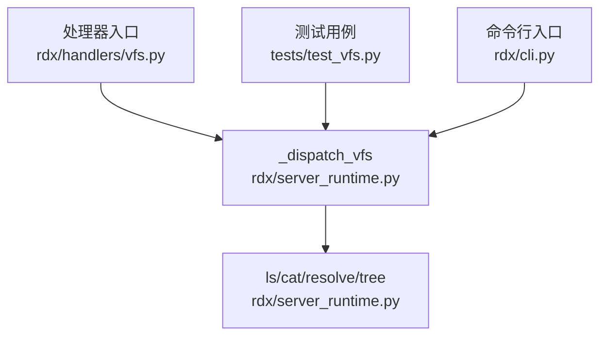
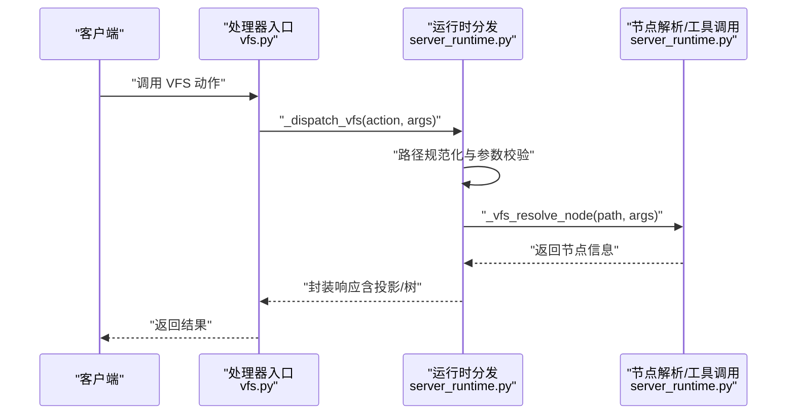
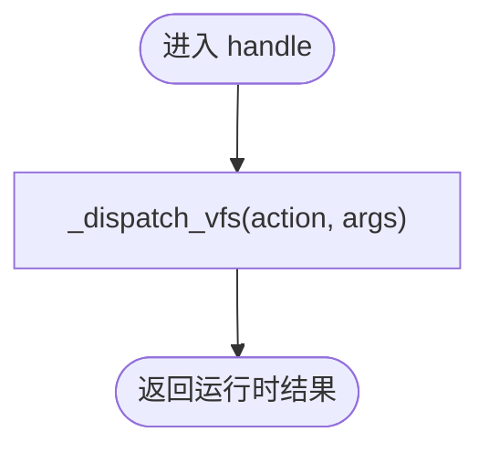
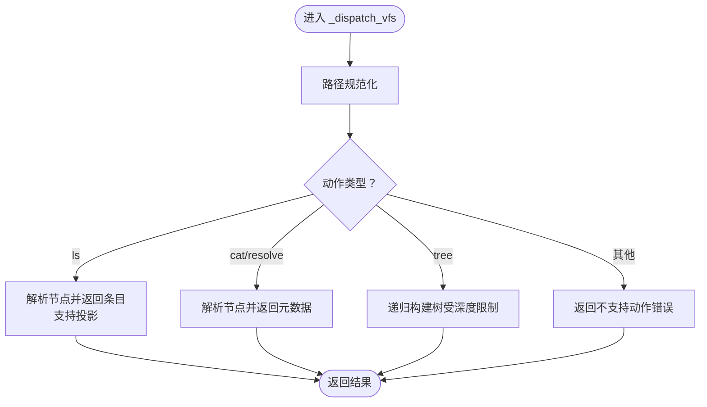
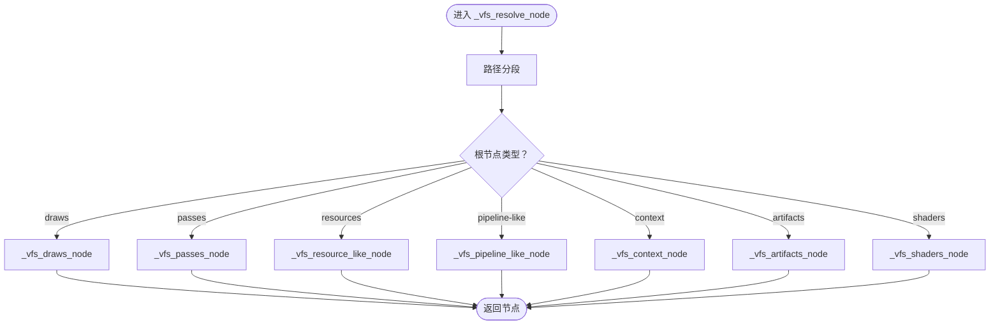
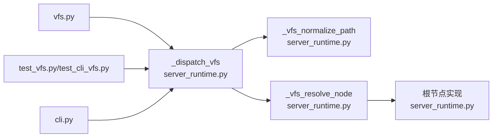

# VFS虚拟文件系统

<cite>
**本文档引用的文件**
- [vfs.py](file://rdx/handlers/vfs.py)
- [server_runtime.py](file://rdx/server_runtime.py)
- [test_vfs.py](file://tests/test_vfs.py)
- [test_cli_vfs.py](file://tests/test_cli_vfs.py)
- [cli.py](file://rdx/cli.py)
</cite>

## 目录
1. [简介](#简介)
2. [项目结构](#项目结构)
3. [核心组件](#核心组件)
4. [架构总览](#架构总览)
5. [详细组件分析](#详细组件分析)
6. [依赖关系分析](#依赖关系分析)
7. [性能考虑](#性能考虑)
8. [故障排除指南](#故障排除指南)
9. [结论](#结论)
10. [附录](#附录)

## 简介
本文件系统为虚拟文件系统（VFS），用于将底层资源抽象为统一的树形文件系统视图，支持列出目录、解析路径、获取节点信息以及构建树状结构等操作。VFS通过统一的入口分发到运行时服务，将物理资源映射为可访问的虚拟节点，并提供投影查询与错误处理能力。

## 项目结构
VFS相关的核心实现位于以下位置：
- 处理器入口：rdx/handlers/vfs.py
- 运行时分发与节点解析：rdx/server_runtime.py
- 测试用例：tests/test_vfs.py、tests/test_cli_vfs.py
- 命令行入口：rdx/cli.py

**图表来源**
- [vfs.py:8-9](file://rdx/handlers/vfs.py#L8-L9)
- [server_runtime.py:12302-12337](file://rdx/server_runtime.py#L12302-L12337)

**章节来源**
- [vfs.py:1-10](file://rdx/handlers/vfs.py#L1-L10)
- [server_runtime.py:12302-12337](file://rdx/server_runtime.py#L12302-L12337)

## 核心组件
- 处理器入口：接收外部调用，将请求转发至运行时分发函数。
- 运行时分发：根据动作类型执行相应逻辑，包括路径规范化、节点解析、投影查询与树构建。
- 节点解析：将虚拟路径映射为具体资源节点，支持多种根节点类型（如管线、调试、资源等）。
- 错误处理：对不支持的动作或参数进行校验并返回标准化错误响应。

**章节来源**
- [vfs.py:8-9](file://rdx/handlers/vfs.py#L8-L9)
- [server_runtime.py:12302-12337](file://rdx/server_runtime.py#L12302-L12337)

## 架构总览
VFS采用“处理器入口 → 运行时分发 → 节点解析”的三层架构。处理器负责协议适配与参数传递；运行时负责路径规范化、动作分发与结果封装；节点解析负责将虚拟路径映射到具体资源。

**图表来源**
- [vfs.py:8-9](file://rdx/handlers/vfs.py#L8-L9)
- [server_runtime.py:12302-12337](file://rdx/server_runtime.py#L12302-L12337)

## 详细组件分析

### 组件A：处理器入口（vfs.py）
- 职责：接收动作与参数，直接委托给运行时分发函数。
- 关键点：保持轻量，避免业务逻辑下沉。

**图表来源**
- [vfs.py:8-9](file://rdx/handlers/vfs.py#L8-L9)

**章节来源**
- [vfs.py:8-9](file://rdx/handlers/vfs.py#L8-L9)

### 组件B：运行时分发（server_runtime.py）
- 路径规范化：统一输入路径格式，确保后续解析一致性。
- 动作分发：
  - ls：解析节点并返回条目列表，支持投影查询。
  - cat/resolve：解析节点并返回节点元数据。
  - tree：递归构建树结构，受深度限制。
- 投影查询：对条目进行投影，支持文本化输出等。
- 错误处理：对不支持的动作或参数组合返回标准化错误。

**图表来源**
- [server_runtime.py:12302-12337](file://rdx/server_runtime.py#L12302-L12337)

**章节来源**
- [server_runtime.py:12302-12337](file://rdx/server_runtime.py#L12302-L12337)

### 组件C：节点解析与树构建（server_runtime.py）
- 节点解析：将路径拆分为段，识别根节点类型（如管线、调试、资源等），并生成对应节点。
- 树构建：基于节点条目递归构建子树，深度由参数控制。
- 根节点与专用节点：支持多种根节点（如 draws、passes、resources、pipeline-like、context、artifacts、shaders 等）。

**图表来源**
- [server_runtime.py:11783-12281](file://rdx/server_runtime.py#L11783-L12281)

**章节来源**
- [server_runtime.py:11783-12281](file://rdx/server_runtime.py#L11783-L12281)

### 组件D：API接口与文件操作方法
- 支持动作：
  - ls：列出目录内容，支持投影查询。
  - cat：获取文件内容（以节点形式返回）。
  - resolve：解析路径为节点。
  - tree：按深度构建树结构。
- 参数与约束：
  - 投影仅支持 ls 动作。
  - 不支持的动作将返回错误。
- 返回结构：包含路径、节点、条目及可选投影结果。

**章节来源**
- [server_runtime.py:12302-12337](file://rdx/server_runtime.py#L12302-L12337)

### 组件E：路径映射与访问控制机制
- 路径映射：通过路径分段与根节点识别，将虚拟路径映射到具体资源。
- 访问控制：当前实现未显式暴露细粒度权限控制接口；可通过上层会话与会话ID管理进行间接控制（例如管线着色器节点要求会话ID）。

**章节来源**
- [server_runtime.py:11783-12281](file://rdx/server_runtime.py#L11783-L12281)
- [server_runtime.py:11901-11922](file://rdx/server_runtime.py#L11901-L11922)

### 组件F：错误处理策略
- 动作不支持：返回标准化错误，包含工具名、支持的动作列表等。
- 参数不支持：如投影非 ls 动作时返回验证类错误。
- 路径不支持：当无法识别的路径前缀出现时抛出异常。

**章节来源**
- [server_runtime.py:12302-12337](file://rdx/server_runtime.py#L12302-L12337)

### 组件G：使用示例与场景
- 列出目录：调用 ls 动作，结合投影查询获取条目信息。
- 获取节点：调用 resolve 或 cat 动作，获取节点元数据或内容。
- 构建树：调用 tree 动作，设置深度参数以控制展开程度。
- 命令行集成：CLI 提供 vfs 子命令入口，便于从命令行触发 VFS 操作。

**章节来源**
- [test_vfs.py](file://tests/test_vfs.py)
- [test_cli_vfs.py](file://tests/test_cli_vfs.py)
- [cli.py:833](file://rdx/cli.py#L833)

## 依赖关系分析
- 处理器入口依赖运行时分发函数。
- 运行时分发依赖路径规范化、节点解析与工具调用。
- 节点解析依赖多种根节点实现与会话管理。
- 测试用例覆盖运行时分发与 CLI 入口。

**图表来源**
- [vfs.py:8-9](file://rdx/handlers/vfs.py#L8-L9)
- [server_runtime.py:12302-12337](file://rdx/server_runtime.py#L12302-L12337)
- [server_runtime.py:11783-12281](file://rdx/server_runtime.py#L11783-L12281)

**章节来源**
- [vfs.py:8-9](file://rdx/handlers/vfs.py#L8-L9)
- [server_runtime.py:12302-12337](file://rdx/server_runtime.py#L12302-L12337)
- [server_runtime.py:11783-12281](file://rdx/server_runtime.py#L11783-L12281)

## 性能考虑
- 树构建深度控制：tree 动作通过深度参数限制递归层级，避免过深遍历导致的性能问题。
- 条目投影：ls 动作支持投影查询，可在保证必要信息的同时减少传输与渲染开销。
- 节点缓存：当前实现未显示内置缓存机制，建议在上层或工具侧实现缓存以提升重复查询性能。
- 并发访问：运行时分发为异步实现，适合高并发场景；但需注意工具调用与资源访问的并发安全。

**章节来源**
- [server_runtime.py:12332-12335](file://rdx/server_runtime.py#L12332-L12335)
- [server_runtime.py:12314-12324](file://rdx/server_runtime.py#L12314-L12324)

## 故障排除指南
- 动作不支持：确认传入的动作是否在支持列表中（ls、cat、resolve、tree）。
- 投影不支持：仅 ls 动作支持投影，其他动作请移除投影参数。
- 路径无效：检查路径前缀与分段是否符合预期，确保根节点类型正确。
- 会话相关错误：某些节点（如管线着色器）需要有效的会话ID，请确认会话上下文。

**章节来源**
- [server_runtime.py:12302-12337](file://rdx/server_runtime.py#L12302-L12337)
- [server_runtime.py:11901-11922](file://rdx/server_runtime.py#L11901-L11922)

## 结论
VFS通过统一的入口与运行时分发，实现了对多类资源的虚拟化访问。其路径规范化、节点解析与树构建能力满足了常见的文件系统浏览与资源定位需求。未来可在缓存、并发控制与细粒度权限方面进一步增强，以适应更复杂的使用场景。

## 附录
- 命令行入口：CLI 提供 vfs 子命令，便于从命令行触发 VFS 操作。
- 测试用例：覆盖运行时分发与 CLI 入口的行为，确保功能稳定性。

**章节来源**
- [cli.py:833](file://rdx/cli.py#L833)
- [test_vfs.py](file://tests/test_vfs.py)
- [test_cli_vfs.py](file://tests/test_cli_vfs.py)