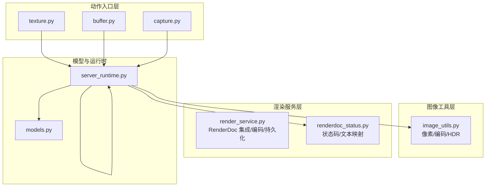
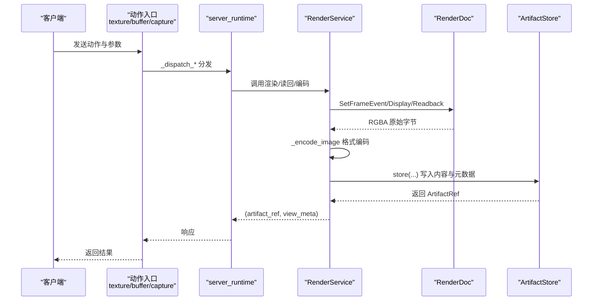
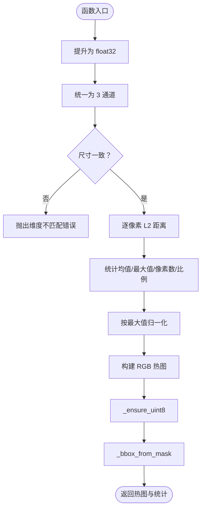
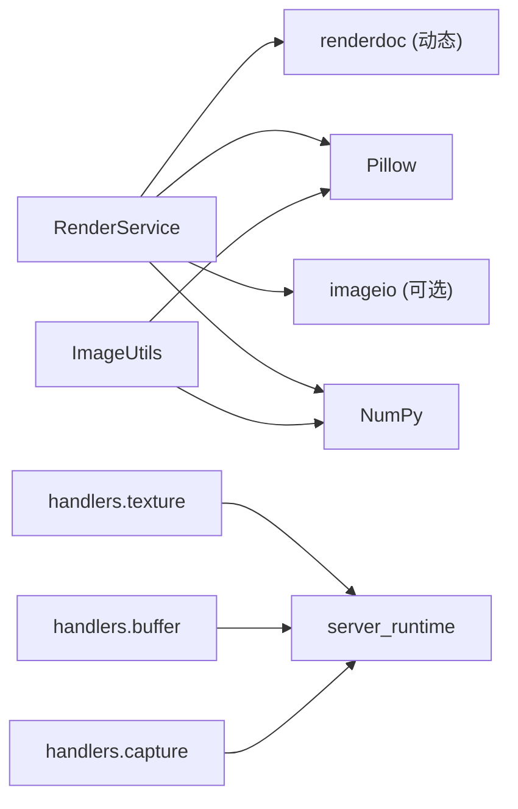

# 图像处理工具

<cite>
**本文引用的文件**
- [image_utils.py](file://rdx/utils/image_utils.py)
- [render_service.py](file://rdx/core/render_service.py)
- [texture.py](file://rdx/handlers/texture.py)
- [buffer.py](file://rdx/handlers/buffer.py)
- [capture.py](file://rdx/handlers/capture.py)
- [models.py](file://rdx/models.py)
- [renderdoc_status.py](file://rdx/core/renderdoc_status.py)
- [server_runtime.py](file://rdx/server_runtime.py)
</cite>

## 目录
1. [简介](#简介)
2. [项目结构](#项目结构)
3. [核心组件](#核心组件)
4. [架构总览](#架构总览)
5. [详细组件分析](#详细组件分析)
6. [依赖分析](#依赖分析)
7. [性能考虑](#性能考虑)
8. [故障排除指南](#故障排除指南)
9. [结论](#结论)
10. [附录](#附录)

## 简介
本文件系统性地梳理了图像处理工具的设计与实现，重点覆盖以下方面：
- 图像格式支持：PNG、JPEG、EXR、HDR、RAW、DDS、TGA、BMP 等
- 像素级操作：数值归一化、类型转换、通道统一、裁剪与统计
- 滤镜与可视化：NaN/Inf 掩膜、差异热图、色调映射（HDR）
- 渲染与导出：基于 RenderDoc 的异步读回、编码与持久化
- GPU 调试应用：纹理分析、帧缓冲区检查、渲染结果对比
- 性能优化：内存管理、线程池调度、格式降级与缓存策略
- 故障排除：错误分类、状态码映射、兼容性注意事项

## 项目结构
围绕“图像处理”这一主题，相关模块主要分布在如下位置：
- rdx/utils：通用图像工具（像素操作、编码/解码、HDR 调色）
- rdx/core：渲染服务（与 RenderDoc 集成，负责读回、编码、持久化）
- rdx/handlers：动作入口（texture/buffer/capture）
- rdx/models：数据模型（包含异常框、验证器类型、实验结果等）
- rdx/core/renderdoc_status.py：RenderDoc 状态辅助
- rdx/server_runtime.py：服务端运行时（动作分发与上下文）

图表来源
- [render_service.py:345-520](file://rdx/core/render_service.py#L345-L520)
- [image_utils.py:21-477](file://rdx/utils/image_utils.py#L21-L477)
- [texture.py:8-9](file://rdx/handlers/texture.py#L8-L9)
- [buffer.py:8-9](file://rdx/handlers/buffer.py#L8-L9)
- [capture.py:8-9](file://rdx/handlers/capture.py#L8-L9)
- [renderdoc_status.py:10-104](file://rdx/core/renderdoc_status.py#L10-L104)
- [models.py:103-122](file://rdx/models.py#L103-L122)
- [server_runtime.py:8660-8689](file://rdx/server_runtime.py#L8660-L8689)

章节来源
- [render_service.py:1-1038](file://rdx/core/render_service.py#L1-L1038)
- [image_utils.py:1-478](file://rdx/utils/image_utils.py#L1-L478)
- [texture.py:1-11](file://rdx/handlers/texture.py#L1-L11)
- [buffer.py:1-11](file://rdx/handlers/buffer.py#L1-L11)
- [capture.py:1-11](file://rdx/handlers/capture.py#L1-L11)
- [renderdoc_status.py:1-105](file://rdx/core/renderdoc_status.py#L1-L105)
- [models.py:1-558](file://rdx/models.py#L1-L558)
- [server_runtime.py:8660-8689](file://rdx/server_runtime.py#L8660-L8689)

## 核心组件
- 图像工具（image_utils.py）
  - 类型与布局：统一为 (H, W, C) 布局，支持 uint8/LDR 与 float32/HDR
  - 像素操作：归一化、裁剪、通道扩展/去 alpha
  - 统计与掩膜：NaN/Inf 掩膜、差异热图、像素统计
  - 编码/解码：PNG 字节序列化/反序列化
  - HDR 调色：Reinhard tone mapping
- 渲染服务（render_service.py）
  - 异步渲染与读回：将 RenderDoc 的阻塞调用分派至线程池
  - 多格式编码：PNG/JPG/EXR/HDR/RAW 等
  - 视图配置：缩放、通道可见性、HDR 倍增、显示范围、翻转、叠加
  - 结果持久化：通过 ArtifactStore 写入元数据与内容
- 动作入口（handlers/texture.py, buffer.py, capture.py）
  - 将外部动作委托给 server_runtime 的分发器
- 数据模型（models.py）
  - 定义异常框、验证器类型、实验结果、报告等结构
- RenderDoc 状态（renderdoc_status.py）
  - 统一的状态码/文本/名称映射，便于错误上报与诊断

章节来源
- [image_utils.py:21-477](file://rdx/utils/image_utils.py#L21-L477)
- [render_service.py:277-337](file://rdx/core/render_service.py#L277-L337)
- [texture.py:8-9](file://rdx/handlers/texture.py#L8-L9)
- [buffer.py:8-9](file://rdx/handlers/buffer.py#L8-L9)
- [capture.py:8-9](file://rdx/handlers/capture.py#L8-L9)
- [models.py:187-204](file://rdx/models.py#L187-L204)
- [renderdoc_status.py:10-104](file://rdx/core/renderdoc_status.py#L10-L104)

## 架构总览
下图展示了从动作入口到渲染服务再到持久化的整体流程。

图表来源
- [texture.py:8-9](file://rdx/handlers/texture.py#L8-L9)
- [buffer.py:8-9](file://rdx/handlers/buffer.py#L8-L9)
- [capture.py:8-9](file://rdx/handlers/capture.py#L8-L9)
- [render_service.py:356-520](file://rdx/core/render_service.py#L356-L520)
- [render_service.py:277-337](file://rdx/core/render_service.py#L277-L337)

## 详细组件分析

### 图像工具（image_utils.py）
- 设计要点
  - 统一输入布局与类型：内部函数确保 (H, W, C)、float32、uint8 等
  - 通道一致性：单通道复制为 RGB，RGBA 去 alpha
  - NaN/Inf 检测：生成 RGBA 掩膜并统计密度与边界框
  - 差异热图：逐像素 L2 距离，归一化为 RGB 热图
  - 统计：按通道求 min/max/mean/std，并检测 NaN/Inf
  - PNG 序列化：自动模式推断（L/RGB/RGBA），支持 float→uint8 归一化
  - HDR 调色：Reinhard tone mapping，支持曝光控制
- 关键算法流程（差异热图）

图表来源
- [image_utils.py:143-220](file://rdx/utils/image_utils.py#L143-L220)

章节来源
- [image_utils.py:21-477](file://rdx/utils/image_utils.py#L21-L477)

### 渲染服务（render_service.py）
- 支持的输出格式与 MIME/Suffix 映射
  - PNG/JPG/EXR/HDR/DDS/TGA/BMP/RAW/NPZ
  - 自动降级：当特定编解码器不可用时回退到 PNG
- 视图配置
  - scale、channels、overlay、hdr/hdr_multiplier、range_min/range_max、flipY、rawOutput
- 读回与统计
  - 自动识别 float32/uint8 布局，支持区域裁剪
  - 统计项：形状、dtype、NaN/Inf 计数、min/max/mean
- 异步执行
  - 使用 asyncio.to_thread 将 RenderDoc 的阻塞调用移至线程池
- 错误处理
  - 统一状态码/文本映射，失败时构造详细错误载荷

章节来源
- [render_service.py:97-141](file://rdx/core/render_service.py#L97-L141)
- [render_service.py:277-337](file://rdx/core/render_service.py#L277-L337)
- [render_service.py:356-520](file://rdx/core/render_service.py#L356-L520)
- [render_service.py:655-800](file://rdx/core/render_service.py#L655-L800)
- [renderdoc_status.py:10-104](file://rdx/core/renderdoc_status.py#L10-L104)

### 动作入口与运行时（handlers/* 与 server_runtime）
- 动作入口
  - texture/buffer/capture 将动作转发给 server_runtime 的分发器
- 运行时
  - 提供 _dispatch_texture/_dispatch_buffer/_dispatch_capture 等分发逻辑
  - 在 GPU 调试场景中，结合 RenderService 实现纹理读回、像素采样与历史轨迹

章节来源
- [texture.py:8-9](file://rdx/handlers/texture.py#L8-L9)
- [buffer.py:8-9](file://rdx/handlers/buffer.py#L8-L9)
- [capture.py:8-9](file://rdx/handlers/capture.py#L8-L9)
- [server_runtime.py:8660-8689](file://rdx/server_runtime.py#L8660-L8689)

### 数据模型（models.py）
- 异常框与验证器
  - AnomalyInfo：包含异常框、NaN/Inf 统计与掩膜产物
  - VerifierType：NANINF、IMAGE_DIFF、PIXEL_STATS 等
- 实验与报告
  - ExperimentDef/ExperimentEvidence/ExperimentResult
  - ReportBundle：聚合验证指标、假设与证据

章节来源
- [models.py:187-204](file://rdx/models.py#L187-L204)
- [models.py:365-397](file://rdx/models.py#L365-L397)
- [models.py:463-477](file://rdx/models.py#L463-L477)

## 依赖分析
- 组件耦合
  - RenderService 依赖 RenderDoc（延迟导入）、PIL、imageio（可选）、NumPy
  - image_utils 依赖 NumPy、PIL
  - handlers 仅作为薄代理，依赖 server_runtime
  - server_runtime 聚合 RenderService 与 ArtifactStore
- 外部依赖
  - RenderDoc：用于读回纹理与像素检查
  - imageio：EXR/HDR 编码（不可用时回退 PNG）
  - PIL：PNG/JPEG 编码与解码

图表来源
- [render_service.py:39-56](file://rdx/core/render_service.py#L39-L56)
- [render_service.py:288-337](file://rdx/core/render_service.py#L288-L337)
- [image_utils.py:13-14](file://rdx/utils/image_utils.py#L13-L14)
- [texture.py:5-9](file://rdx/handlers/texture.py#L5-L9)
- [buffer.py:5-9](file://rdx/handlers/buffer.py#L5-L9)
- [capture.py:5-9](file://rdx/handlers/capture.py#L5-L9)

章节来源
- [render_service.py:39-56](file://rdx/core/render_service.py#L39-L56)
- [render_service.py:288-337](file://rdx/core/render_service.py#L288-L337)
- [image_utils.py:13-14](file://rdx/utils/image_utils.py#L13-L14)
- [texture.py:5-9](file://rdx/handlers/texture.py#L5-L9)
- [buffer.py:5-9](file://rdx/handlers/buffer.py#L5-L9)
- [capture.py:5-9](file://rdx/handlers/capture.py#L5-L9)

## 性能考虑
- 内存管理
  - 优先使用就地/原位操作（如 clip、maximum），避免不必要的拷贝
  - 对 float32/HDR 数据进行 NaN/Inf 替换与裁剪，减少后续计算开销
- 并行处理
  - RenderDoc 的阻塞调用通过 asyncio.to_thread 移至线程池，避免阻塞事件循环
- 缓存策略
  - 对于重复的纹理读回，建议在上层缓存 ArtifactRef 与元数据
- 格式选择
  - RAW/EXR/HDR 适合离线分析；PNG/JPEG 适合快速预览与分享
  - 当缺少 imageio 时自动回退 PNG，保证可用性

## 故障排除指南
- RenderDoc 相关
  - 症状：导入 renderdoc 失败或 FileType 不可用
  - 排查：确认运行环境处于 RenderDoc replay 上下文，或已将共享库目录加入 sys.path/PYTHONPATH
  - 参考：状态码/文本映射与错误构造工具
- 编码失败
  - 症状：EXR/HDR 编码异常
  - 排查：检查是否安装 imageio；若不可用则自动回退 PNG
- 读回尺寸不匹配
  - 症状：RGBA8/RGBA32F/RGB8 尺寸不一致导致异常
  - 排查：服务端会进行尺寸归一与截断/填充，必要时检查上游数据源
- 统计与掩膜
  - 症状：NaN/Inf 密度过高或差异像素比例异常
  - 排查：结合掩膜与边界框定位问题区域，使用通道可见性与显示范围缩小问题域

章节来源
- [render_service.py:39-56](file://rdx/core/render_service.py#L39-L56)
- [render_service.py:143-158](file://rdx/core/render_service.py#L143-L158)
- [render_service.py:197-231](file://rdx/core/render_service.py#L197-L231)
- [renderdoc_status.py:10-104](file://rdx/core/renderdoc_status.py#L10-L104)

## 结论
本图像处理工具以 RenderDoc 为核心，结合通用图像工具与异步执行模型，实现了从 GPU 帧缓冲区读回、多格式编码到结果持久化的完整链路。其特性包括：
- 全面的图像格式支持与降级策略
- 高效的像素级分析与可视化能力
- 面向 GPU 调试的实用工具集
- 可靠的错误处理与状态映射
建议在生产环境中配合缓存与并行策略，以获得更优的吞吐与稳定性。

## 附录

### API 使用示例（路径指引）
- 渲染事件并导出为 PNG/JPG/EXR/HDR
  - 参考：[render_service.py:356-520](file://rdx/core/render_service.py#L356-L520)
- 读回纹理为 .npz 并统计
  - 参考：[render_service.py:655-800](file://rdx/core/render_service.py#L655-L800)
- 计算 NaN/Inf 掩膜与统计
  - 参考：[image_utils.py:80-135](file://rdx/utils/image_utils.py#L80-L135)
- 计算差异热图与统计
  - 参考：[image_utils.py:143-220](file://rdx/utils/image_utils.py#L143-L220)
- 绘制边界框
  - 参考：[image_utils.py:228-303](file://rdx/utils/image_utils.py#L228-L303)
- HDR 调色
  - 参考：[image_utils.py:434-477](file://rdx/utils/image_utils.py#L434-L477)
- PNG 序列化/反序列化
  - 参考：[image_utils.py:375-426](file://rdx/utils/image_utils.py#L375-L426)

### GPU 调试场景示例（路径指引）
- 纹理读回与像素统计
  - 参考：[render_service.py:655-800](file://rdx/core/render_service.py#L655-L800)
- 帧缓冲区检查与叠加
  - 参考：[render_service.py:420-478](file://rdx/core/render_service.py#L420-L478)
- 渲染结果对比与差异热图
  - 参考：[image_utils.py:143-220](file://rdx/utils/image_utils.py#L143-L220)