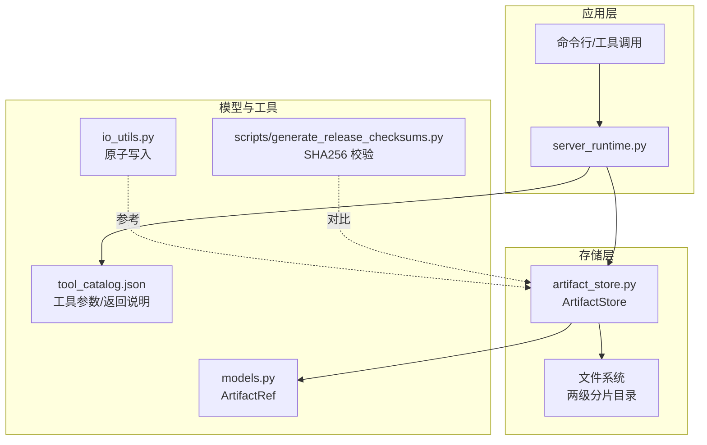
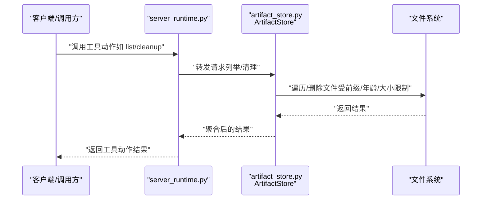
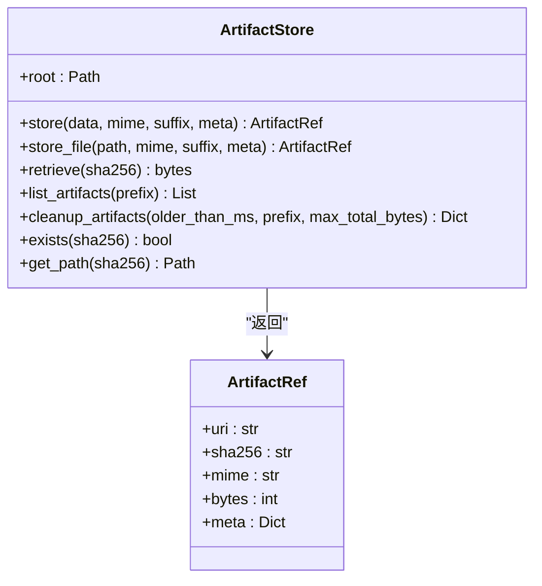
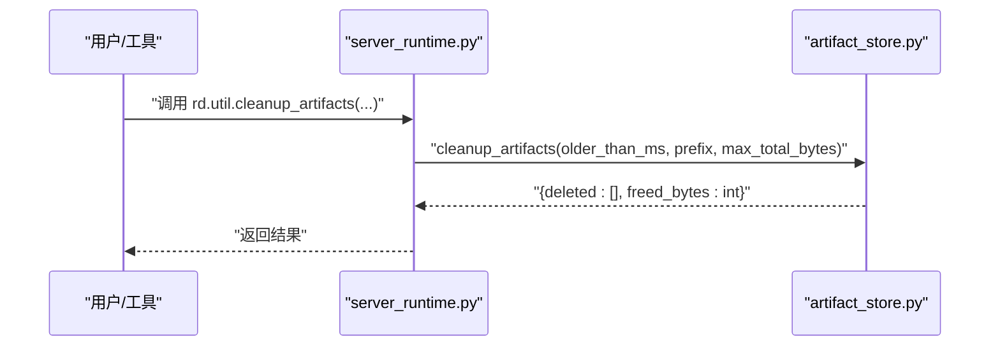
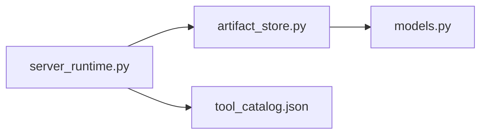

# 工件存储系统

<cite>
**本文档引用的文件**
- [artifact_store.py](file://rdx/utils/artifact_store.py)
- [models.py](file://rdx/models.py)
- [server_runtime.py](file://rdx/server_runtime.py)
- [tool_catalog.json](file://spec/tool_catalog.json)
- [io_utils.py](file://rdx/io_utils.py)
- [cleanup_workspace.py](file://scripts/cleanup_workspace.py)
- [generate_release_checksums.py](file://scripts/generate_release_checksums.py)
</cite>

## 目录
1. [简介](#简介)
2. [项目结构](#项目结构)
3. [核心组件](#核心组件)
4. [架构总览](#架构总览)
5. [详细组件分析](#详细组件分析)
6. [依赖关系分析](#依赖关系分析)
7. [性能考虑](#性能考虑)
8. [故障排查指南](#故障排查指南)
9. [结论](#结论)
10. [附录](#附录)

## 简介
本文件面向“工件存储系统”的使用者与维护者，系统性阐述内容寻址存储（CAS）的设计理念与实现细节，覆盖以下主题：
- 内容寻址：以 SHA256 哈希为键进行去重与定位
- 存储布局：两级分片目录结构，类 Git 对象存储布局
- 原子写入：临时文件 + 重命名，确保写入一致性
- 核心能力：存储、检索、清理、列出、存在性校验与元数据管理
- 多类型工件：二进制数据、文本、JSON 配置、图像资源
- API 使用示例：存储新工件、查询工件信息、批量清理
- 性能优化：内存管理、并发控制、I/O 分块策略
- 容量管理与完整性：清理策略、校验脚本、故障恢复建议

## 项目结构
围绕工件存储的关键文件与职责如下：
- rdx/utils/artifact_store.py：内容寻址存储实现，提供统一的 store/retrieve/list/cleanup 接口
- rdx/models.py：定义 ArtifactRef 等模型，承载工件的 URI、哈希、MIME、大小与元数据
- rdx/server_runtime.py：服务端运行时集成工件存储，暴露 list/cleanup 等工具动作
- spec/tool_catalog.json：声明工具动作参数与返回，包括清理工件工具
- rdx/io_utils.py：提供通用原子写入能力（与 CAS 的原子写入理念一致）
- scripts/cleanup_workspace.py：工作区清理脚本（概念参考）
- scripts/generate_release_checksums.py：生成发布资产的 SHA256 校验（与 CAS 哈希一致）

图表来源
- [artifact_store.py:74-439](file://rdx/utils/artifact_store.py#L74-L439)
- [models.py:102-102](file://rdx/models.py#L102-L102)
- [server_runtime.py:11765-11809](file://rdx/server_runtime.py#L11765-L11809)
- [tool_catalog.json:3828-3847](file://spec/tool_catalog.json#L3828-L3847)
- [io_utils.py:85-125](file://rdx/io_utils.py#L85-L125)
- [generate_release_checksums.py:1-48](file://scripts/generate_release_checksums.py#L1-L48)

章节来源
- [artifact_store.py:1-110](file://rdx/utils/artifact_store.py#L1-L110)
- [models.py:102-102](file://rdx/models.py#L102-L102)
- [server_runtime.py:11765-11809](file://rdx/server_runtime.py#L11765-L11809)
- [tool_catalog.json:3828-3847](file://spec/tool_catalog.json#L3828-L3847)
- [io_utils.py:85-125](file://rdx/io_utils.py#L85-L125)
- [generate_release_checksums.py:1-48](file://scripts/generate_release_checksums.py#L1-L48)

## 核心组件
- 内容寻址存储（CAS）：以 SHA256 为键，相同内容仅存一份，支持按哈希检索
- 两级分片目录：将 64 位十六进制字符串拆分为两段作为目录层级，降低单目录文件数量
- 原子写入：先写临时文件，再原子重命名，失败时清理临时文件
- 元数据管理：ArtifactRef 承载 URI、SHA256、MIME、字节数、自定义元数据与存储时间戳
- 多类型工件适配：二进制、文本、JSON、图像（PNG/JPEG/EXR），自动推断后缀与 MIME
- 清理与列举：按前缀、年龄、总量阈值清理；列出相对路径、字节大小、时间戳

章节来源
- [artifact_store.py:74-158](file://rdx/utils/artifact_store.py#L74-L158)
- [artifact_store.py:243-313](file://rdx/utils/artifact_store.py#L243-L313)
- [artifact_store.py:315-384](file://rdx/utils/artifact_store.py#L315-L384)
- [models.py:102-102](file://rdx/models.py#L102-L102)

## 架构总览
CAS 通过统一接口对外提供能力，内部以 SHA256 为键组织文件系统，结合原子写入保障一致性。服务端运行时可直接调用 CAS 的清理与列举能力。

图表来源
- [server_runtime.py:11765-11809](file://rdx/server_runtime.py#L11765-L11809)
- [artifact_store.py:315-384](file://rdx/utils/artifact_store.py#L315-L384)

## 详细组件分析

### 组件一：内容寻址存储（ArtifactStore）
- 设计要点
  - 以 SHA256 为键，避免重复存储
  - 两级分片目录结构，降低目录项数量
  - 原子写入：临时文件 + 重命名，异常时清理临时文件
  - 提供 store/store_file/retrieve/list_artifacts/cleanup_artifacts/exist/get_path 等方法
- 数据结构与复杂度
  - 存储：O(1) 查找 + O(n) 写入（n 为内容大小，但去重后实际写入一次）
  - 列举：O(k) 遍历（k 为实际文件数，排除 .tmp）
  - 清理：O(k log k) 排序 + O(k) 删除
- 错误处理
  - 读取不存在的哈希抛出 FileNotFoundError
  - 写入异常清理临时文件，保证一致性
- 并发与线程安全
  - 存储对象为无状态，可在多异步任务间共享
  - 写入采用原子重命名，避免并发读到部分写入

图表来源
- [artifact_store.py:74-439](file://rdx/utils/artifact_store.py#L74-L439)
- [models.py:102-102](file://rdx/models.py#L102-L102)

章节来源
- [artifact_store.py:74-158](file://rdx/utils/artifact_store.py#L74-L158)
- [artifact_store.py:160-242](file://rdx/utils/artifact_store.py#L160-L242)
- [artifact_store.py:243-313](file://rdx/utils/artifact_store.py#L243-L313)
- [artifact_store.py:315-384](file://rdx/utils/artifact_store.py#L315-L384)
- [artifact_store.py:386-409](file://rdx/utils/artifact_store.py#L386-L409)
- [artifact_store.py:411-439](file://rdx/utils/artifact_store.py#L411-L439)

### 组件二：模型（ArtifactRef）
- 字段含义
  - uri：rdx://artifacts/<sha[:2]>/<sha[2:4]>/<sha>
  - sha256：内容的 SHA256（十六进制）
  - mime：MIME 类型
  - bytes：字节数
  - meta：自定义元数据（如 name、session_id、suffix、stored_ts）
- 用途
  - 作为 CAS 的返回值，承载工件的引用信息与元数据

章节来源
- [models.py:102-102](file://rdx/models.py#L102-L102)
- [artifact_store.py:148-158](file://rdx/utils/artifact_store.py#L148-L158)

### 组件三：服务端运行时集成
- 动作映射
  - list_artifacts：返回工件列表（可投影）
  - cleanup_artifacts：按条件清理并返回删除清单与释放字节
- 参数与返回
  - 参数：session_id（可选）、older_than_ms（可选）、prefix（可选）、max_total_bytes（可选）
  - 返回：ok、data.deleted、data.freed_bytes、artifacts（可选）

图表来源
- [server_runtime.py:11765-11809](file://rdx/server_runtime.py#L11765-L11809)
- [artifact_store.py:340-384](file://rdx/utils/artifact_store.py#L340-L384)

章节来源
- [server_runtime.py:11765-11809](file://rdx/server_runtime.py#L11765-L11809)
- [tool_catalog.json:3828-3847](file://spec/tool_catalog.json#L3828-L3847)

### 组件四：通用原子写入（参考）
- 设计思想
  - 通过临时文件与最终替换，实现跨平台的原子写入
  - 失败时回滚备份，确保一致性
- 与 CAS 的关系
  - 二者均强调“先写临时，再原子替换”，保障并发与异常下的数据一致性

章节来源
- [io_utils.py:85-125](file://rdx/io_utils.py#L85-L125)

### 组件五：清理与容量管理
- 清理策略
  - 按年龄：older_than_ms 过滤，超过阈值的文件删除
  - 按总量：max_total_bytes 控制，按修改时间排序删除最旧文件直至达标
  - 前缀过滤：prefix 限定清理范围
- 列举与统计
  - list_artifacts 返回相对路径、字节大小、创建/修改时间戳，便于策略决策

章节来源
- [artifact_store.py:315-384](file://rdx/utils/artifact_store.py#L315-L384)

### 组件六：类型化存储（二进制/文本/JSON/图像）
- 二进制数据：store(data, ...) 直接存储
- 文本：store_text(text, mime="text/plain", suffix=".txt", ...)
- JSON：store_json(payload, mime="application/json", suffix=".json", ...)
- 图像：store_image(image, fmt="PNG|JPEG|EXR", 自动推断 MIME 与后缀）
- 元数据合并：name、session_id 等自动合并到 meta

章节来源
- [artifact_store.py:243-313](file://rdx/utils/artifact_store.py#L243-L313)

## 依赖关系分析
- ArtifactStore 依赖
  - Python 标准库：hashlib、time、logging、aiofiles、aiofiles.os、pathlib
  - 模型：ArtifactRef
- 服务端运行时
  - 通过工具动作调用 ArtifactStore 的 list/cleanup
- 工具参数
  - tool_catalog.json 描述了清理工具的参数与返回

图表来源
- [artifact_store.py:26-26](file://rdx/utils/artifact_store.py#L26-L26)
- [server_runtime.py:11765-11809](file://rdx/server_runtime.py#L11765-L11809)
- [tool_catalog.json:3828-3847](file://spec/tool_catalog.json#L3828-L3847)

章节来源
- [artifact_store.py:26-26](file://rdx/utils/artifact_store.py#L26-L26)
- [server_runtime.py:11765-11809](file://rdx/server_runtime.py#L11765-L11809)
- [tool_catalog.json:3828-3847](file://spec/tool_catalog.json#L3828-L3847)

## 性能考虑
- I/O 分块与内存占用
  - 文件哈希与读取采用 64 KiB 分块，避免大文件一次性加载至内存
- 目录层级与查找效率
  - 两级分片目录显著降低单目录项数量，提升查找与遍历效率
- 原子写入与并发
  - 临时文件 + 重命名的原子写入减少锁竞争，适合高并发场景
- 清理策略的时间复杂度
  - 清理按修改时间排序，删除策略为 O(k log k) + O(k)，适合大规模工件集
- 建议
  - 对超大工件优先使用 store_file，避免复制到内存
  - 合理设置 older_than_ms 与 max_total_bytes，定期执行清理

章节来源
- [artifact_store.py:34-66](file://rdx/utils/artifact_store.py#L34-L66)
- [artifact_store.py:340-384](file://rdx/utils/artifact_store.py#L340-L384)

## 故障排查指南
- 常见问题
  - 读取不存在的哈希：抛出 FileNotFoundError，确认 sha256 是否正确或是否已被清理
  - 写入失败：检查磁盘空间与权限；临时文件会在异常时清理
  - 清理未生效：确认 older_than_ms、prefix、max_total_bytes 设置是否合理
- 建议流程
  - 使用 list_artifacts 确认目标工件是否存在与路径
  - 使用 exists 快速判断
  - 使用 cleanup_artifacts 带日志清理，观察 freed_bytes 与 deleted 列表
  - 如需校验完整性，可参考 scripts/generate_release_checksums.py 的分块哈希思路

章节来源
- [artifact_store.py:386-409](file://rdx/utils/artifact_store.py#L386-L409)
- [artifact_store.py:340-384](file://rdx/utils/artifact_store.py#L340-L384)
- [generate_release_checksums.py:11-19](file://scripts/generate_release_checksums.py#L11-L19)

## 结论
工件存储系统以内容寻址为核心，结合两级分片目录与原子写入，提供了高效、可靠且易于扩展的工件管理能力。通过统一的 API 支持多种工件类型，并与服务端运行时无缝集成，满足从存储、检索到清理与容量管理的全生命周期需求。配合合理的清理策略与分块 I/O，系统在高并发与大数据场景下仍能保持良好性能与稳定性。

## 附录

### API 使用示例（步骤说明）
- 存储新工件
  - 二进制：调用 store(data, mime, suffix, meta)
  - 文本：调用 store_text(text, mime="text/plain", suffix=".txt", ...)
  - JSON：调用 store_json(payload, mime="application/json", suffix=".json", ...)
  - 图像：调用 store_image(image, fmt="PNG|JPEG|EXR", ...)
- 查询工件信息
  - retrieve(sha256) 获取原始字节
  - exists(sha256) 判断是否存在
  - get_path(sha256) 获取文件系统路径
  - list_artifacts(prefix) 列出工件（含相对路径、大小、时间戳）
- 批量清理
  - cleanup_artifacts(older_than_ms, prefix, max_total_bytes)
  - 返回 deleted 与 freed_bytes，便于审计

章节来源
- [artifact_store.py:99-158](file://rdx/utils/artifact_store.py#L99-L158)
- [artifact_store.py:160-242](file://rdx/utils/artifact_store.py#L160-L242)
- [artifact_store.py:243-313](file://rdx/utils/artifact_store.py#L243-L313)
- [artifact_store.py:315-384](file://rdx/utils/artifact_store.py#L315-L384)
- [artifact_store.py:386-409](file://rdx/utils/artifact_store.py#L386-L409)
- [artifact_store.py:411-439](file://rdx/utils/artifact_store.py#L411-L439)

### 最佳实践
- 存储
  - 大文件优先 store_file，避免内存压力
  - 为不同工件类型选择合适的 MIME 与后缀，便于检索与展示
- 清理
  - 定期执行清理，结合 older_than_ms 与 max_total_bytes
  - 使用 prefix 精确限定清理范围
- 完整性与容量
  - 参考生成校验脚本的分块哈希策略，对关键工件进行周期性校验
  - 监控 freed_bytes 与 deleted 列表，评估清理效果

章节来源
- [artifact_store.py:340-384](file://rdx/utils/artifact_store.py#L340-L384)
- [generate_release_checksums.py:11-19](file://scripts/generate_release_checksums.py#L11-L19)