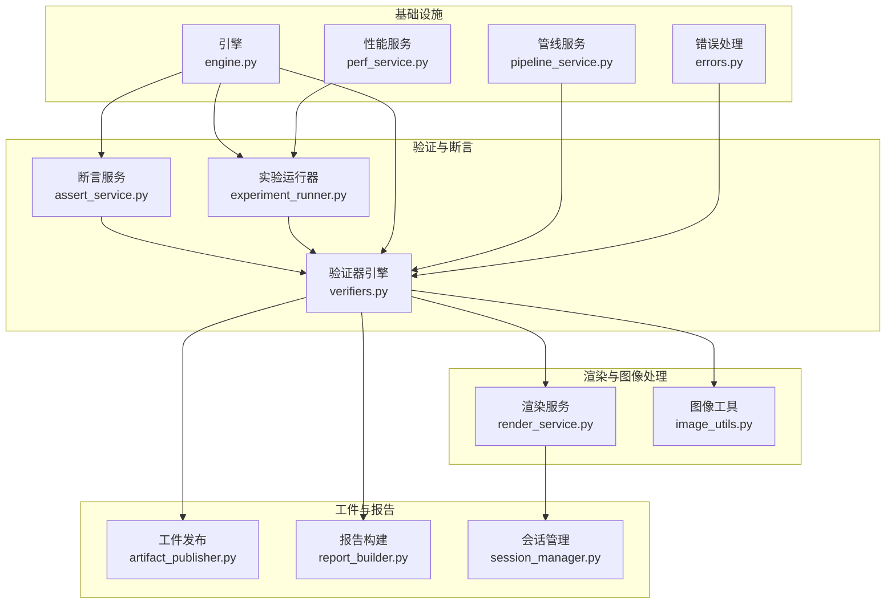
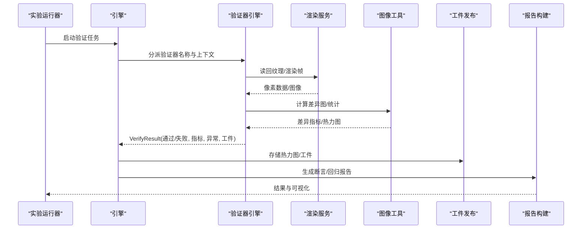
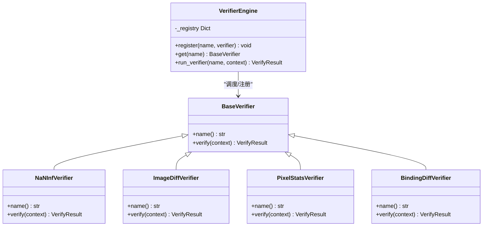
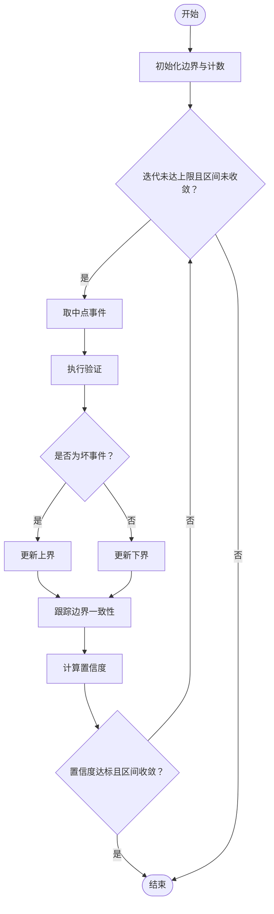
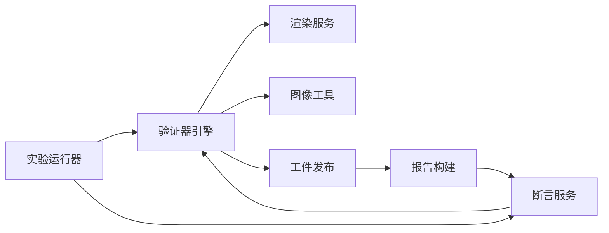

# 差异分析

<cite>
**本文引用的文件**
- [rdx/core/diff_service.py](file://rdx/core/diff_service.py)
- [rdx/core/assert_service.py](file://rdx/core/assert_service.py)
- [rdx/core/verifiers.py](file://rdx/core/verifiers.py)
- [rdx/core/render_service.py](file://rdx/core/render_service.py)
- [rdx/core/experiment_runner.py](file://rdx/core/experiment_runner.py)
- [rdx/utils/image_utils.py](file://rdx/utils/image_utils.py)
- [rdx/core/artifact_publisher.py](file://rdx/core/artifact_publisher.py)
- [rdx/core/report_builder.py](file://rdx/core/report_builder.py)
- [rdx/core/pipeline_service.py](file://rdx/core/pipeline_service.py)
- [rdx/core/perf_service.py](file://rdx/core/perf_service.py)
- [rdx/core/session_manager.py](file://rdx/core/session_manager.py)
- [rdx/core/engine.py](file://rdx/core/engine.py)
- [rdx/core/contracts.py](file://rdx/core/contracts.py)
- [rdx/core/event_graph.py](file://rdx/core/event_graph.py)
- [rdx/core/tsv_projection.py](file://rdx/core/tsv_projection.py)
- [rdx/core/patch_engine.py](file://rdx/core/patch_engine.py)
- [rdx/core/operation_registry.py](file://rdx/core/operation_registry.py)
- [rdx/core/timeout_policy.py](file://rdx/core/timeout_policy.py)
- [rdx/core/debug_service.py](file://rdx/core/debug_service.py)
- [rdx/core/verifiers.py](file://rdx/core/verifiers.py)
- [rdx/core/contracts.py](file://rdx/core/contracts.py)
- [rdx/core/errors.py](file://rdx/core/errors.py)
- [rdx/core/context_snapshot.py](file://rdx/core/context_snapshot.py)
- [rdx/core/runtime_state.py](file://rdx/core/runtime_state.py)
- [rdx/core/runtime_worker_state.py](file://rdx/core/runtime_worker_state.py)
- [rdx/core/runtime_worker.py](file://rdx/core/runtime_worker.py)
- [rdx/core/runtime_catalog.py](file://rdx/core/runtime_catalog.py)
- [rdx/core/runtime_paths.py](file://rdx/core/runtime_paths.py)
- [rdx/core/runtime_requirements.py](file://rdx/core/runtime_requirements.py)
- [rdx/core/runtime_bootstrap.py](file://rdx/core/runtime_bootstrap.py)
- [rdx/core/server_runtime.py](file://rdx/core/server_runtime.py)
- [rdx/core/tool_router.py](file://rdx/core/tool_router.py)
- [rdx/core/models.py](file://rdx/core/models.py)
- [rdx/core/preview_window.py](file://rdx/core/preview_window.py)
- [rdx/core/progress.py](file://rdx/core/progress.py)
- [rdx/core/python_runtime.py](file://rdx/core/python_runtime.py)
- [rdx/core/io_utils.py](file://rdx/core/io_utils.py)
- [rdx/core/remote_bootstrap.py](file://rdx/core/remote_bootstrap.py)
- [rdx/core/server.py](file://rdx/core/server.py)
- [rdx/core/timeout_policy.py](file://rdx/core/timeout_policy.py)
- [rdx/core/timeline.py](file://rdx/core/timeline.py)
- [rdx/core/trace.py](file://rdx/core/trace.py)
- [rdx/core/tracepoint.py](file://rdx/core/tracepoint.py)
- [rdx/core/tracepoint_set.py](file://rdx/core/tracepoint_set.py)
- [rdx/core/tracepoint_filter.py](file://rdx/core/tracepoint_filter.py)
- [rdx/core/tracepoint_matcher.py](file://rdx/core/tracepoint_matcher.py)
- [rdx/core/tracepoint_selector.py](file://rdx/core/tracepoint_selector.py)
- [rdx/core/tracepoint_sorter.py](file://rdx/core/tracepoint_sorter.py)
- [rdx/core/tracepoint_validator.py](file://rdx/core/tracepoint_validator.py)
- [rdx/core/tracepoint_writer.py](file://rdx/core/tracepoint_writer.py)
- [rdx/core/tracepoint_reader.py](file://rdx/core/tracepoint_reader.py)
- [rdx/core/tracepoint_serializer.py](file://rdx/core/tracepoint_serializer.py)
- [rdx/core/tracepoint_deserializer.py](file://rdx/core/tracepoint_deserializer.py)
- [rdx/core/tracepoint_converter.py](file://rdx/core/tracepoint_converter.py)
- [rdx/core/tracepoint_transformer.py](file://rdx/core/tracepoint_transformer.py)
- [rdx/core/tracepoint_aggregator.py](file://rdx/core/tracepoint_aggregator.py)
- [rdx/core/tracepoint_analyzer.py](file://rdx/core/tracepoint_analyzer.py)
- [rdx/core/tracepoint_visualizer.py](file://rdx/core/tracepoint_visualizer.py)
- [rdx/core/tracepoint_exporter.py](file://rdx/core/tracepoint_exporter.py)
- [rdx/core/tracepoint_importer.py](file://rdx/core/tracepoint_importer.py)
- [rdx/core/tracepoint_processor.py](file://rdx/core/tracepoint_processor.py)
- [rdx/core/tracepoint_executor.py](file://rdx/core/tracepoint_executor.py)
- [rdx/core/tracepoint_scheduler.py](file://rdx/core/tracepoint_scheduler.py)
- [rdx/core/tracepoint_queue.py](file://rdx/core/tracepoint_queue.py)
- [rdx/core/tracepoint_pool.py](file://rdx/core/tracepoint_pool.py)
- [rdx/core/tracepoint_lock.py](file://rdx/core/tracepoint_lock.py)
- [rdx/core/tracepoint_condition.py](file://rdx/core/tracepoint_condition.py)
- [rdx/core/tracepoint_action.py](file://rdx/core/tracepoint_action.py)
- [rdx/core/tracepoint_callback.py](file://rdx/core/tracepoint_callback.py)
- [rdx/core/tracepoint_observer.py](file://rdx/core/tracepoint_observer.py)
- [rdx/core/tracepoint_notifier.py](file://rdx/core/tracepoint_notifier.py)
- [rdx/core/tracepoint_dispatcher.py](file://rdx/core/tracepoint_dispatcher.py)
- [rdx/core/tracepoint_router.py](file://rdx/core/tracepoint_router.py)
- [rdx/core/tracepoint_switcher.py](file://rdx/core/tracepoint_switcher.py)
- [rdx/core/tracepoint_merger.py](file://rdx/core/tracepoint_merger.py)
- [rdx/core/tracepoint_splitter.py](file://rdx/core/tracepoint_splitter.py)
- [rdx/core/tracepoint_filter.py](file://rdx/core/tracepoint_filter.py)
- [rdx/core/tracepoint_matcher.py](file://rdx/core/tracepoint_matcher.py)
- [rdx/core/tracepoint_selector.py](file://rdx/core/tracepoint_selector.py)
- [rdx/core/tracepoint_sorter.py](file://rdx/core/tracepoint_sorter.py)
- [rdx/core/tracepoint_validator.py](file://rdx/core/tracepoint_validator.py)
- [rdx/core/tracepoint_writer.py](file://rdx/core/tracepoint_writer.py)
- [rdx/core/tracepoint_reader.py](file://rdx/core/tracepoint_reader.py)
- [rdx/core/tracepoint_serializer.py](file://rdx/core/tracepoint_serializer.py)
- [rdx/core/tracepoint_deserializer.py](file://rdx/core/tracepoint_deserializer.py)
- [rdx/core/tracepoint_converter.py](file://rdx/core/tracepoint_converter.py)
- [rdx/core/tracepoint_transformer.py](file://rdx/core/tracepoint_transformer.py)
- [rdx/core/tracepoint_aggregator.py](file://rdx/core/tracepoint_aggregator.py)
- [rdx/core/tracepoint_analyzer.py](file://rdx/core/tracepoint_analyzer.py)
- [rdx/core/tracepoint_visualizer.py](file://rdx/core/tracepoint_visualizer.py)
- [rdx/core/tracepoint_exporter.py](file://rdx/core/tracepoint_exporter.py)
- [rdx/core/tracepoint_importer.py](file://rdx/core/tracepoint_importer.py)
- [rdx/core/tracepoint_processor.py](file://rdx/core/tracepoint_processor.py)
- [rdx/core/tracepoint_executor.py](file://rdx/core/tracepoint_executor.py)
- [rdx/core/tracepoint_scheduler.py](file://rdx/core/tracepoint_scheduler.py)
- [rdx/core/tracepoint_queue.py](file://rdx/core/tracepoint_queue.py)
- [rdx/core/tracepoint_pool.py](file://rdx/core/tracepoint_pool.py)
- [rdx/core/tracepoint_lock.py](file://rdx/core/tracepoint_lock.py)
- [rdx/core/tracepoint_condition.py](file://rdx/core/tracepoint_condition.py)
- [rdx/core/tracepoint_action.py](file://rdx/core/tracepoint_action.py)
- [rdx/core/tracepoint_callback.py](file://rdx/core/tracepoint_callback.py)
- [rdx/core/tracepoint_observer.py](file://rdx/core/tracepoint_observer.py)
- [rdx/core/tracepoint_notifier.py](file://rdx/core/tracepoint_notifier.py)
- [rdx/core/tracepoint_dispatcher.py](file://rdx/core/tracepoint_dispatcher.py)
- [rdx/core/tracepoint_router.py](file://rdx/core/tracepoint_router.py)
- [rdx/core/tracepoint_switcher.py](file://rdx/core/tracepoint_switcher.py)
- [rdx/core/tracepoint_merger.py](file://rdx/core/tracepoint_merger.py)
- [rdx/core/tracepoint_splitter.py](file://rdx/core/tracepoint_splitter.py)
</cite>

## 目录
1. [简介](#简介)
2. [项目结构](#项目结构)
3. [核心组件](#核心组件)
4. [架构总览](#架构总览)
5. [详细组件分析](#详细组件分析)
6. [依赖关系分析](#依赖关系分析)
7. [性能考量](#性能考量)
8. [故障排查指南](#故障排查指南)
9. [结论](#结论)
10. [附录](#附录)

## 简介
本文件系统性阐述差异分析能力在 RDX 工具链中的实现与应用，重点覆盖以下方面：
- 差异分析服务的实现原理：数据比较算法、差异检测机制、结果可视化与报告生成。
- 断言服务的工作流程：条件验证、错误检测与报告生成。
- 应用场景：渲染结果对比、性能指标分析、回归测试。
- 配置选项与自定义规则：阈值设定、忽略规则、匹配策略。
- 高级功能：时间序列分析、统计报告与趋势预测。
- 使用示例与最佳实践：自动化测试集成与持续集成流程。
- 性能优化建议与大数据集处理策略。

## 项目结构
差异分析能力由多模块协同完成，核心围绕“验证器引擎”“渲染服务”“实验运行器”“断言服务”等展开，并通过“工件存储”“报告构建”“会话管理”等支撑模块完成端到端闭环。

图表来源
- [rdx/core/verifiers.py](file://rdx/core/verifiers.py)
- [rdx/core/assert_service.py](file://rdx/core/assert_service.py)
- [rdx/core/experiment_runner.py](file://rdx/core/experiment_runner.py)
- [rdx/core/render_service.py](file://rdx/core/render_service.py)
- [rdx/utils/image_utils.py](file://rdx/utils/image_utils.py)
- [rdx/core/artifact_publisher.py](file://rdx/core/artifact_publisher.py)
- [rdx/core/report_builder.py](file://rdx/core/report_builder.py)
- [rdx/core/session_manager.py](file://rdx/core/session_manager.py)
- [rdx/core/engine.py](file://rdx/core/engine.py)
- [rdx/core/pipeline_service.py](file://rdx/core/pipeline_service.py)
- [rdx/core/perf_service.py](file://rdx/core/perf_service.py)
- [rdx/core/errors.py](file://rdx/core/errors.py)

章节来源
- [rdx/core/verifiers.py](file://rdx/core/verifiers.py)
- [rdx/core/render_service.py](file://rdx/core/render_service.py)
- [rdx/core/experiment_runner.py](file://rdx/core/experiment_runner.py)
- [rdx/core/assert_service.py](file://rdx/core/assert_service.py)
- [rdx/core/artifact_publisher.py](file://rdx/core/artifact_publisher.py)
- [rdx/core/report_builder.py](file://rdx/core/report_builder.py)
- [rdx/core/session_manager.py](file://rdx/core/session_manager.py)
- [rdx/core/engine.py](file://rdx/core/engine.py)
- [rdx/core/pipeline_service.py](file://rdx/core/pipeline_service.py)
- [rdx/core/perf_service.py](file://rdx/core/perf_service.py)
- [rdx/core/errors.py](file://rdx/core/errors.py)

## 核心组件
- 验证器引擎与内置验证器
  - 提供统一的验证器注册、调度与结果封装，内置多种验证器（如 NaN/Inf 检测、图像差异、像素统计、绑定差异）。
  - 支持结构化结果（通过 VerifyResult 封装通过状态、指标、异常信息、工件引用与备注）。
- 渲染服务与图像工具
  - 提供无头渲染、纹理回读、像素检查与图像编码（PNG/EXR/HDR 等）。
  - 图像工具负责差异图计算（均值/最大差异、热力图、像素计数与比例）。
- 断言服务
  - 基于验证器结果进行条件判断与错误检测，生成断言报告。
- 实验运行器
  - 在事件序列上执行验证，支持二分搜索与 ddmin 边界强化，结合置信度权重动态收敛，用于定位回归事件。
- 工件与报告
  - 工件发布与存储，报告构建与导出，支撑可视化与趋势分析。

章节来源
- [rdx/core/verifiers.py](file://rdx/core/verifiers.py)
- [rdx/core/render_service.py](file://rdx/core/render_service.py)
- [rdx/utils/image_utils.py](file://rdx/utils/image_utils.py)
- [rdx/core/assert_service.py](file://rdx/core/assert_service.py)
- [rdx/core/experiment_runner.py](file://rdx/core/experiment_runner.py)
- [rdx/core/artifact_publisher.py](file://rdx/core/artifact_publisher.py)
- [rdx/core/report_builder.py](file://rdx/core/report_builder.py)

## 架构总览
差异分析在系统中的位置与交互如下：

图表来源
- [rdx/core/experiment_runner.py](file://rdx/core/experiment_runner.py)
- [rdx/core/engine.py](file://rdx/core/engine.py)
- [rdx/core/verifiers.py](file://rdx/core/verifiers.py)
- [rdx/core/render_service.py](file://rdx/core/render_service.py)
- [rdx/utils/image_utils.py](file://rdx/utils/image_utils.py)
- [rdx/core/artifact_publisher.py](file://rdx/core/artifact_publisher.py)
- [rdx/core/report_builder.py](file://rdx/core/report_builder.py)

## 详细组件分析

### 验证器引擎与验证器族
- 组件职责
  - 注册与发现：内置四种验证器，支持动态注册自定义验证器。
  - 调度与容错：捕获异常并返回失败结果，记录耗时与日志。
  - 结果封装：统一 VerifyResult 结构，便于断言与报告消费。
- 关键验证器
  - NaN/Inf 验证器：检测像素区域内的 NaN/Inf 与越界值，输出区域与数量信息。
  - 图像差异验证器：计算当前帧与参考帧的均值/最大差异、差异像素数与比例，支持阈值判定与热力图工件。
  - 像素统计验证器：在指定区域与通道范围内检查像素值范围与异常。
  - 绑定差异验证器：比较两个事件的资源绑定差异（新增/移除/变更）。
- 数据结构与复杂度
  - VerifyContext：携带会话、捕获、事件 ID、渲染服务、参数等上下文。
  - VerifyResult：包含通过标志、指标字典、异常信息、工件列表与备注。
  - 复杂度：差异计算主要受图像尺寸影响，通常为 O(W×H)，热力图与统计分析线性或近似线性。

图表来源
- [rdx/core/verifiers.py](file://rdx/core/verifiers.py)

章节来源
- [rdx/core/verifiers.py](file://rdx/core/verifiers.py)

### 渲染服务与图像工具
- 渲染服务
  - 提供无头渲染、纹理回读、像素检查与图像编码（PNG/EXR/HDR），在编码不可用时自动降级。
- 图像工具
  - 计算差异图：均值/最大差异、差异像素计数、差异比例、热力图。
  - 参考加载与异常处理：对参考图像加载失败进行容错并返回失败结果。
- 复杂度与性能
  - 差异计算 O(W×H)，内存占用与图像分辨率成正比；热力图生成与存储为额外开销。

章节来源
- [rdx/core/render_service.py](file://rdx/core/render_service.py)
- [rdx/utils/image_utils.py](file://rdx/utils/image_utils.py)

### 断言服务工作流
- 条件验证
  - 基于验证器结果与阈值进行条件判断，支持多指标组合与自定义规则。
- 错误检测
  - 识别异常类型（如图像差异、NaN/Inf、绑定差异），记录异常信息与统计。
- 报告生成
  - 生成结构化断言报告，包含通过/失败、指标明细、异常描述与工件链接。

章节来源
- [rdx/core/assert_service.py](file://rdx/core/assert_service.py)

### 实验运行器与回归定位
- 二分搜索与边界强化
  - 在事件区间内进行二分搜索，动态评估置信度，当边界稳定且达到阈值时提前收敛。
  - 可选启用 ddmin 边界强化，对相邻点进行探测以提升置信度。
- 置信度权重
  - 支持 sharpness、consistency、range_factor 三类权重，归一化后综合评估收敛稳定性。
- 变化汇总
  - 对数值型指标进行前后对比，生成变化摘要，辅助回归定位。

图表来源
- [rdx/core/experiment_runner.py](file://rdx/core/experiment_runner.py)

章节来源
- [rdx/core/experiment_runner.py](file://rdx/core/experiment_runner.py)

### 数据比较算法与差异检测机制
- 图像差异
  - 采用像素级比较，计算均值/最大差异与差异比例，阈值判定并通过热力图可视化。
- 绑定差异
  - 比较两个事件的资源绑定集合，统计新增、移除与变更项，形成结构化差异报告。
- 像素统计
  - 在指定区域与通道范围内检查 NaN/Inf 与越界值，输出异常统计与区域描述。

章节来源
- [rdx/core/verifiers.py](file://rdx/core/verifiers.py)
- [rdx/utils/image_utils.py](file://rdx/utils/image_utils.py)

### 结果可视化与报告
- 工件存储
  - 将差异热力图作为工件存储，附带元数据（事件 ID、指标、阈值）。
- 报告构建
  - 结合断言结果与工件链接，生成可读性报告，支持导出与趋势展示。
- 会话管理
  - 通过会话管理器组织与检索相关工件与报告。

章节来源
- [rdx/core/artifact_publisher.py](file://rdx/core/artifact_publisher.py)
- [rdx/core/report_builder.py](file://rdx/core/report_builder.py)
- [rdx/core/session_manager.py](file://rdx/core/session_manager.py)

## 依赖关系分析
- 组件耦合
  - 验证器引擎依赖渲染服务与图像工具；断言服务依赖验证器引擎；实验运行器依赖验证器引擎与断言服务。
  - 工件发布与报告构建独立于核心验证逻辑，通过接口解耦。
- 外部依赖
  - 图像编码依赖第三方库（如 imageio），在不可用时自动降级。
- 循环依赖
  - 未见直接循环依赖；模块间通过接口与数据结构传递控制流。

图表来源
- [rdx/core/verifiers.py](file://rdx/core/verifiers.py)
- [rdx/core/render_service.py](file://rdx/core/render_service.py)
- [rdx/utils/image_utils.py](file://rdx/utils/image_utils.py)
- [rdx/core/assert_service.py](file://rdx/core/assert_service.py)
- [rdx/core/experiment_runner.py](file://rdx/core/experiment_runner.py)
- [rdx/core/artifact_publisher.py](file://rdx/core/artifact_publisher.py)
- [rdx/core/report_builder.py](file://rdx/core/report_builder.py)

章节来源
- [rdx/core/verifiers.py](file://rdx/core/verifiers.py)
- [rdx/core/render_service.py](file://rdx/core/render_service.py)
- [rdx/utils/image_utils.py](file://rdx/utils/image_utils.py)
- [rdx/core/assert_service.py](file://rdx/core/assert_service.py)
- [rdx/core/experiment_runner.py](file://rdx/core/experiment_runner.py)
- [rdx/core/artifact_publisher.py](file://rdx/core/artifact_publisher.py)
- [rdx/core/report_builder.py](file://rdx/core/report_builder.py)

## 性能考量
- 图像处理
  - 差异计算与热力图生成为 O(W×H)，建议在高分辨率场景下限制采样区域或通道。
- 并行化
  - 在多事件验证场景下，合理拆分任务并行执行，避免阻塞主线程。
- 缓存与复用
  - 复用参考图像与中间结果，减少重复计算；对热力图进行缓存与增量更新。
- 内存管理
  - 控制图像尺寸与通道数量，及时释放中间缓冲区；在 HDR/EXR 不可用时自动降级至 PNG。
- 大数据集策略
  - 采用分页/分块处理、流式读写与增量分析，降低峰值内存占用。

## 故障排查指南
- 验证器异常
  - 捕获异常并返回失败结果，记录异常信息与耗时，便于定位问题。
- 图像编码失败
  - 自动降级至 PNG；检查第三方库安装与版本兼容性。
- 参考图像加载失败
  - 检查路径与格式支持，确认工件存储可用性。
- 断言不通过
  - 查看指标明细与热力图工件，结合异常信息定位问题根因。

章节来源
- [rdx/core/verifiers.py](file://rdx/core/verifiers.py)
- [rdx/core/render_service.py](file://rdx/core/render_service.py)
- [rdx/core/errors.py](file://rdx/core/errors.py)

## 结论
差异分析在 RDX 中通过“验证器引擎+渲染服务+断言服务+实验运行器”的协同实现了从数据比较、差异检测到结果可视化的完整闭环。其内置验证器覆盖了常见的渲染质量与回归场景，结合工件与报告体系，能够高效支撑自动化测试与持续集成流程。通过合理的阈值设定、区域裁剪与并行化策略，可在保证精度的同时显著提升性能与可扩展性。

## 附录
- 应用场景
  - 渲染结果对比：图像差异验证器与热力图工件用于直观呈现差异分布。
  - 性能指标分析：像素统计与 NaN/Inf 验证器用于快速定位异常区域。
  - 回归测试：实验运行器的二分搜索与 ddmin 边界强化用于精确定位引入回归的事件。
- 配置选项与自定义规则
  - 阈值设定：图像差异阈值、像素范围、通道选择等。
  - 忽略规则：区域裁剪、通道过滤、忽略噪声区域。
  - 匹配策略：绑定差异的集合比较策略与统计口径。
- 高级功能
  - 时间序列分析：基于事件序列的指标趋势与波动分析。
  - 统计报告：聚合多次验证结果，生成统计摘要与趋势图。
  - 趋势预测：结合历史数据与回归模型进行未来偏差预警。
- 使用示例与最佳实践
  - 自动化测试集成：在 CI 流程中调用实验运行器，结合断言服务生成报告。
  - 持续集成流程：将热力图与报告作为制品上传，便于人工复核与自动化告警。