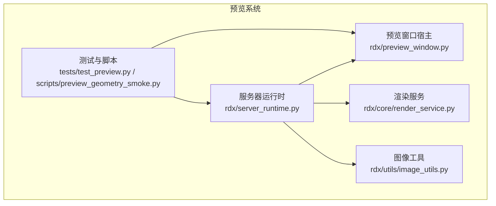
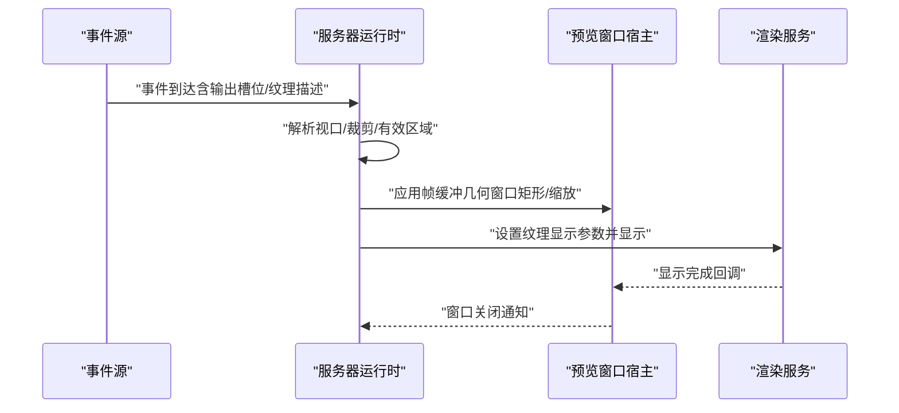
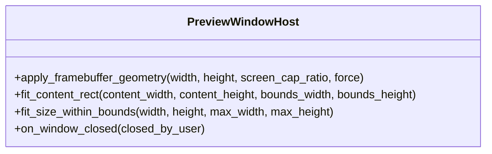
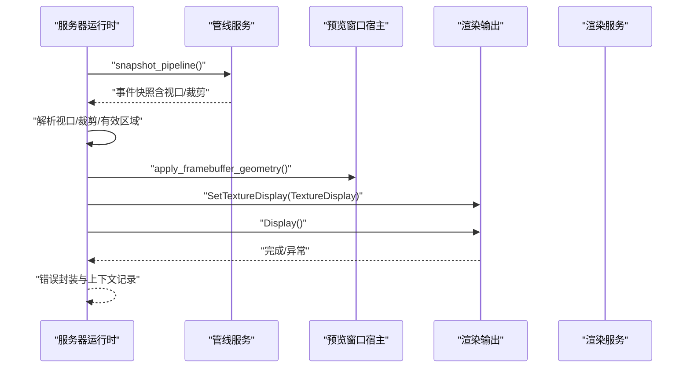
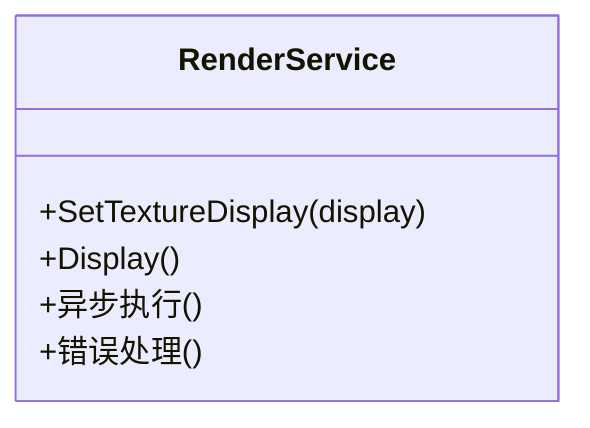
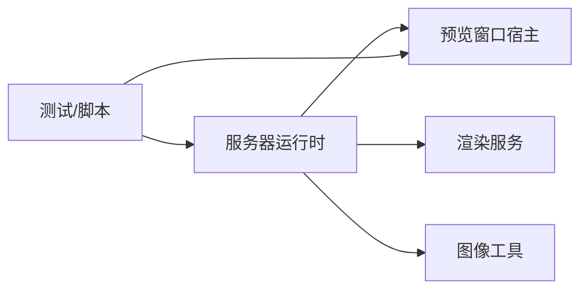

# 预览系统

<cite>
**本文引用的文件**
- [rdx/preview_window.py](file://rdx/preview_window.py)
- [rdx/server_runtime.py](file://rdx/server_runtime.py)
- [rdx/core/render_service.py](file://rdx/core/render_service.py)
- [rdx/utils/image_utils.py](file://rdx/utils/image_utils.py)
- [tests/test_preview.py](file://tests/test_preview.py)
- [scripts/preview_geometry_smoke.py](file://scripts/preview_geometry_smoke.py)
</cite>

## 目录
1. [简介](#简介)
2. [项目结构](#项目结构)
3. [核心组件](#核心组件)
4. [架构总览](#架构总览)
5. [详细组件分析](#详细组件分析)
6. [依赖关系分析](#依赖关系分析)
7. [性能考虑](#性能考虑)
8. [故障排除指南](#故障排除指南)
9. [结论](#结论)
10. [附录](#附录)

## 简介
本文件系统性阐述 RDX 预览系统的实现与使用方法，重点覆盖以下方面：
- 实时渲染结果预览：从事件管线中选择输出纹理，计算视口/裁剪区域，驱动预览显示。
- 预览窗口管理：窗口生命周期（创建、布局适配、关闭）、与宿主平台的几何绑定。
- 渲染服务集成：与渲染服务协作，确保纹理资源可用与显示参数正确。
- 图像处理管道：缩放、颜色通道映射、HDR 调整等显示前处理。
- 多线程与异步更新：通过异步任务与“脱管”调用保障 UI 响应与渲染吞吐。
- 使用示例与最佳实践：高分辨率、动画帧预览、批量预览等场景。
- 故障排除与性能调优：常见问题定位与优化建议。

## 项目结构
预览系统主要由以下模块构成：
- 预览窗口宿主与几何适配：负责窗口创建、尺寸与位置计算、与宿主平台的绑定。
- 服务器运行时：负责从事件管线提取纹理与几何信息，构建显示状态并触发显示。
- 渲染服务：提供渲染能力与资源管理接口，供预览系统调用。
- 图像工具：提供图像处理辅助函数（如尺寸适配）。
- 测试与脚本：验证预览行为、几何适配与回归测试。

**图表来源**
- [rdx/preview_window.py](file://rdx/preview_window.py)
- [rdx/server_runtime.py](file://rdx/server_runtime.py)
- [rdx/core/render_service.py](file://rdx/core/render_service.py)
- [rdx/utils/image_utils.py](file://rdx/utils/image_utils.py)
- [tests/test_preview.py](file://tests/test_preview.py)
- [scripts/preview_geometry_smoke.py](file://scripts/preview_geometry_smoke.py)

**章节来源**
- [rdx/preview_window.py](file://rdx/preview_window.py)
- [rdx/server_runtime.py](file://rdx/server_runtime.py)
- [rdx/core/render_service.py](file://rdx/core/render_service.py)
- [rdx/utils/image_utils.py](file://rdx/utils/image_utils.py)
- [tests/test_preview.py](file://tests/test_preview.py)
- [scripts/preview_geometry_smoke.py](file://scripts/preview_geometry_smoke.py)

## 核心组件
- 预览窗口宿主（PreviewWindowHost）
  - 负责与宿主平台交互，应用帧缓冲几何（窗口矩形、缩放比例），并提供窗口关闭回调。
  - 提供内容适配与居中逻辑，用于在不同屏幕比例下保持预览可视性。
- 服务器运行时（ServerRuntime）
  - 从事件管线快照中解析视口与裁剪区域，计算有效显示区域，并生成预览显示状态。
  - 选择目标纹理与输出槽位，构造 TextureDisplay 参数并调用渲染输出进行显示。
  - 提供预览错误封装与异常处理。
- 渲染服务（RenderService）
  - 提供渲染能力与资源管理接口，支持纹理显示设置与显示命令执行。
- 图像工具（image_utils）
  - 提供尺寸适配与边界内放置等辅助函数，支撑预览窗口的布局与缩放。

**章节来源**
- [rdx/preview_window.py](file://rdx/preview_window.py)
- [rdx/server_runtime.py](file://rdx/server_runtime.py)
- [rdx/core/render_service.py](file://rdx/core/render_service.py)
- [rdx/utils/image_utils.py](file://rdx/utils/image_utils.py)

## 架构总览
预览系统采用“事件驱动 + 异步显示”的架构：
- 事件源（捕获/回放）产生帧数据与输出槽位。
- 服务器运行时解析事件快照，确定纹理、视口、裁剪与有效区域。
- 预览窗口宿主根据宿主平台几何信息调整窗口大小与位置。
- 渲染服务接收显示参数并执行显示操作。
- 测试与脚本对预览行为进行验证与回归。

**图表来源**
- [rdx/server_runtime.py](file://rdx/server_runtime.py)
- [rdx/preview_window.py](file://rdx/preview_window.py)
- [rdx/core/render_service.py](file://rdx/core/render_service.py)

## 详细组件分析

### 预览窗口宿主（PreviewWindowHost）
- 职责
  - 应用帧缓冲几何：根据宽度、高度与屏幕捕获比例，计算窗口矩形。
  - 内容适配：提供内容矩形与边界内放置的辅助函数，保证预览内容在窗口中合理展示。
  - 生命周期回调：注册窗口关闭回调，向服务器运行时报告关闭原因。
- 关键点
  - 几何计算与缩放：通过宿主平台提供的几何应用接口，确保窗口尺寸与内容比例匹配。
  - 与服务器运行时的交互：在显示前完成几何应用，在显示后响应关闭事件。

**图表来源**
- [rdx/preview_window.py](file://rdx/preview_window.py)

**章节来源**
- [rdx/preview_window.py](file://rdx/preview_window.py)

### 服务器运行时（预览显示流程）
- 职责
  - 从事件管线快照中提取视口与裁剪区域，计算有效显示区域。
  - 选择目标纹理与输出槽位，构建显示状态并设置到渲染输出。
  - 执行显示命令，处理异常并返回错误上下文。
- 关键流程
  - 快照与区域解析：从事件快照中读取视口与裁剪，转换为内部矩形表示。
  - 显示状态构建：组合纹理ID、格式、帧缓冲尺寸、窗口矩形与区域标记模式。
  - 显示执行：构造 TextureDisplay 并调用渲染输出进行显示；失败时抛出预览错误。

**图表来源**
- [rdx/server_runtime.py](file://rdx/server_runtime.py)

**章节来源**
- [rdx/server_runtime.py](file://rdx/server_runtime.py)

### 渲染服务（RenderService）
- 职责
  - 提供渲染能力与资源管理接口，支持纹理显示参数设置与显示命令执行。
  - 作为服务器运行时与底层渲染输出之间的桥梁，负责异步执行与错误传播。
- 关键点
  - 异步执行：通过“脱管”调用避免阻塞主线程。
  - 参数一致性：确保颜色通道、缩放范围、HDR 多plier 等参数符合预期。

**图表来源**
- [rdx/core/render_service.py](file://rdx/core/render_service.py)

**章节来源**
- [rdx/core/render_service.py](file://rdx/core/render_service.py)

### 图像处理工具（image_utils）
- 职责
  - 提供尺寸适配与边界内放置等通用图像处理辅助函数，支撑预览窗口的布局与缩放。
- 关键点
  - 尺寸适配：在给定边界内按比例缩放内容，保证不溢出。
  - 居中与填充：提供多种适配策略以满足不同预览需求。

**章节来源**
- [rdx/utils/image_utils.py](file://rdx/utils/image_utils.py)

### 测试与脚本（验证与回归）
- 测试（test_preview.py）
  - 验证预览窗口的尺寸适配与居中逻辑，覆盖高分辨率与中心化场景。
- 回归脚本（preview_geometry_smoke.py）
  - 检测预览窗口几何变化，支持截图与定位，便于回归验证。

**章节来源**
- [tests/test_preview.py](file://tests/test_preview.py)
- [scripts/preview_geometry_smoke.py](file://scripts/preview_geometry_smoke.py)

## 依赖关系分析
- 组件耦合
  - 服务器运行时依赖预览窗口宿主进行几何应用，依赖渲染服务执行显示。
  - 预览窗口宿主与渲染服务之间通过显示状态与显示命令解耦。
- 外部依赖
  - 事件管线快照：提供视口、裁剪与有效区域信息。
  - 宿主平台几何接口：提供帧缓冲尺寸与窗口矩形计算入口。
- 循环依赖
  - 未发现循环依赖；各模块职责清晰，接口单向依赖。

**图表来源**
- [rdx/server_runtime.py](file://rdx/server_runtime.py)
- [rdx/preview_window.py](file://rdx/preview_window.py)
- [rdx/core/render_service.py](file://rdx/core/render_service.py)
- [rdx/utils/image_utils.py](file://rdx/utils/image_utils.py)
- [tests/test_preview.py](file://tests/test_preview.py)
- [scripts/preview_geometry_smoke.py](file://scripts/preview_geometry_smoke.py)

**章节来源**
- [rdx/server_runtime.py](file://rdx/server_runtime.py)
- [rdx/preview_window.py](file://rdx/preview_window.py)
- [rdx/core/render_service.py](file://rdx/core/render_service.py)
- [rdx/utils/image_utils.py](file://rdx/utils/image_utils.py)
- [tests/test_preview.py](file://tests/test_preview.py)
- [scripts/preview_geometry_smoke.py](file://scripts/preview_geometry_smoke.py)

## 性能考虑
- 异步与脱管调用
  - 通过异步任务与“脱管”调用避免阻塞 UI 线程，提升响应性。
- 显示参数优化
  - 合理设置缩放范围与 HDR 多倍数，减少不必要的后处理开销。
  - 仅启用必要的颜色通道，降低带宽占用。
- 几何与布局
  - 使用合适的屏幕捕获比例与内容适配策略，避免过度缩放导致的采样损失。
- 批量与动画
  - 动画预览建议限制刷新频率，结合事件节流策略，平衡流畅度与资源消耗。
  - 批量预览可采用队列化处理与并发上限控制，防止峰值内存与 CPU 占用。

## 故障排除指南
- 显示失败
  - 现象：调用显示命令后立即失败或无画面。
  - 排查：检查纹理 ID 是否有效、输出槽位是否正确、显示参数是否越界。
  - 参考：服务器运行时对显示异常的封装与上下文记录。
- 几何异常
  - 现象：窗口尺寸异常、内容被裁剪或未居中。
  - 排查：确认帧缓冲尺寸与屏幕捕获比例，核对内容适配与边界计算。
  - 参考：预览窗口宿主的几何应用与适配函数。
- 窗口关闭问题
  - 现象：用户关闭窗口后未收到回调或状态未清理。
  - 排查：确认关闭回调注册与上下文 ID 传递，检查服务器运行时的关闭处理逻辑。
- 回归验证
  - 使用预览几何回归脚本定位窗口几何变化，必要时配合截图比对。

**章节来源**
- [rdx/server_runtime.py](file://rdx/server_runtime.py)
- [rdx/preview_window.py](file://rdx/preview_window.py)
- [scripts/preview_geometry_smoke.py](file://scripts/preview_geometry_smoke.py)

## 结论
预览系统通过事件驱动与异步显示机制，实现了从纹理选择、几何解析到窗口显示的完整闭环。其模块化设计使得预览窗口宿主、服务器运行时与渲染服务职责清晰、耦合可控。配合图像处理工具与测试脚本，系统在高分辨率、动画与批量场景下具备良好的扩展性与稳定性。建议在实际使用中关注异步执行、显示参数与几何适配，以获得更佳的性能与体验。

## 附录
- 使用示例与最佳实践
  - 高分辨率预览：提高帧缓冲尺寸与屏幕捕获比例，注意内存与带宽开销。
  - 动画预览：限制刷新频率，启用事件节流，避免 UI 卡顿。
  - 批量预览：采用队列化与并发上限控制，分批处理以稳定资源占用。
- 相关实现参考
  - 预览窗口几何与适配：参见预览窗口宿主相关函数。
  - 显示状态构建与执行：参见服务器运行时的显示流程。
  - 图像处理辅助：参见图像工具的尺寸适配与边界放置函数。