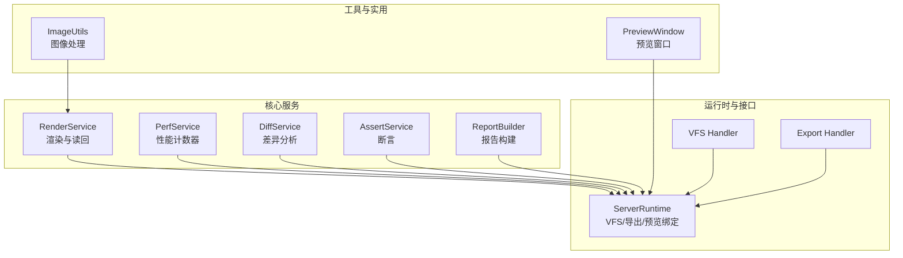
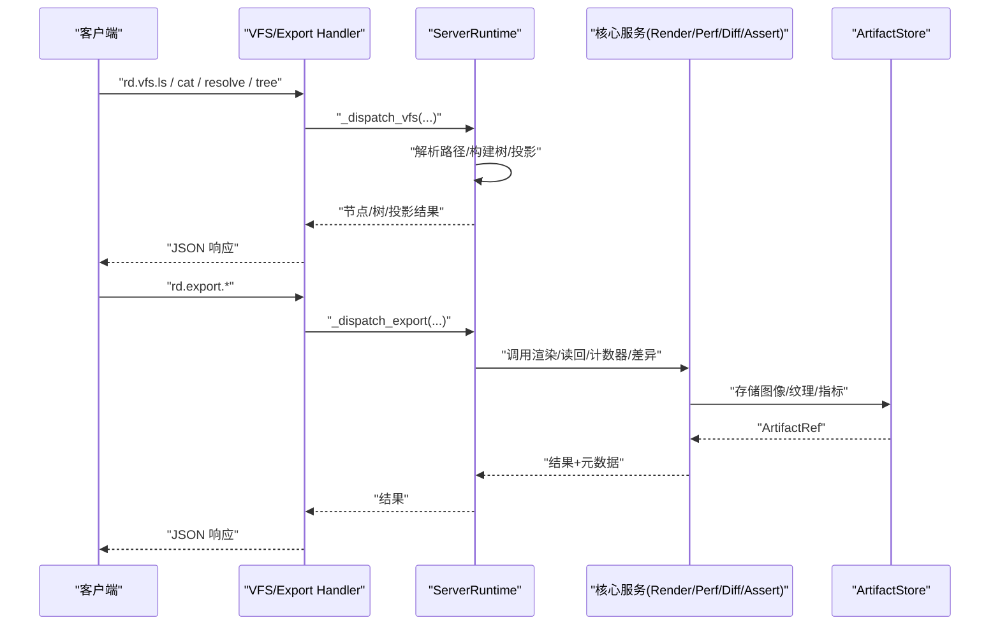
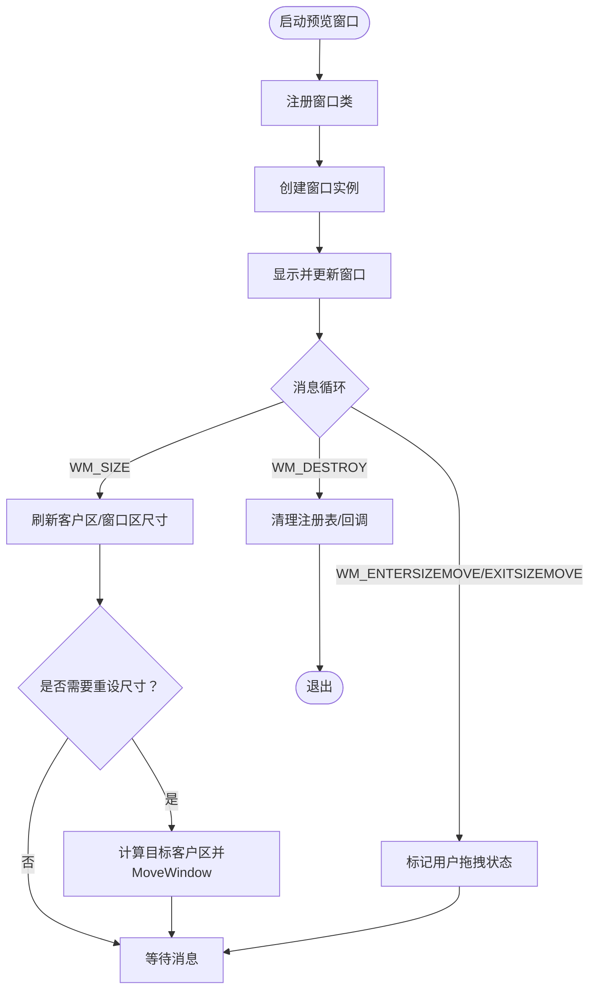
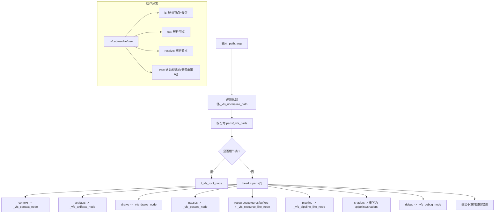
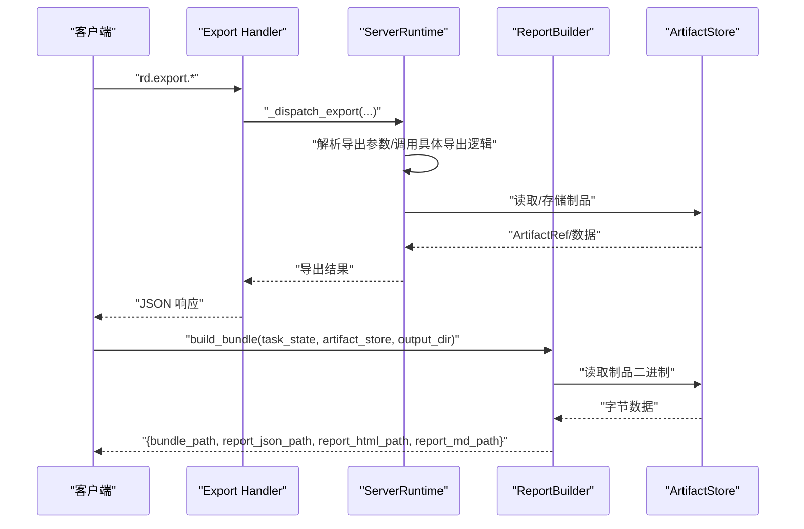
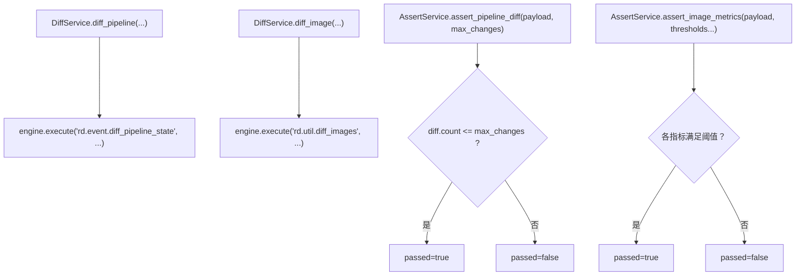
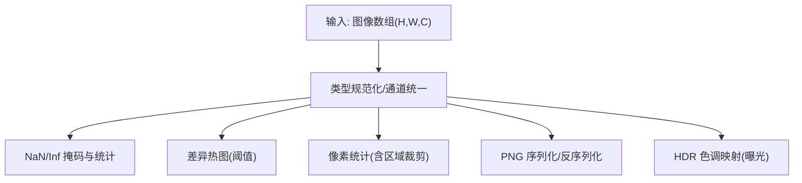
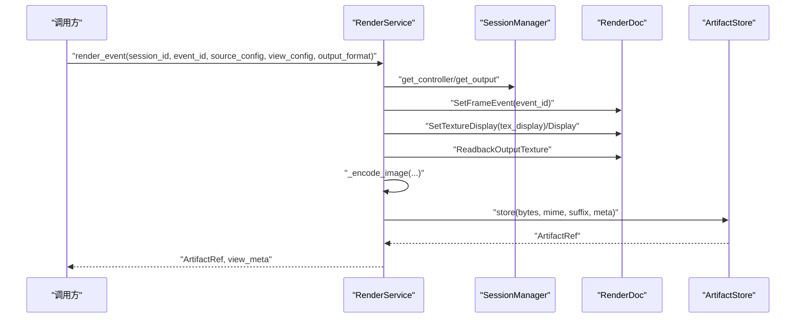
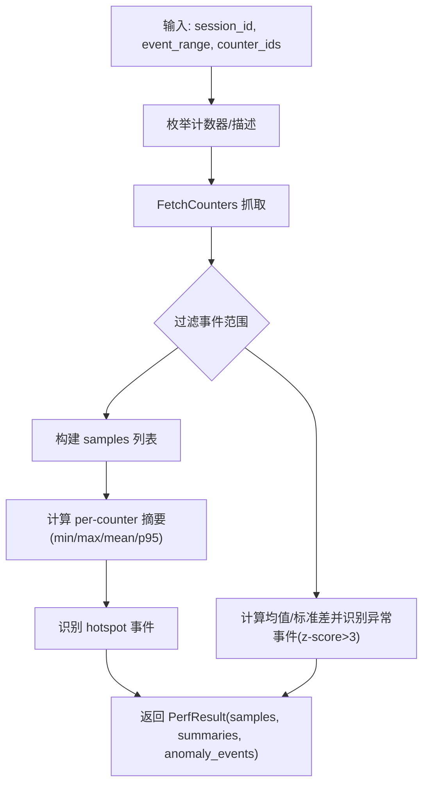
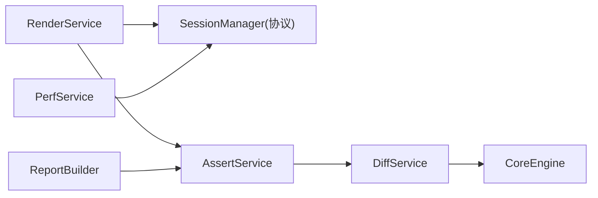

# 高级功能

<cite>
**本文引用的文件**
- [rdx/preview_window.py](file://rdx/preview_window.py)
- [rdx/server_runtime.py](file://rdx/server_runtime.py)
- [rdx/handlers/vfs.py](file://rdx/handlers/vfs.py)
- [rdx/core/report_builder.py](file://rdx/core/report_builder.py)
- [rdx/core/render_service.py](file://rdx/core/render_service.py)
- [rdx/utils/image_utils.py](file://rdx/utils/image_utils.py)
- [rdx/core/diff_service.py](file://rdx/core/diff_service.py)
- [rdx/core/assert_service.py](file://rdx/core/assert_service.py)
- [rdx/core/perf_service.py](file://rdx/core/perf_service.py)
- [rdx/handlers/export.py](file://rdx/handlers/export.py)
</cite>

## 目录
1. [简介](#简介)
2. [项目结构](#项目结构)
3. [核心组件](#核心组件)
4. [架构总览](#架构总览)
5. [详细组件分析](#详细组件分析)
6. [依赖分析](#依赖分析)
7. [性能考量](#性能考量)
8. [故障排查指南](#故障排查指南)
9. [结论](#结论)
10. [附录](#附录)

## 简介
本文件面向有经验的用户，系统化阐述 RDC-Agent-Tools 的高级功能与实现原理，覆盖以下主题：
- 预览系统：窗口几何与帧缓冲联动、用户交互与自动调整策略
- VFS 虚拟文件系统：树形浏览、节点解析、投影与分页
- 导出与报告：报告构建器、导出处理器、产物组织与发布
- 差异分析：管线状态差异、图像差异与指标断言
- 图像处理工具：HDR/NaN/Inf 检测、差异热图、像素统计与色调映射
- 渲染服务：异步渲染、纹理读回、像素检查与格式编码
- 断言服务：稳定判定语义与阈值断言
- 性能分析：GPU 性能计数器枚举、采样、热点检测与异常事件识别
- 并发与内存：线程池调度、阻塞 I/O 离线化、内存布局与数据类型规范化

## 项目结构
围绕“高级功能”的相关模块主要分布在 rdx/core、rdx/handlers、rdx/utils、以及 rdx/server_runtime.py 中。下图给出与高级功能相关的模块关系概览。

图表来源
- [rdx/core/render_service.py:345-520](file://rdx/core/render_service.py#L345-L520)
- [rdx/core/perf_service.py:168-574](file://rdx/core/perf_service.py#L168-L574)
- [rdx/core/diff_service.py:11-51](file://rdx/core/diff_service.py#L11-L51)
- [rdx/core/assert_service.py:16-79](file://rdx/core/assert_service.py#L16-L79)
- [rdx/core/report_builder.py:460-558](file://rdx/core/report_builder.py#L460-L558)
- [rdx/utils/image_utils.py:1-478](file://rdx/utils/image_utils.py#L1-L478)
- [rdx/preview_window.py:192-437](file://rdx/preview_window.py#L192-L437)
- [rdx/server_runtime.py:12200-12337](file://rdx/server_runtime.py#L12200-L12337)
- [rdx/handlers/vfs.py:8-9](file://rdx/handlers/vfs.py#L8-L9)
- [rdx/handlers/export.py:8-9](file://rdx/handlers/export.py#L8-L9)

章节来源
- [rdx/server_runtime.py:12200-12337](file://rdx/server_runtime.py#L12200-L12337)
- [rdx/handlers/vfs.py:8-9](file://rdx/handlers/vfs.py#L8-L9)
- [rdx/handlers/export.py:8-9](file://rdx/handlers/export.py#L8-L9)

## 核心组件
- 预览系统：通过 Windows 窗口消息循环与几何管理，实现帧缓冲尺寸与窗口尺寸的联动，支持用户手动调整与自动适配。
- VFS 虚拟文件系统：以路径解析为核心，支持 ls/cat/resolve/tree 等动作，结合投影与树构建，提供上下文、资源、管线、着色器等多维导航。
- 导出与报告：导出处理器对接 server_runtime 的导出分发；报告构建器产出包含 JSON、Markdown、HTML 与资产的自包含报告包。
- 差异分析：DiffService 封装引擎操作，支持管线状态差异与图像差异；配合断言服务进行阈值判定。
- 图像处理工具：提供 NaN/Inf 检测、差异热图、像素统计、PNG 序列化与 HDR 色调映射等实用算法。
- 渲染服务：RenderService 将 RenderDoc 的渲染、读回与像素检查封装为异步接口，支持多种输出格式与子资源读取。
- 断言服务：提供稳定的断言结果语义，支持管线差异计数与图像指标阈值断言。
- 性能分析：PerfService 支持计数器枚举、事件范围采样、热点检测与异常事件识别。

章节来源
- [rdx/preview_window.py:192-437](file://rdx/preview_window.py#L192-L437)
- [rdx/server_runtime.py:12200-12337](file://rdx/server_runtime.py#L12200-L12337)
- [rdx/core/report_builder.py:460-558](file://rdx/core/report_builder.py#L460-L558)
- [rdx/core/diff_service.py:11-51](file://rdx/core/diff_service.py#L11-L51)
- [rdx/utils/image_utils.py:1-478](file://rdx/utils/image_utils.py#L1-L478)
- [rdx/core/render_service.py:345-520](file://rdx/core/render_service.py#L345-L520)
- [rdx/core/assert_service.py:16-79](file://rdx/core/assert_service.py#L16-L79)
- [rdx/core/perf_service.py:168-574](file://rdx/core/perf_service.py#L168-L574)

## 架构总览
下图展示“VFS/导出/预览”与“核心服务”的交互关系，体现高级功能的控制流与数据流。

图表来源
- [rdx/handlers/vfs.py:8-9](file://rdx/handlers/vfs.py#L8-L9)
- [rdx/server_runtime.py:12200-12337](file://rdx/server_runtime.py#L12200-L12337)
- [rdx/handlers/export.py:8-9](file://rdx/handlers/export.py#L8-L9)

## 详细组件分析

### 预览系统
- 几何联动：根据帧缓冲尺寸动态调整窗口大小，限制在工作区的一定比例内，避免过大影响用户体验。
- 用户交互：监听窗口尺寸变化与拖拽开始/结束事件，区分用户手动调整与自动调整，防止互相覆盖。
- 生命周期：启动线程创建窗口类与窗口实例，进入消息循环；支持关闭与超时等待。

图表来源
- [rdx/preview_window.py:171-437](file://rdx/preview_window.py#L171-L437)

章节来源
- [rdx/preview_window.py:192-437](file://rdx/preview_window.py#L192-L437)

### VFS 虚拟文件系统
- 路径解析：支持 context/artifacts/draws/passes/resources/textures/buffers/pipeline/shaders/debug 等根节点，按层级展开。
- 动作支持：ls/cat/resolve/tree；tree 支持深度限制；部分动作支持投影（如 ls 的投影）。
- 会话绑定：部分节点要求 session_id，解析时进行校验与重写。
- 错误处理：对不支持的动作与路径返回标准化错误载荷。

图表来源
- [rdx/server_runtime.py:12253-12337](file://rdx/server_runtime.py#L12253-L12337)
- [rdx/handlers/vfs.py:8-9](file://rdx/handlers/vfs.py#L8-L9)

章节来源
- [rdx/server_runtime.py:12200-12337](file://rdx/server_runtime.py#L12200-L12337)
- [rdx/handlers/vfs.py:8-9](file://rdx/handlers/vfs.py#L8-L9)

### 导出与报告
- 导出处理器：将导出动作委托给 server_runtime 的导出分发函数，统一处理导出请求。
- 报告构建器：生成包含 report.json、report.md、index.html 与 assets/experiments 的自包含报告包；支持从任务状态与制品存储生成报告。

图表来源
- [rdx/handlers/export.py:8-9](file://rdx/handlers/export.py#L8-L9)
- [rdx/core/report_builder.py:470-558](file://rdx/core/report_builder.py#L470-L558)

章节来源
- [rdx/handlers/export.py:8-9](file://rdx/handlers/export.py#L8-L9)
- [rdx/core/report_builder.py:460-558](file://rdx/core/report_builder.py#L460-L558)

### 差异分析与断言
- DiffService：封装引擎差异操作，支持管线状态差异与图像差异，并可选输出路径。
- AssertService：提供断言结果数据结构与静态断言方法，支持管线变更计数断言与图像指标阈值断言。

图表来源
- [rdx/core/diff_service.py:11-51](file://rdx/core/diff_service.py#L11-L51)
- [rdx/core/assert_service.py:16-79](file://rdx/core/assert_service.py#L16-L79)

章节来源
- [rdx/core/diff_service.py:11-51](file://rdx/core/diff_service.py#L11-L51)
- [rdx/core/assert_service.py:16-79](file://rdx/core/assert_service.py#L16-L79)

### 图像处理工具
- NaN/Inf 检测：生成高亮掩码与统计信息（计数、密度、包围盒）。
- 差异热图：计算逐像素 L2 距离，生成从黑到白的热图并统计差异像素比例。
- 像素统计：支持区域裁剪，输出每通道 min/max/mean/std 与 NaN/Inf 标记。
- PNG 序列化：支持 float32 与 uint8，自动处理 HDR 归一化与模式转换。
- HDR 色调映射：Reinhard tonemapping，支持曝光调节。

图表来源
- [rdx/utils/image_utils.py:80-478](file://rdx/utils/image_utils.py#L80-L478)

章节来源
- [rdx/utils/image_utils.py:1-478](file://rdx/utils/image_utils.py#L1-L478)

### 渲染服务
- 异步渲染：将 RenderDoc 的阻塞调用通过线程池调度，保证事件循环不被阻塞。
- 输出格式：支持 PNG/JPG/EXR/HDR/BMP/TGA/DDS 等，未知格式回退至 PNG。
- 视图配置：缩放、通道可见性、调试叠加、HDR 倍增、显示范围、Y 轴翻转、原始输出等。
- 纹理读回：支持子资源与区域裁剪，输出压缩的 .npz 并统计 NaN/Inf 与极值。

图表来源
- [rdx/core/render_service.py:356-520](file://rdx/core/render_service.py#L356-L520)

章节来源
- [rdx/core/render_service.py:345-520](file://rdx/core/render_service.py#L345-L520)

### 性能分析
- 计数器枚举：列出可用 GPU 性能计数器及其描述（名称、单位、结果类型）。
- 事件范围采样：在指定事件范围内抓取计数器值，生成 per-event/samples 与 per-counter/summaries，并识别异常事件。
- 热点检测：基于 GPU duration 计数器识别最慢的 K 个事件。

图表来源
- [rdx/core/perf_service.py:270-445](file://rdx/core/perf_service.py#L270-L445)

章节来源
- [rdx/core/perf_service.py:168-574](file://rdx/core/perf_service.py#L168-L574)

## 依赖分析
- 低耦合设计：核心服务通过协议注入 SessionManager 与 ArtifactStore，便于测试与替换。
- 异步与线程池：渲染与性能计数器采样通过线程池离散阻塞调用，避免阻塞事件循环。
- 延迟导入：RenderDoc 模块延迟导入，保证在无 RenderDoc 环境下的可加载性与降级行为。

图表来源
- [rdx/core/render_service.py:64-91](file://rdx/core/render_service.py#L64-L91)
- [rdx/core/perf_service.py:178-185](file://rdx/core/perf_service.py#L178-L185)
- [rdx/core/diff_service.py:8-8](file://rdx/core/diff_service.py#L8-L8)
- [rdx/core/assert_service.py:16-79](file://rdx/core/assert_service.py#L16-L79)
- [rdx/core/report_builder.py:460-558](file://rdx/core/report_builder.py#L460-L558)

章节来源
- [rdx/core/render_service.py:64-91](file://rdx/core/render_service.py#L64-L91)
- [rdx/core/perf_service.py:178-185](file://rdx/core/perf_service.py#L178-L185)
- [rdx/core/diff_service.py:8-8](file://rdx/core/diff_service.py#L8-L8)
- [rdx/core/assert_service.py:16-79](file://rdx/core/assert_service.py#L16-L79)
- [rdx/core/report_builder.py:460-558](file://rdx/core/report_builder.py#L460-L558)

## 性能考量
- 异步渲染与读回：通过线程池将 RenderDoc 的阻塞调用移出事件循环，降低主线程阻塞风险。
- 内存布局与数据类型：图像处理工具对 float32/uint8 进行规范化与裁剪，避免越界与精度损失。
- I/O 与临时文件：纹理导出支持临时文件与外部路径，注意清理与权限；图像编码优先使用高效格式（如 PNG/JPEG）。
- 计数器采样：事件范围采样与摘要计算避免一次性加载全量数据，异常检测采用 z-score 阈值减少误报。
- 预览窗口：窗口尺寸与工作区比例限制，避免过大窗口导致的测量误差与资源浪费。

## 故障排查指南
- RenderDoc 可用性：渲染与性能分析依赖 RenderDoc 模块；若导入失败，相关功能将不可用或返回空结果。
- VFS 路径错误：不支持的路径或动作会返回标准化错误载荷，检查路径头与动作是否匹配。
- 导出失败：纹理导出成功但文件为空或不存在时会抛出错误；检查 subresource、格式与后端类型。
- 断言失败：断言服务返回 passed/reason/details，依据详情定位阈值或输入问题。
- 性能计数器：若计数器不可用或枚举失败，返回空结果；确认 GPU 驱动与 RenderDoc 版本兼容性。

章节来源
- [rdx/core/render_service.py:39-56](file://rdx/core/render_service.py#L39-L56)
- [rdx/server_runtime.py:12302-12337](file://rdx/server_runtime.py#L12302-L12337)
- [rdx/core/perf_service.py:35-58](file://rdx/core/perf_service.py#L35-L58)

## 结论
本文件系统性梳理了 RDC-Agent-Tools 的高级功能：预览系统提供稳定的窗口几何与交互体验；VFS 提供强大的树形导航与投影能力；导出与报告体系支持产物的结构化组织与发布；差异分析与断言服务为自动化验证提供可靠手段；图像处理工具覆盖从 HDR 到差异热图的全流程；渲染与性能服务将 RenderDoc 的强大能力以异步方式暴露给上层。整体设计强调低耦合、可测试与可扩展，适合在复杂图形调试与回归场景中落地。

## 附录
- 高级使用场景建议
  - 复杂工作流：使用 VFS 导航上下文与资源，结合 RenderService 渲染关键事件，利用 DiffService 与 AssertService 自动化回归验证，最后由 ReportBuilder 生成报告包。
  - 性能优化：通过 PerfService 的热点检测与异常事件识别，定位 GPU 性能瓶颈；结合渲染服务的 HDR 与色调映射，辅助可视化分析。
  - 资源管理：合理设置预览窗口比例与自动调整深度，避免频繁尺寸切换；导出时选择合适格式与子资源，减少不必要的 I/O。
- 最佳实践
  - 使用线程池离散阻塞调用，避免阻塞事件循环。
  - 对输入数据进行类型与尺寸校验，确保后续处理稳定性。
  - 在导出与报告阶段统一元数据与 MIME 类型，便于检索与消费。
  - 对 RenderDoc 依赖进行降级处理，保证在无环境下的可用性。